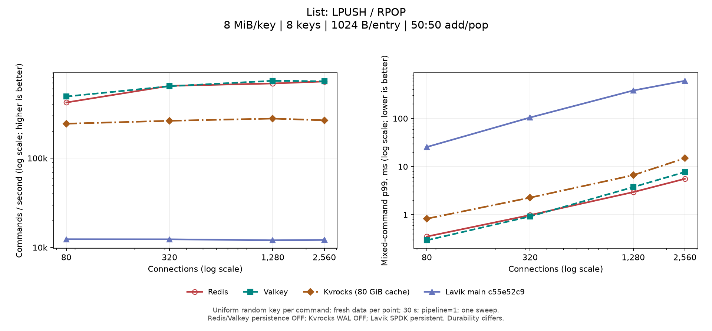
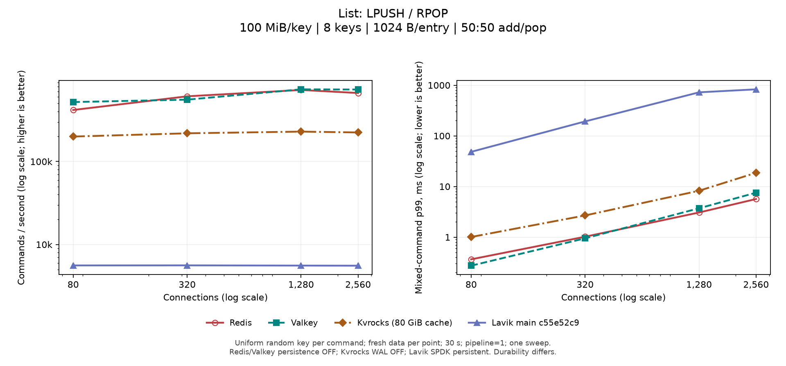
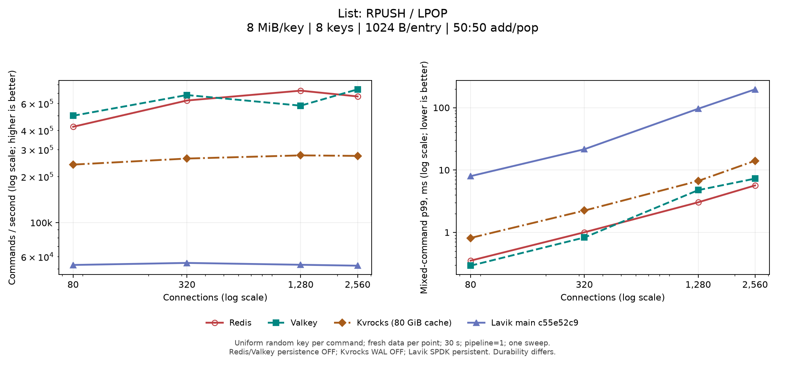
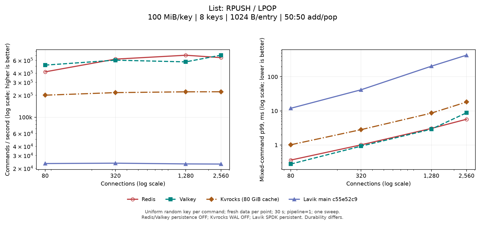
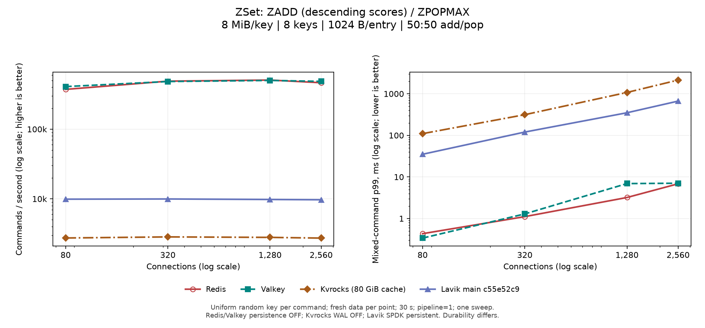
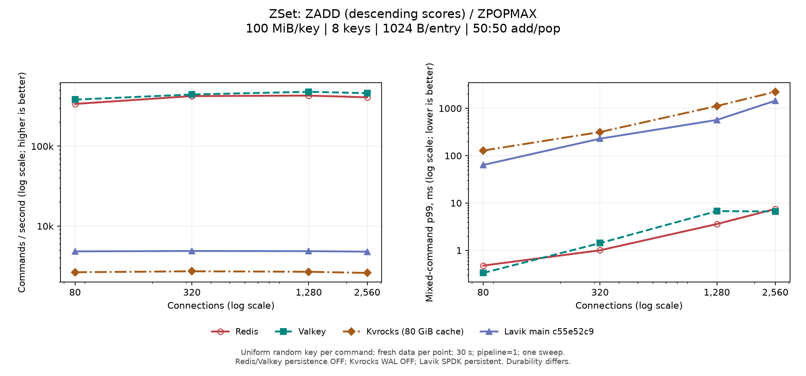
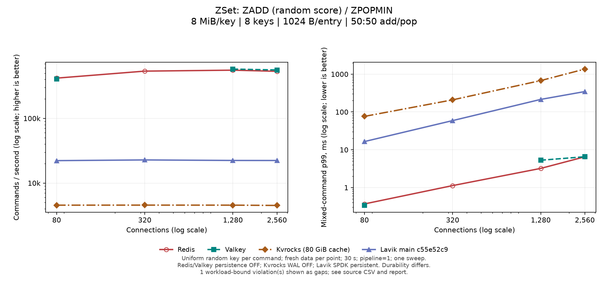
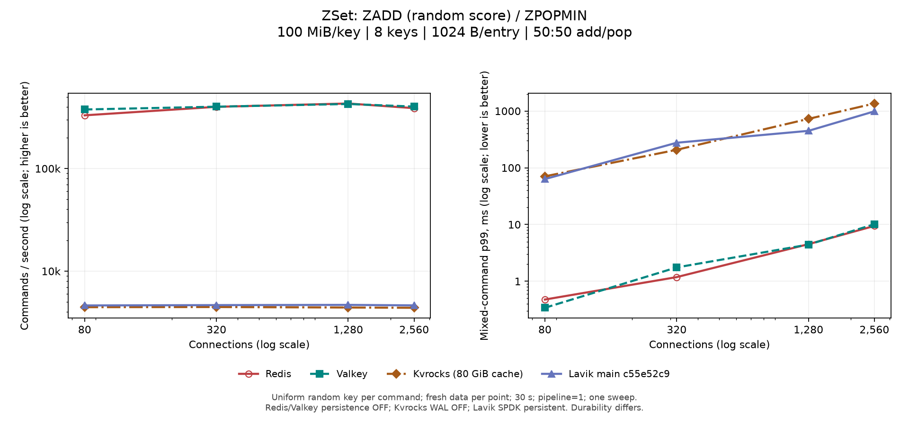
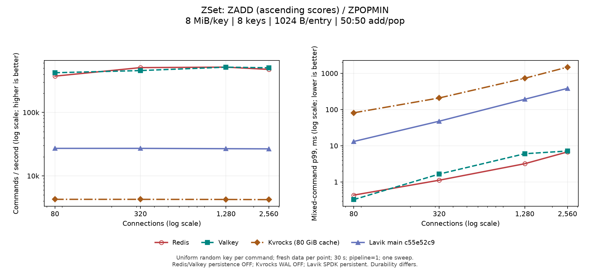
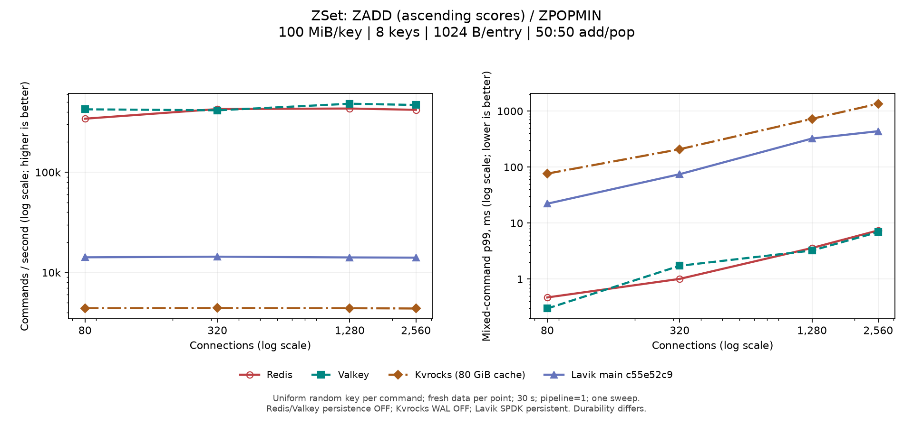

# Complex structures: Redis, Valkey, Kvrocks and Lavik

[简体中文](README.zh-CN.md)

**2026-10-08: main `c55e52c9`, including merged #244, #246, #247, #249, #258, #259, #260, #262, #265, #266, #267, #268, #270, #275, #280, #281, #282, #284, #285, #286, #287, #288; 28/28 conditions refreshed.**

Batched HSET/SADD import is tracked separately: 4/4 conditions refreshed.

At the user's request, all current curves and summaries exclude 5120 connections. Existing measurements remain archived; subsequent runs skip that level.

New List push/pop and ZSet add/pop: 160 points across four systems, with 10 QPS/p99 comparison figures.

1 observation(s) exceeded the predeclared final-cardinality bounds and remain gaps. Original counts and failure records are retained without replacement runs; see the [mixed-write validation notes](diagnostics/main-c55e52c9-20261008/mixed-writes.md).

[Measurements and validation](diagnostics/main-c55e52c9-20261008/README.md) · [Fresh four-system random add/pop](diagnostics/main-c55e52c9-20261008/mixed-writes.md) · [Comparison with the previous main](diagnostics/main-c55e52c9-20261008/previous-main-comparison.md). #288 is merged. All current Lavik curves measure the merged main; historical PR evidence retains its measured revisions. · [#289: three paired rank and List push/pop runs](diagnostics/pr289-c8f128dc-20261008/README.md) (separate PR comparison; current main curves retained). · #289 is merged as main `cc31b3a6`; [8 MiB RPUSH/LPOP: merged-main retest and three optimization experiments](diagnostics/list-queue-8m-main-cc31b3a6-20261008/README.md) (focused tests; full curves retained; combined optimization submitted as [PR #291](https://github.com/eloqdata/lavik/pull/291), with throughput and tail-latency results disclosed).

Throughput figures fix the command, payload bytes per key, entry size and key count; axes show connections and QPS. Batched-import figures show seconds to fill a fixed dataset. Keep the current main and subsequent unmerged PRs. Existing command charts retain historical matched peer runs; the new random add/pop charts rerun all four systems.

Redis/Valkey disable persistence. Kvrocks uses uncompressed RAID0, disabled WAL and 80 GiB block/blob cache. Lavik persists through six SPDK NVMe devices without caching field/page payloads. Write QPS compares these configurations, not equivalent durability.

Existing command grids rerun Lavik only; new random add/pop grids rerun all four systems for 30 s/point. Lavik uses AMD EPYC 9V74, 16 vCPUs and 12 serving workers. Existing command points last 8 s (10 s for high-key-count LSET); all use pipeline=1. Each condition is independently seeded and checked key by key. Perf diagnostics are separate from throughput measurements; see the measurement notes for this round’s profiling scope. Single sweeps have no statistical confidence intervals.

This round pins the main revision above. Merged optimizations are no longer separate PR curves. Historical observations retain their measured commits; each chart is replaced only after its independent rerun completes.

[Plot sources](current-main.json) · [Runner](run.py) · [Historical build and hardware (Oct 4)](diagnostics/main-refresh-20261004/host-and-build.json)

[Complete main baseline: per-command gaps](diagnostics/main-c55e52c9-20261008/main-gap-summary.md)

[Current build and hardware](diagnostics/main-c55e52c9-20261008/host-and-build.json)

[Current measurements and validation](diagnostics/main-c55e52c9-20261008/README.md)

[Current plot-data audit](diagnostics/main-c55e52c9-20261008/report-audit.json)

[Historical plot-data audit (Oct 4)](diagnostics/main-refresh-20261004/report-audit.json) · [Historical audit script (Oct 4)](diagnostics/main-refresh-20261004/audit-report.py)

[Hash/Set write profiles](diagnostics/hashset-write-20261004/README.md) · [Ordered metadata optimization and tests](diagnostics/ordered-metadata-20261004/README.md)

[Closed PR #283: historical paired results, perf and validation](diagnostics/pr283-main-20261006/README.md)

[Historical PR disposition and retained failure records](diagnostics/grouped-expiry-recovery-20261004/pr-cleanup-current.md)

[Historical fixed combination: full results and tradeoffs](diagnostics/combined-20261005/README.md)

[Historical #280 measurements and perf](diagnostics/zset-score-views-20261005/README.md)

[Stream reply and read-window evidence](diagnostics/stream-reply-20261004/README.md)

[List replies and grouped root-read evidence](diagnostics/list-reply-reserve-20261004/README.md)

[Historical 100 MiB LRANGE admission analysis](diagnostics/main-refresh-20261004/list-lrange-admission.md)

## List

### Random add/pop: fresh four-system measurements

Each request independently chooses a uniform random key and then add or pop with 50% probability each. Points last 30 s at pipeline=1, with 8 keys and 1 KiB entries; every point starts a fresh server and seeded population. Left: command QPS, not pairs/s. Right: mixed-command p99.

[Workload, configuration and validation](diagnostics/main-c55e52c9-20261008/mixed-writes.md) · [All raw sources](current-mixed-writes.json)

#### List: LPUSH / RPOP · 8 MiB/key

[CSV](list-8388608-1024-k8-lpush_rpop-mixed.csv)

#### List: LPUSH / RPOP · 100 MiB/key

[CSV](list-104857600-1024-k8-lpush_rpop-mixed.csv)

#### List: RPUSH / LPOP · 8 MiB/key

[CSV](list-8388608-1024-k8-rpush_lpop-mixed.csv)

#### List: RPUSH / LPOP · 100 MiB/key

[CSV](list-104857600-1024-k8-rpush_lpop-mixed.csv)

### LINDEX

#### 64 KiB/key

128 B/entry · 64 keys · Measured main baseline `c55e52c9`

[Redis](raw/redis/) · [Valkey](raw/valkey/) · [Kvrocks (80 GiB cache)](raw/kvrocks/) · [Lavik main c55e52c9](raw/lavik-mainc55e52c9-ordered-list-65536-k64-f128-20261008/)

1024 B/entry · 64 keys · Measured main baseline `c55e52c9`

[Redis](raw/redis/) · [Valkey](raw/valkey/) · [Kvrocks (80 GiB cache)](raw/kvrocks/) · [Lavik main c55e52c9](raw/lavik-mainc55e52c9-ordered-list-65536-k64-f1024-20261008/)

#### 1 MiB/key

128 B/entry · 64 keys · Measured main baseline `c55e52c9`

[Redis](raw/redis/) · [Valkey](raw/valkey/) · [Kvrocks (80 GiB cache)](raw/kvrocks/) · [Lavik main c55e52c9](raw/lavik-mainc55e52c9-ordered-list-1048576-k64-f128-20261008/)

1024 B/entry · 64 keys · Measured main baseline `c55e52c9`

[Redis](raw/redis/) · [Valkey](raw/valkey/) · [Kvrocks (80 GiB cache)](raw/kvrocks/) · [Lavik main c55e52c9](raw/lavik-mainc55e52c9-ordered-list-1048576-k64-f1024-20261008/)

#### 100 MiB/key

128 B/entry · 8 keys · Measured main baseline `c55e52c9`

[Redis](raw/redis-100m/) · [Valkey](raw/valkey-100m/) · [Kvrocks (80 GiB cache)](raw/kvrocks-100m/) · [Lavik main c55e52c9](raw/lavik-mainc55e52c9-ordered-list-104857600-k8-f128-20261008/)

1024 B/entry · 8 keys · Measured main baseline `c55e52c9`

[Redis](raw/redis-100m/) · [Valkey](raw/valkey-100m/) · [Kvrocks (80 GiB cache)](raw/kvrocks-100m/) · [Lavik main c55e52c9](raw/lavik-mainc55e52c9-ordered-list-104857600-k8-f1024-20261008/)

### LSET

#### 64 KiB/key

128 B/entry · 64 keys · Measured main baseline `c55e52c9`

[Redis](raw/redis/) · [Valkey](raw/valkey/) · [Kvrocks (80 GiB cache)](raw/kvrocks/) · [Lavik main c55e52c9](raw/lavik-mainc55e52c9-ordered-list-65536-k64-f128-20261008/)

1024 B/entry · 64 keys · Measured main baseline `c55e52c9`

[Redis](raw/redis/) · [Valkey](raw/valkey/) · [Kvrocks (80 GiB cache)](raw/kvrocks/) · [Lavik main c55e52c9](raw/lavik-mainc55e52c9-ordered-list-65536-k64-f1024-20261008/)

#### 1 MiB/key

128 B/entry · 64 keys · Measured main baseline `c55e52c9`

[Redis](raw/redis/) · [Valkey](raw/valkey/) · [Kvrocks (80 GiB cache)](raw/kvrocks/) · [Lavik main c55e52c9](raw/lavik-mainc55e52c9-ordered-list-1048576-k64-f128-20261008/)

1024 B/entry · 50,000 keys · Measured main baseline `c55e52c9`

[Redis](raw/redis-lset-matched-1048576-k50000-f1024-20261001/) · [Valkey](raw/valkey-lset-matched-1048576-k50000-f1024-20261001/) · [Kvrocks (80 GiB cache)](raw/kvrocks-lset-matched-1048576-k50000-f1024-20261001/) · [Lavik main c55e52c9](raw/lavik-mainc55e52c9-lset-list-1048576-k50000-f1024-20261008/)

#### 100 MiB/key

128 B/entry · 8 keys · Measured main baseline `c55e52c9`

[Redis](raw/redis-100m/) · [Valkey](raw/valkey-100m/) · [Kvrocks (80 GiB cache)](raw/kvrocks-100m/) · [Lavik main c55e52c9](raw/lavik-mainc55e52c9-ordered-list-104857600-k8-f128-20261008/)

1024 B/entry · 500 keys · Measured main baseline `c55e52c9`

[Redis](raw/redis-lset-matched-104857600-k500-f1024-20261001/) · [Valkey](raw/valkey-lset-matched-104857600-k500-f1024-20261001/) · [Kvrocks (80 GiB cache)](raw/kvrocks-lset-matched-104857600-k500-f1024-20261001/) · [Lavik main c55e52c9](raw/lavik-mainc55e52c9-lset-list-104857600-k500-f1024-20261008/)

### LRANGE 0 -1

#### 64 KiB/key

128 B/entry · 64 keys · Measured main baseline `c55e52c9`

[Redis](raw/redis/) · [Valkey](raw/valkey/) · [Kvrocks (80 GiB cache)](raw/kvrocks/) · [Lavik main c55e52c9](raw/lavik-mainc55e52c9-ordered-list-65536-k64-f128-20261008/)

1024 B/entry · 64 keys · Measured main baseline `c55e52c9`

[Redis](raw/redis/) · [Valkey](raw/valkey/) · [Kvrocks (80 GiB cache)](raw/kvrocks/) · [Lavik main c55e52c9](raw/lavik-mainc55e52c9-ordered-list-65536-k64-f1024-20261008/)

#### 1 MiB/key

128 B/entry · 64 keys · Measured main baseline `c55e52c9`

[Redis](raw/redis/) · [Valkey](raw/valkey/) · [Kvrocks (80 GiB cache)](raw/kvrocks/) · [Lavik main c55e52c9](raw/lavik-mainc55e52c9-ordered-list-1048576-k64-f128-20261008/)

1024 B/entry · 64 keys · Measured main baseline `c55e52c9`

[Redis](raw/redis/) · [Valkey](raw/valkey/) · [Kvrocks (80 GiB cache)](raw/kvrocks/) · [Lavik main c55e52c9](raw/lavik-mainc55e52c9-ordered-list-1048576-k64-f1024-20261008/)

#### 100 MiB/key

128 B/entry · 8 keys · Measured main baseline `c55e52c9`

[Redis](raw/redis-100m/) · [Valkey](raw/valkey-100m/) · [Kvrocks (80 GiB cache)](raw/kvrocks-100m/) · [Lavik main c55e52c9](raw/lavik-mainc55e52c9-ordered-list-104857600-k8-f128-20261008/)

1024 B/entry · 8 keys · Measured main baseline `c55e52c9`

[Redis](raw/redis-100m/) · [Valkey](raw/valkey-100m/) · [Kvrocks (80 GiB cache)](raw/kvrocks-100m/) · [Lavik main c55e52c9](raw/lavik-mainc55e52c9-ordered-list-104857600-k8-f1024-20261008/)

### RPUSH batched seeding

Independent LSET seeding timings: 32 clients, pipeline=4, 128 one-KiB entries per command, with the same client encoder across all four databases.

#### 1 MiB/key

#### 100 MiB/key

## Hash

### HGET

#### 1 MiB/key

128 B/entry · 50,000 keys · Measured main baseline `c55e52c9`

[Redis](raw/redis-hash-1m-k50000-f128-20260929/) · [Valkey](raw/valkey-hash-1m-k50000-f128-20260929/) · [Kvrocks (80 GiB cache)](raw/kvrocks-hash-1m-k50000-f128-20260929/) · [Lavik main c55e52c9](raw/lavik-mainc55e52c9-hashset-hash-1048576-k50000-f128-20261008/)

1024 B/entry · 50,000 keys · Measured main baseline `c55e52c9`

[Redis](raw/redis-hash-1m-k50000-f1024-20260929/) · [Valkey](raw/valkey-hash-1m-k50000-f1024-20260929/) · [Kvrocks (80 GiB cache)](raw/kvrocks-hash-1m-k50000-f1024-20260929/) · [Lavik main c55e52c9](raw/lavik-mainc55e52c9-hashset-hash-1048576-k50000-f1024-20261008/)

#### 100 MiB/key

128 B/entry · 500 keys · Measured main baseline `c55e52c9`

[Redis](raw/redis-hash-100m-k500-f128-20260929/) · [Valkey](raw/valkey-hash-100m-k500-f128-20260929/) · [Kvrocks (80 GiB cache)](raw/kvrocks-hash-100m-k500-f128-20260929/) · [Lavik main c55e52c9](raw/lavik-mainc55e52c9-hashset-hash-104857600-k500-f128-20261008/)

1024 B/entry · 500 keys · Measured main baseline `c55e52c9`

[Redis](raw/redis-hash-100m-k500-f1024-20260929/) · [Valkey](raw/valkey-hash-100m-k500-f1024-20260929/) · [Kvrocks (80 GiB cache)](raw/kvrocks-hash-100m-k500-f1024-20260929/) · [Lavik main c55e52c9](raw/lavik-mainc55e52c9-hashset-hash-104857600-k500-f1024-20261008/)

### HSET

#### 1 MiB/key

128 B/entry · 50,000 keys · Measured main baseline `c55e52c9`

[Redis](raw/redis-hash-1m-k50000-f128-20260929/) · [Valkey](raw/valkey-hash-1m-k50000-f128-20260929/) · [Kvrocks (80 GiB cache)](raw/kvrocks-hash-1m-k50000-f128-20260929/) · [Lavik main c55e52c9](raw/lavik-mainc55e52c9-hashset-hash-1048576-k50000-f128-20261008/)

1024 B/entry · 50,000 keys · Measured main baseline `c55e52c9`

[Redis](raw/redis-hash-1m-k50000-f1024-20260929/) · [Valkey](raw/valkey-hash-1m-k50000-f1024-20260929/) · [Kvrocks (80 GiB cache)](raw/kvrocks-hash-1m-k50000-f1024-20260929/) · [Lavik main c55e52c9](raw/lavik-mainc55e52c9-hashset-hash-1048576-k50000-f1024-20261008/)

#### 100 MiB/key

128 B/entry · 500 keys · Measured main baseline `c55e52c9`

[Redis](raw/redis-hash-100m-k500-f128-20260929/) · [Valkey](raw/valkey-hash-100m-k500-f128-20260929/) · [Kvrocks (80 GiB cache)](raw/kvrocks-hash-100m-k500-f128-20260929/) · [Lavik main c55e52c9](raw/lavik-mainc55e52c9-hashset-hash-104857600-k500-f128-20261008/)

1024 B/entry · 500 keys · Measured main baseline `c55e52c9`

[Redis](raw/redis-hash-100m-k500-f1024-20260929/) · [Valkey](raw/valkey-hash-100m-k500-f1024-20260929/) · [Kvrocks (80 GiB cache)](raw/kvrocks-hash-100m-k500-f1024-20260929/) · [Lavik main c55e52c9](raw/lavik-mainc55e52c9-hashset-hash-104857600-k500-f1024-20261008/)

### HGETALL

#### 1 MiB/key

128 B/entry · 50,000 keys · Measured main baseline `c55e52c9`

[Redis](raw/redis-hash-1m-k50000-f128-20260929/) · [Valkey](raw/valkey-hash-1m-k50000-f128-20260929/) · [Kvrocks (80 GiB cache)](raw/kvrocks-hash-1m-k50000-f128-20260929/) · [Lavik main c55e52c9](raw/lavik-mainc55e52c9-hashset-hash-1048576-k50000-f128-20261008/)

1024 B/entry · 50,000 keys · Measured main baseline `c55e52c9`

[Redis](raw/redis-hash-1m-k50000-f1024-20260929/) · [Valkey](raw/valkey-hash-1m-k50000-f1024-20260929/) · [Kvrocks (80 GiB cache)](raw/kvrocks-hash-1m-k50000-f1024-20260929/) · [Lavik main c55e52c9](raw/lavik-mainc55e52c9-hashset-hash-1048576-k50000-f1024-20261008/)

#### 100 MiB/key

128 B/entry · 500 keys · Measured main baseline `c55e52c9`

[Redis](raw/redis-hash-100m-k500-f128-20260929/) · [Valkey](raw/valkey-hash-100m-k500-f128-20260929/) · [Kvrocks (80 GiB cache)](raw/kvrocks-hash-100m-k500-f128-20260929/) · [Lavik main c55e52c9](raw/lavik-mainc55e52c9-hashset-hash-104857600-k500-f128-20261008/)

1024 B/entry · 500 keys · Measured main baseline `c55e52c9`

[Redis](raw/redis-hash-100m-k500-f1024-20260929/) · [Valkey](raw/valkey-hash-100m-k500-f1024-20260929/) · [Kvrocks (80 GiB cache)](raw/kvrocks-hash-100m-k500-f1024-20260929/) · [Lavik main c55e52c9](raw/lavik-mainc55e52c9-hashset-hash-104857600-k500-f1024-20261008/)

### HSET batched import

#### 1 MiB/key

50,000 keys; 8 clients, pipeline=64, about 16 KiB entries/command. Per-command RESP encoding matches the historical peer workload; elapsed time includes Python client encoding. This is not RESTORE or a server-only throughput ceiling.

1024 B/entry · Measured main baseline `c55e52c9`

[Lavik raw](raw/lavik-mainc55e52c9-import-hash-1048576-k50000-f1024-20261008/)

128 B/entry · Measured main baseline `c55e52c9`

[Lavik raw](raw/lavik-mainc55e52c9-import-hash-1048576-k50000-f128-20261008/)

## Set

SADD + SREM mixes the two commands equally; QPS counts commands, not pairs. Random concurrent access can produce no-op additions/removals, so this is not the rate of durable changes.

### SISMEMBER

#### 1 MiB/key

128 B/entry · 50,000 keys · Measured main baseline `c55e52c9`

[Redis](raw/redis-set-1m-k50000-f128-20260929/) · [Valkey](raw/valkey-set-1m-k50000-f128-20260929/) · [Kvrocks (80 GiB cache)](raw/kvrocks-set-1m-k50000-f128-20260929/) · [Lavik main c55e52c9](raw/lavik-mainc55e52c9-hashset-set-1048576-k50000-f128-20261008/)

1024 B/entry · 50,000 keys · Measured main baseline `c55e52c9`

[Redis](raw/redis-set-1m-k50000-f1024-20260929/) · [Valkey](raw/valkey-set-1m-k50000-f1024-20260929/) · [Kvrocks (80 GiB cache)](raw/kvrocks-set-1m-k50000-f1024-20260929/) · [Lavik main c55e52c9](raw/lavik-mainc55e52c9-hashset-set-1048576-k50000-f1024-20261008/)

#### 100 MiB/key

128 B/entry · 500 keys · Measured main baseline `c55e52c9`

[Redis](raw/redis-set-100m-k500-f128-20260929/) · [Valkey](raw/valkey-set-100m-k500-f128-20260929/) · [Kvrocks (80 GiB cache)](raw/kvrocks-set-100m-k500-f128-20260929/) · [Lavik main c55e52c9](raw/lavik-mainc55e52c9-hashset-set-104857600-k500-f128-20261008/)

1024 B/entry · 500 keys · Measured main baseline `c55e52c9`

[Redis](raw/redis-set-100m-k500-f1024-20260929/) · [Valkey](raw/valkey-set-100m-k500-f1024-20260929/) · [Kvrocks (80 GiB cache)](raw/kvrocks-set-100m-k500-f1024-20260929/) · [Lavik main c55e52c9](raw/lavik-mainc55e52c9-hashset-set-104857600-k500-f1024-20261008/)

### SADD + SREM

#### 1 MiB/key

128 B/entry · 50,000 keys · Measured main baseline `c55e52c9`

[Redis](raw/redis-set-1m-k50000-f128-20260929/) · [Valkey](raw/valkey-set-1m-k50000-f128-20260929/) · [Kvrocks (80 GiB cache)](raw/kvrocks-set-1m-k50000-f128-20260929/) · [Lavik main c55e52c9](raw/lavik-mainc55e52c9-hashset-set-1048576-k50000-f128-20261008/)

1024 B/entry · 50,000 keys · Measured main baseline `c55e52c9`

[Redis](raw/redis-set-1m-k50000-f1024-20260929/) · [Valkey](raw/valkey-set-1m-k50000-f1024-20260929/) · [Kvrocks (80 GiB cache)](raw/kvrocks-set-1m-k50000-f1024-20260929/) · [Lavik main c55e52c9](raw/lavik-mainc55e52c9-hashset-set-1048576-k50000-f1024-20261008/)

#### 100 MiB/key

128 B/entry · 500 keys · Measured main baseline `c55e52c9`

[Redis](raw/redis-set-100m-k500-f128-20260929/) · [Valkey](raw/valkey-set-100m-k500-f128-20260929/) · [Kvrocks (80 GiB cache)](raw/kvrocks-set-100m-k500-f128-20260929/) · [Lavik main c55e52c9](raw/lavik-mainc55e52c9-hashset-set-104857600-k500-f128-20261008/)

1024 B/entry · 500 keys · Measured main baseline `c55e52c9`

[Redis](raw/redis-set-100m-k500-f1024-20260929/) · [Valkey](raw/valkey-set-100m-k500-f1024-20260929/) · [Kvrocks (80 GiB cache)](raw/kvrocks-set-100m-k500-f1024-20260929/) · [Lavik main c55e52c9](raw/lavik-mainc55e52c9-hashset-set-104857600-k500-f1024-20261008/)

### SMEMBERS

#### 1 MiB/key

128 B/entry · 50,000 keys · Measured main baseline `c55e52c9`

[Redis](raw/redis-set-1m-k50000-f128-20260929/) · [Valkey](raw/valkey-set-1m-k50000-f128-20260929/) · [Kvrocks (80 GiB cache)](raw/kvrocks-set-1m-k50000-f128-20260929/) · [Lavik main c55e52c9](raw/lavik-mainc55e52c9-hashset-set-1048576-k50000-f128-20261008/)

1024 B/entry · 50,000 keys · Measured main baseline `c55e52c9`

[Redis](raw/redis-set-1m-k50000-f1024-20260929/) · [Valkey](raw/valkey-set-1m-k50000-f1024-20260929/) · [Kvrocks (80 GiB cache)](raw/kvrocks-set-1m-k50000-f1024-20260929/) · [Lavik main c55e52c9](raw/lavik-mainc55e52c9-hashset-set-1048576-k50000-f1024-20261008/)

#### 100 MiB/key

128 B/entry · 500 keys · Measured main baseline `c55e52c9`

[Redis](raw/redis-set-100m-k500-f128-20260929/) · [Valkey](raw/valkey-set-100m-k500-f128-20260929/) · [Kvrocks (80 GiB cache)](raw/kvrocks-set-100m-k500-f128-20260929/) · [Lavik main c55e52c9](raw/lavik-mainc55e52c9-hashset-set-104857600-k500-f128-20261008/)

1024 B/entry · 500 keys · Measured main baseline `c55e52c9`

[Redis](raw/redis-set-100m-k500-f1024-20260929/) · [Valkey](raw/valkey-set-100m-k500-f1024-20260929/) · [Kvrocks (80 GiB cache)](raw/kvrocks-set-100m-k500-f1024-20260929/) · [Lavik main c55e52c9](raw/lavik-mainc55e52c9-hashset-set-104857600-k500-f1024-20261008/)

### SADD batched import

#### 1 MiB/key

50,000 keys; 8 clients, pipeline=64, about 16 KiB entries/command. Per-command RESP encoding matches the historical peer workload; elapsed time includes Python client encoding. This is not RESTORE or a server-only throughput ceiling.

1024 B/entry · Measured main baseline `c55e52c9`

[Lavik raw](raw/lavik-mainc55e52c9-import-set-1048576-k50000-f1024-20261008/)

128 B/entry · Measured main baseline `c55e52c9`

[Lavik raw](raw/lavik-mainc55e52c9-import-set-1048576-k50000-f128-20261008/)

## Sorted Set

### Random add/pop: fresh four-system measurements

Each request independently chooses a uniform random key and then add or pop with 50% probability each. Points last 30 s at pipeline=1, with 8 keys and 1 KiB entries; every point starts a fresh server and seeded population. Left: command QPS, not pairs/s. Right: mixed-command p99.

ZADD NX inserts a unique new member every time. Head/tail scores decrease/increase beyond the seed range; random scores are uniform within the original seed range. Scores are monotonic in client ticket order; concurrent arrival can reorder them, so strict head/tail insertion is not guaranteed. Uniform scores do not imply uniform ranks after turnover. Every pop must return a nonempty member.

[Workload, configuration and validation](diagnostics/main-c55e52c9-20261008/mixed-writes.md) · [All raw sources](current-mixed-writes.json)

#### ZSet: ZADD (descending scores) / ZPOPMAX · 8 MiB/key

[CSV](zset-8388608-1024-k8-zadd_head_zpopmax-mixed.csv)

#### ZSet: ZADD (descending scores) / ZPOPMAX · 100 MiB/key

[CSV](zset-104857600-1024-k8-zadd_head_zpopmax-mixed.csv)

#### ZSet: ZADD (random score) / ZPOPMIN · 8 MiB/key

[CSV](zset-8388608-1024-k8-zadd_random_zpopmin-mixed.csv)

#### ZSet: ZADD (random score) / ZPOPMIN · 100 MiB/key

[CSV](zset-104857600-1024-k8-zadd_random_zpopmin-mixed.csv)

#### ZSet: ZADD (ascending scores) / ZPOPMIN · 8 MiB/key

[CSV](zset-8388608-1024-k8-zadd_tail_zpopmin-mixed.csv)

#### ZSet: ZADD (ascending scores) / ZPOPMIN · 100 MiB/key

[CSV](zset-104857600-1024-k8-zadd_tail_zpopmin-mixed.csv)

### ZSCORE

#### 64 KiB/key

128 B/entry · 64 keys · Measured main baseline `c55e52c9`

[Redis](raw/redis/) · [Valkey](raw/valkey/) · [Kvrocks (80 GiB cache)](raw/kvrocks/) · [Lavik main c55e52c9](raw/lavik-mainc55e52c9-ordered-zset-65536-k64-f128-20261008/)

1024 B/entry · 64 keys · Measured main baseline `c55e52c9`

[Redis](raw/redis/) · [Valkey](raw/valkey/) · [Kvrocks (80 GiB cache)](raw/kvrocks/) · [Lavik main c55e52c9](raw/lavik-mainc55e52c9-ordered-zset-65536-k64-f1024-20261008/)

#### 1 MiB/key

128 B/entry · 64 keys · Measured main baseline `c55e52c9`

[Redis](raw/redis/) · [Valkey](raw/valkey/) · [Kvrocks (80 GiB cache)](raw/kvrocks/) · [Lavik main c55e52c9](raw/lavik-mainc55e52c9-ordered-zset-1048576-k64-f128-20261008/)

1024 B/entry · 64 keys · Measured main baseline `c55e52c9`

[Redis](raw/redis/) · [Valkey](raw/valkey/) · [Kvrocks (80 GiB cache)](raw/kvrocks/) · [Lavik main c55e52c9](raw/lavik-mainc55e52c9-ordered-zset-1048576-k64-f1024-20261008/)

#### 100 MiB/key

128 B/entry · 8 keys · Measured main baseline `c55e52c9`

[Redis](raw/redis-100m/) · [Valkey](raw/valkey-100m/) · [Kvrocks (80 GiB cache)](raw/kvrocks-100m/) · [Lavik main c55e52c9](raw/lavik-mainc55e52c9-ordered-zset-104857600-k8-f128-20261008/)

1024 B/entry · 8 keys · Measured main baseline `c55e52c9`

[Redis](raw/redis-100m/) · [Valkey](raw/valkey-100m/) · [Kvrocks (80 GiB cache)](raw/kvrocks-100m/) · [Lavik main c55e52c9](raw/lavik-mainc55e52c9-ordered-zset-104857600-k8-f1024-20261008/)

### ZINCRBY

#### 64 KiB/key

128 B/entry · 64 keys · Measured main baseline `c55e52c9`

[Redis](raw/redis/) · [Valkey](raw/valkey/) · [Kvrocks (80 GiB cache)](raw/kvrocks/) · [Lavik main c55e52c9](raw/lavik-mainc55e52c9-ordered-zset-65536-k64-f128-20261008/)

1024 B/entry · 64 keys · Measured main baseline `c55e52c9`

[Redis](raw/redis/) · [Valkey](raw/valkey/) · [Kvrocks (80 GiB cache)](raw/kvrocks/) · [Lavik main c55e52c9](raw/lavik-mainc55e52c9-ordered-zset-65536-k64-f1024-20261008/)

#### 1 MiB/key

128 B/entry · 64 keys · Measured main baseline `c55e52c9`

[Redis](raw/redis/) · [Valkey](raw/valkey/) · [Kvrocks (80 GiB cache)](raw/kvrocks/) · [Lavik main c55e52c9](raw/lavik-mainc55e52c9-ordered-zset-1048576-k64-f128-20261008/)

1024 B/entry · 64 keys · Measured main baseline `c55e52c9`

[Redis](raw/redis/) · [Valkey](raw/valkey/) · [Kvrocks (80 GiB cache)](raw/kvrocks/) · [Lavik main c55e52c9](raw/lavik-mainc55e52c9-ordered-zset-1048576-k64-f1024-20261008/)

#### 100 MiB/key

128 B/entry · 8 keys · Measured main baseline `c55e52c9`

[Redis](raw/redis-100m/) · [Valkey](raw/valkey-100m/) · [Kvrocks (80 GiB cache)](raw/kvrocks-100m/) · [Lavik main c55e52c9](raw/lavik-mainc55e52c9-ordered-zset-104857600-k8-f128-20261008/)

1024 B/entry · 8 keys · Measured main baseline `c55e52c9`

[Redis](raw/redis-100m/) · [Valkey](raw/valkey-100m/) · [Kvrocks (80 GiB cache)](raw/kvrocks-100m/) · [Lavik main c55e52c9](raw/lavik-mainc55e52c9-ordered-zset-104857600-k8-f1024-20261008/)

### ZRANGE 0 -1 WITHSCORES

#### 64 KiB/key

128 B/entry · 64 keys · Measured main baseline `c55e52c9`

[Redis](raw/redis/) · [Valkey](raw/valkey/) · [Kvrocks (80 GiB cache)](raw/kvrocks/) · [Lavik main c55e52c9](raw/lavik-mainc55e52c9-ordered-zset-65536-k64-f128-20261008/)

1024 B/entry · 64 keys · Measured main baseline `c55e52c9`

[Redis](raw/redis/) · [Valkey](raw/valkey/) · [Kvrocks (80 GiB cache)](raw/kvrocks/) · [Lavik main c55e52c9](raw/lavik-mainc55e52c9-ordered-zset-65536-k64-f1024-20261008/)

#### 1 MiB/key

128 B/entry · 64 keys · Measured main baseline `c55e52c9`

[Redis](raw/redis/) · [Valkey](raw/valkey/) · [Kvrocks (80 GiB cache)](raw/kvrocks/) · [Lavik main c55e52c9](raw/lavik-mainc55e52c9-ordered-zset-1048576-k64-f128-20261008/)

1024 B/entry · 64 keys · Measured main baseline `c55e52c9`

[Redis](raw/redis/) · [Valkey](raw/valkey/) · [Kvrocks (80 GiB cache)](raw/kvrocks/) · [Lavik main c55e52c9](raw/lavik-mainc55e52c9-ordered-zset-1048576-k64-f1024-20261008/)

#### 100 MiB/key

128 B/entry · 8 keys · Measured main baseline `c55e52c9`

[Redis](raw/redis-100m/) · [Valkey](raw/valkey-100m/) · [Kvrocks (80 GiB cache)](raw/kvrocks-100m/) · [Lavik main c55e52c9](raw/lavik-mainc55e52c9-ordered-zset-104857600-k8-f128-20261008/)

1024 B/entry · 8 keys · Measured main baseline `c55e52c9`

[Redis](raw/redis-100m/) · [Valkey](raw/valkey-100m/) · [Kvrocks (80 GiB cache)](raw/kvrocks-100m/) · [Lavik main c55e52c9](raw/lavik-mainc55e52c9-ordered-zset-104857600-k8-f1024-20261008/)

## Stream

### XRANGE (one ID)

#### 64 KiB/key

128 B/entry · 64 keys · Measured main baseline `c55e52c9`

[Redis](raw/redis/) · [Valkey](raw/valkey/) · [Kvrocks (80 GiB cache)](raw/kvrocks/) · [Lavik main c55e52c9](raw/lavik-mainc55e52c9-ordered-stream-65536-k64-f128-20261008/)

1024 B/entry · 64 keys · Measured main baseline `c55e52c9`

[Redis](raw/redis/) · [Valkey](raw/valkey/) · [Kvrocks (80 GiB cache)](raw/kvrocks/) · [Lavik main c55e52c9](raw/lavik-mainc55e52c9-ordered-stream-65536-k64-f1024-20261008/)

#### 1 MiB/key

128 B/entry · 64 keys · Measured main baseline `c55e52c9`

[Redis](raw/redis/) · [Valkey](raw/valkey/) · [Kvrocks (80 GiB cache)](raw/kvrocks/) · [Lavik main c55e52c9](raw/lavik-mainc55e52c9-ordered-stream-1048576-k64-f128-20261008/)

1024 B/entry · 64 keys · Measured main baseline `c55e52c9`

[Redis](raw/redis/) · [Valkey](raw/valkey/) · [Kvrocks (80 GiB cache)](raw/kvrocks/) · [Lavik main c55e52c9](raw/lavik-mainc55e52c9-ordered-stream-1048576-k64-f1024-20261008/)

#### 100 MiB/key

128 B/entry · 8 keys · Measured main baseline `c55e52c9`

[Redis](raw/redis-100m/) · [Valkey](raw/valkey-100m/) · [Kvrocks (80 GiB cache)](raw/kvrocks-100m/) · [Lavik main c55e52c9](raw/lavik-mainc55e52c9-ordered-stream-104857600-k8-f128-20261008/)

1024 B/entry · 8 keys · Measured main baseline `c55e52c9`

[Redis](raw/redis-100m/) · [Valkey](raw/valkey-100m/) · [Kvrocks (80 GiB cache)](raw/kvrocks-100m/) · [Lavik main c55e52c9](raw/lavik-mainc55e52c9-ordered-stream-104857600-k8-f1024-20261008/)

### XADD MAXLEN ~

#### 64 KiB/key

128 B/entry · 64 keys · Measured main baseline `c55e52c9`

[Redis](raw/redis/) · [Valkey](raw/valkey/) · [Kvrocks (80 GiB cache)](raw/kvrocks/) · [Lavik main c55e52c9](raw/lavik-mainc55e52c9-ordered-stream-65536-k64-f128-20261008/)

1024 B/entry · 64 keys · Measured main baseline `c55e52c9`

[Redis](raw/redis/) · [Valkey](raw/valkey/) · [Kvrocks (80 GiB cache)](raw/kvrocks/) · [Lavik main c55e52c9](raw/lavik-mainc55e52c9-ordered-stream-65536-k64-f1024-20261008/)

#### 1 MiB/key

128 B/entry · 64 keys · Measured main baseline `c55e52c9`

[Redis](raw/redis/) · [Valkey](raw/valkey/) · [Kvrocks (80 GiB cache)](raw/kvrocks/) · [Lavik main c55e52c9](raw/lavik-mainc55e52c9-ordered-stream-1048576-k64-f128-20261008/)

1024 B/entry · 64 keys · Measured main baseline `c55e52c9`

[Redis](raw/redis/) · [Valkey](raw/valkey/) · [Kvrocks (80 GiB cache)](raw/kvrocks/) · [Lavik main c55e52c9](raw/lavik-mainc55e52c9-ordered-stream-1048576-k64-f1024-20261008/)

#### 100 MiB/key

128 B/entry · 8 keys · Measured main baseline `c55e52c9`

[Redis](raw/redis-100m/) · [Valkey](raw/valkey-100m/) · [Kvrocks (80 GiB cache)](raw/kvrocks-100m/) · [Lavik main c55e52c9](raw/lavik-mainc55e52c9-ordered-stream-104857600-k8-f128-20261008/)

1024 B/entry · 8 keys · Measured main baseline `c55e52c9`

[Redis](raw/redis-100m/) · [Valkey](raw/valkey-100m/) · [Kvrocks (80 GiB cache)](raw/kvrocks-100m/) · [Lavik main c55e52c9](raw/lavik-mainc55e52c9-ordered-stream-104857600-k8-f1024-20261008/)

### XRANGE - +

#### 64 KiB/key

128 B/entry · 64 keys · Measured main baseline `c55e52c9`

[Redis](raw/redis/) · [Valkey](raw/valkey/) · [Kvrocks (80 GiB cache)](raw/kvrocks/) · [Lavik main c55e52c9](raw/lavik-mainc55e52c9-ordered-stream-65536-k64-f128-20261008/)

1024 B/entry · 64 keys · Measured main baseline `c55e52c9`

[Redis](raw/redis/) · [Valkey](raw/valkey/) · [Kvrocks (80 GiB cache)](raw/kvrocks/) · [Lavik main c55e52c9](raw/lavik-mainc55e52c9-ordered-stream-65536-k64-f1024-20261008/)

#### 1 MiB/key

128 B/entry · 64 keys · Measured main baseline `c55e52c9`

[Redis](raw/redis/) · [Valkey](raw/valkey/) · [Kvrocks (80 GiB cache)](raw/kvrocks/) · [Lavik main c55e52c9](raw/lavik-mainc55e52c9-ordered-stream-1048576-k64-f128-20261008/)

1024 B/entry · 64 keys · Measured main baseline `c55e52c9`

[Redis](raw/redis/) · [Valkey](raw/valkey/) · [Kvrocks (80 GiB cache)](raw/kvrocks/) · [Lavik main c55e52c9](raw/lavik-mainc55e52c9-ordered-stream-1048576-k64-f1024-20261008/)

#### 100 MiB/key

128 B/entry · 8 keys · Measured main baseline `c55e52c9`

[Redis](raw/redis-100m/) · [Valkey](raw/valkey-100m/) · [Kvrocks (80 GiB cache)](raw/kvrocks-100m/) · [Lavik main c55e52c9](raw/lavik-mainc55e52c9-ordered-stream-104857600-k8-f128-20261008/)

1024 B/entry · 8 keys · Measured main baseline `c55e52c9`

[Redis](raw/redis-100m/) · [Valkey](raw/valkey-100m/) · [Kvrocks (80 GiB cache)](raw/kvrocks-100m/) · [Lavik main c55e52c9](raw/lavik-mainc55e52c9-ordered-stream-104857600-k8-f1024-20261008/)

## Measurement and reproduction

Existing command charts use memtier on the separate client 172.16.0.5 pinned to CPUs 0–15, with uniformly random keys. HGET/HSET, SISMEMBER, LINDEX/LSET, ZSCORE/ZINCRBY and one-ID XRANGE rotate through eight evenly spaced positions per key, not all fields uniformly. SADD/SREM uses a fixed test member; XADD MAXLEN appends new IDs. Connection points run sequentially within a condition, so later writes inherit values/layout changed by earlier points.

Hash/Set use 50,000 keys at 1 MiB/key and 500 at 100 MiB/key; high-key-count LSET uses the same counts. Other ordered-structure conditions retain the matched 64/8-key peer workloads, explicitly identified in titles. Different key counts are not interchangeable.

Hash/Set use independent RESTORE seeding, transaction cleanup and recovery before measurement. High-key-count LSET seeds with 32 clients, 128 KiB RPUSH batches and pipeline=4. Fill timings remain in raw directories; RESTORE timings are not equated with peer HSET/SADD import timings.

Low-throughput whole-key reads can complete few replies in eight seconds; small differences are not performance conclusions. Eight successful seconds do not establish sustained memory stability: an earlier sustained SMEMBERS run exhausted memory admission. Failed points remain gaps with annotations, never zeroes or interpolated values.

Historical optimization evidence remains in raw/ and diagnostics/; merged PRs are not shown as separate series.
