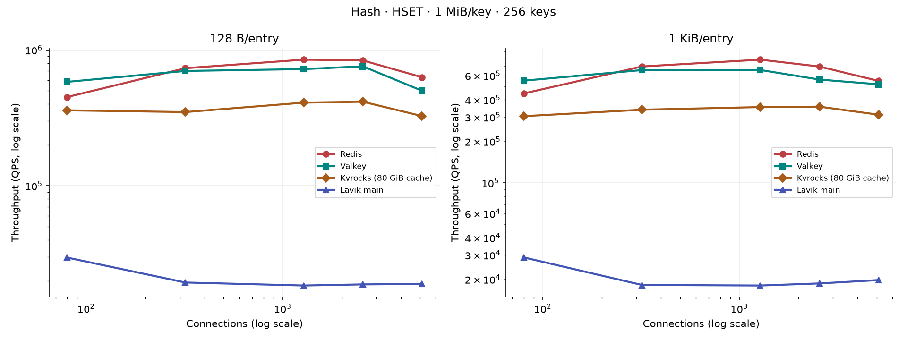
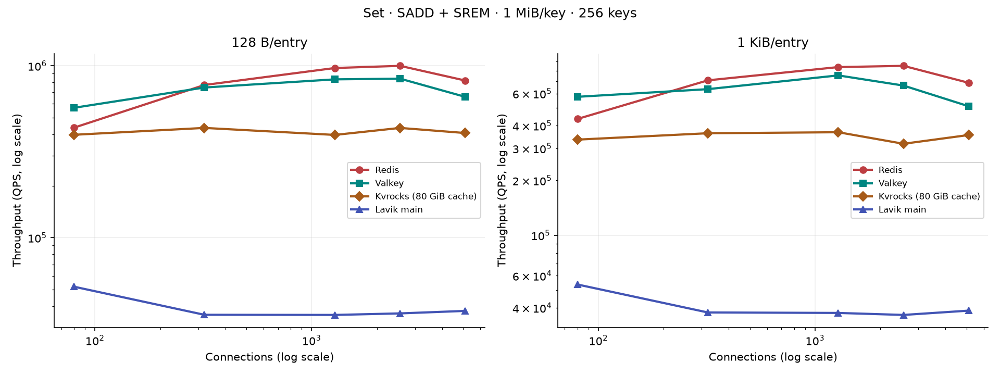
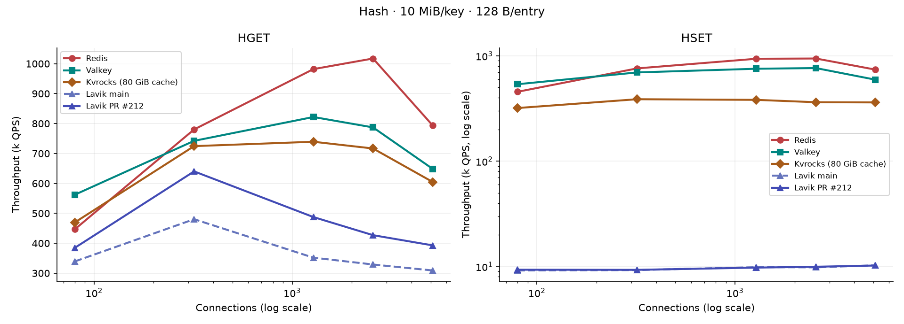
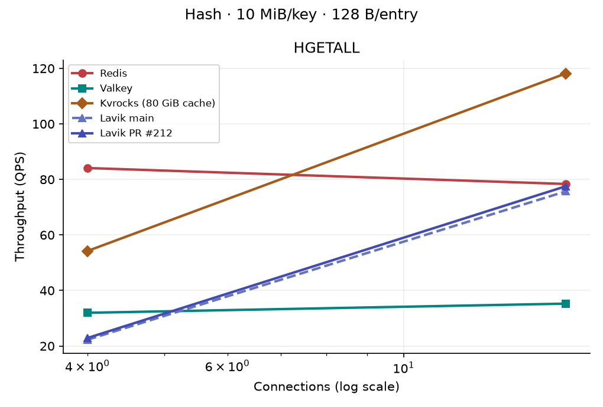
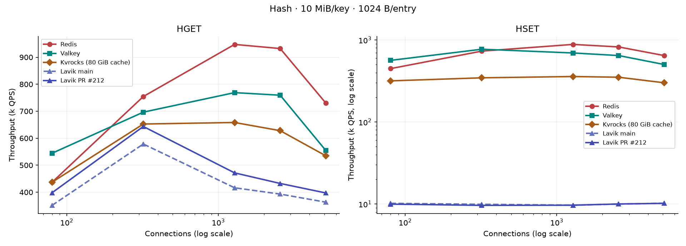
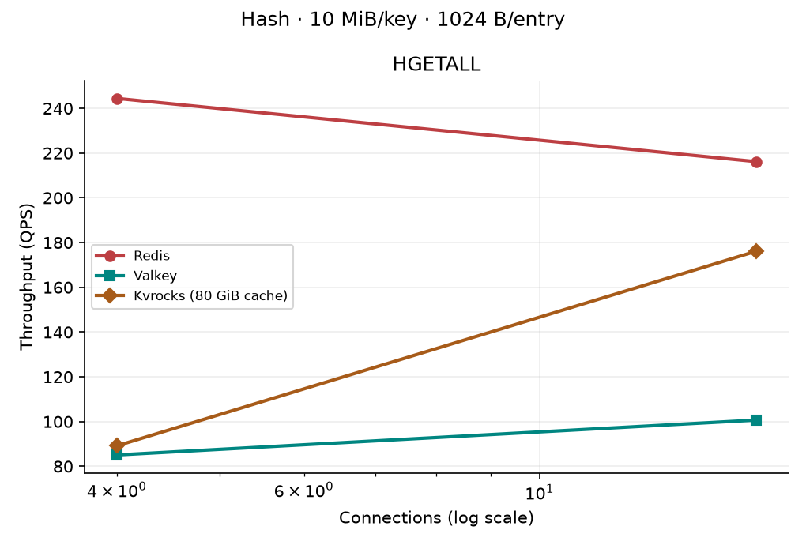
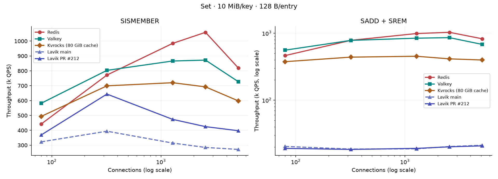
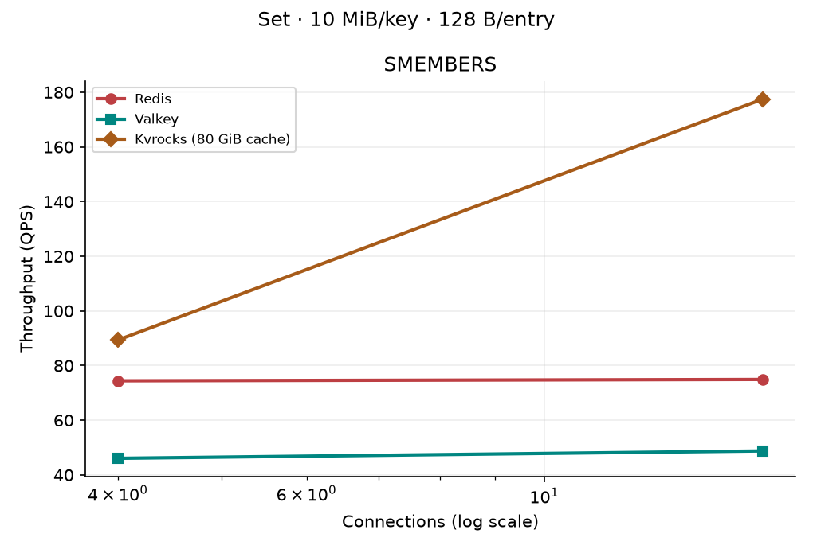
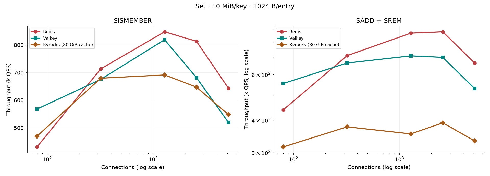
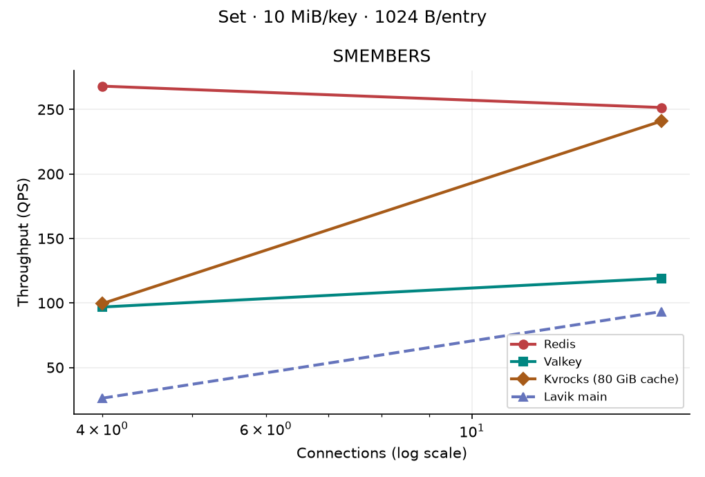

# Complex Redis collection performance: Redis, Valkey, Lavik, and Kvrocks

[简体中文](README.zh-CN.md)

This report compares five Redis-compatible collection types on one server and one
remote memtier client. Each chart fixes the collection type, logical payload per
key, and payload bytes per entry. The horizontal axis is simultaneous
connections; the vertical axis is completed commands per second.

## 2026-09-29 grouped Hash and Set retest

Only `main` after merged [PR #212](https://github.com/eloqdata/lavik/pull/212)
is plotted for Lavik. The 1 MiB run uses commit `bde3120e` and a SPDK
RelWithDebInfo binary with SHA256
`1acecaa40948d473caedce591d1a775d3d910b260a50b38a68f25bf946a4546e`.
The three peers have completed 10 MiB and 100 MiB runs; the merged main has
not yet been measured at those sizes. Those charts currently show peers only,
and tables mark missing Lavik points with `—`. Earlier main and PR #212 raw
runs remain in `raw/` but are not represented as current main results.

The 1 MiB and 10 MiB runs use 64 keys; 100 MiB uses eight. Entry sizes are
128 B and 1 KiB. Point commands use 80/320/1280/2560/5120 connections;
full reads use 16/80 for 1 MiB, 4/16 for 10 MiB, and 1/4/16 for 100 MiB.
Each point runs for eight seconds. Redis and Valkey disable persistence;
Kvrocks uses uncompressed RAID0, WAL disabled, an 80 GiB block cache and
blob cache. Lavik commits to six NVMe devices via SPDK. These settings affect
absolute write throughput.

At 320 connections, values below are thousands of commands per second. Each
row lists all four products; missing Lavik points will be filled after their
matched runs complete.

| Type | Per key | Entry | Read | Redis | Valkey | Kvrocks | Lavik main |
|---|---:|---:|---|---:|---:|---:|---:|
| Hash | 1 MiB | 128 B | HGET | 763.0 | 741.3 | 750.8 | 677.3 |
| Hash | 1 MiB | 1 KiB | HGET | 715.5 | 721.8 | 725.7 | 741.4 |
| Hash | 10 MiB | 128 B | HGET | 780.3 | 742.2 | 724.5 | — |
| Hash | 10 MiB | 1 KiB | HGET | 754.4 | 696.6 | 652.6 | — |
| Hash | 100 MiB | 128 B | HGET | 779.4 | 785.4 | 663.1 | — |
| Hash | 100 MiB | 1 KiB | HGET | 744.8 | 736.4 | 644.3 | — |
| Set | 1 MiB | 128 B | SISMEMBER | 768.0 | 854.3 | 715.8 | 675.5 |
| Set | 1 MiB | 1 KiB | SISMEMBER | 694.3 | 656.2 | 680.7 | 724.4 |
| Set | 10 MiB | 128 B | SISMEMBER | 771.7 | 803.1 | 699.2 | — |
| Set | 10 MiB | 1 KiB | SISMEMBER | 713.3 | 675.3 | 679.5 | — |
| Set | 100 MiB | 128 B | SISMEMBER | 778.5 | 781.2 | 646.2 | — |
| Set | 100 MiB | 1 KiB | SISMEMBER | 701.6 | 679.5 | 615.2 | — |

The 1 MiB/64-key HGET and SISMEMBER points use merged main. Lavik's
larger-key point and full reads are pending. No data-page cache was added.

| Type | Per key | Entry | Write | Redis | Valkey | Kvrocks | Lavik main |
|---|---:|---:|---|---:|---:|---:|---:|
| Hash | 1 MiB | 128 B | HSET | 734.7 | 804.3 | 371.6 | 9.4 |
| Hash | 1 MiB | 1 KiB | HSET | 711.4 | 660.5 | 369.4 | 9.6 |
| Hash | 10 MiB | 128 B | HSET | 759.0 | 695.2 | 387.1 | — |
| Hash | 10 MiB | 1 KiB | HSET | 731.0 | 770.8 | 345.4 | — |
| Hash | 100 MiB | 128 B | HSET | 746.4 | 727.4 | 318.4 | — |
| Hash | 100 MiB | 1 KiB | HSET | 729.7 | 696.6 | 302.0 | — |
| Set | 1 MiB | 128 B | SADD + SREM | 763.1 | 758.0 | 440.8 | 18.8 |
| Set | 1 MiB | 1 KiB | SADD + SREM | 687.9 | 651.3 | 332.2 | 20.1 |
| Set | 10 MiB | 128 B | SADD + SREM | 782.2 | 781.1 | 439.2 | — |
| Set | 10 MiB | 1 KiB | SADD + SREM | 709.4 | 664.5 | 376.9 | — |
| Set | 100 MiB | 128 B | SADD + SREM | 765.3 | 770.1 | 354.2 | — |
| Set | 100 MiB | 1 KiB | SADD + SREM | 704.6 | 645.9 | 326.2 | — |

At 1 MiB/64 keys, merged main HSET is about 9.4–9.6k QPS and mixed
SADD/SREM about 18.8–20.1k QPS; the latter includes no-op replies.
The next section compares a larger hot-key set.

### Write retest with 256 hot keys

All four products were seeded with 256 keys of 1 MiB each, with 128 B and
1 KiB entries. Commands, eight-second measurements, connection counts, and
persistence settings match the 64-key runs above. Only the latest main
(`9acd7b6f`) is plotted for Lavik. At 320 connections, values are thousands
of completed commands per second:

| Type | Entry | Command | Redis | Valkey | Kvrocks | Lavik main |
|---|---:|---|---:|---:|---:|---:|
| Hash | 128 B | HSET | 733.3 | 699.9 | 348.8 | 19.2 |
| Hash | 1 KiB | HSET | 698.0 | 657.4 | 339.2 | 19.8 |
| Set | 128 B | SADD + SREM | 772.6 | 746.9 | 434.9 | 36.1 |
| Set | 1 KiB | SADD + SREM | 708.6 | 634.0 | 363.1 | 36.3 |

With 128 B entries, increasing hot keys from 64 to 256 raised Lavik's
320-connection HSET from about 9.4k to 19.2k QPS and SADD/SREM from 18.8k
to 36.1k. Both remain far below Kvrocks. At 80 connections, Lavik HSET
reached 29.7k QPS, then fell to 19.2k at 320 connections. The charts use
logarithmic throughput axes to retain the full four-product gap.





The [complete points](write-256.csv), [plot script](plot_write_256.py), and
raw [Redis](raw/redis-1m-k256-write-20260929/),
[Valkey](raw/valkey-1m-k256-write-20260929/),
[Kvrocks](raw/kvrocks-1m-k256-write-20260929/), and
[Lavik](raw/lavik-main9acd-1m-k256-20260929/) runs retain the evidence.

Earlier write-path and HGETALL memory investigations remain available in the [HSET diagnostic](diagnostics/hset-20260929/README.md) and [HGETALL memory investigation](diagnostics/hgetall-oom-20260929/README.md); they are not current-main measurements. Each point has one run, without a confidence interval. The [current CSV](set-hash-ab.csv), [raw runs](raw/), and [plot script](plot_set_hash_ab.py) retain the evidence.

### Hash / 1 MiB / 128 B


### Hash / 1 MiB / 1 KiB


### Hash / 10 MiB / 128 B





### Hash / 10 MiB / 1 KiB





### Hash / 100 MiB / 128 B


### Hash / 100 MiB / 1 KiB


### Set / 1 MiB / 128 B


### Set / 1 MiB / 1 KiB


### Set / 10 MiB / 128 B





### Set / 10 MiB / 1 KiB





### Set / 100 MiB / 128 B


### Set / 100 MiB / 1 KiB


## Workloads

| Type | Point read | Write | Full read | Write behavior |
|---|---|---|---|---|
| Hash | HGET | HSET | HGETALL | Overwrite an existing field with a new value |
| Set | SISMEMBER | SADD + SREM | SMEMBERS | Toggle one member; the two commands have an equal ratio |
| List | LINDEX | LSET | LRANGE 0 -1 | Overwrite an existing element |
| Sorted Set | ZSCORE | ZINCRBY | ZRANGE WITHSCORES | Increment the score of an existing member |
| Stream | Exact-ID XRANGE | XADD MAXLEN ~ N | XRANGE - + | Append and approximately trim to the seeded length |

For positional reads and overwrites, memtier cycles through eight evenly spaced
entry positions per key. The 64 KiB, 1 MiB, and new 10 MiB conditions use
64 keys; the 100 MiB extension uses eight keys. Each operation chooses a key uniformly
within its condition. Each field value, member, or element is exactly 128 B
or 1 KiB.
Stream field names and collection metadata are extra. All seeded entries and
sample payloads are checked before measurement. Cardinality is checked after
the write sweep. Set toggle commands can return no-op results when their
randomly chosen key is already in the target state, so their throughput is the
combined command rate, not the rate of durable mutations.

## Test configuration

- Server: 172.16.0.4, 16 vCPUs on AMD EPYC 9V74, CPUs 0–15, 100 Gb/s NIC.
  Redis 8.8.0 and Valkey 9.1.0 use 12 I/O
  threads, with RDB and AOF disabled. Lavik uses 12 workers, kernel TCP, and
  six dedicated SPDK NVMe devices. These are different durability settings.
- Lavik binary: source commit `646a7b4e` from [PR #203](https://github.com/eloqdata/lavik/pull/203),
  SHA256 `d98624e48eeac1aa942435f53e3c0f56882022f1f2184ae0bc415dfe5e31870a`;
  the upstream `main` HEAD was `9e31d073` when testing began. The 100 MiB
  extension reuses this exact binary so differences from the original sizes
  are not confounded by a source change.
- Kvrocks uses the same configuration at all three sizes. Its 64 KiB and
  1 MiB points were measured on 2026-09-27 in a later pass with identical
  workload settings. The saved configuration enables an 80 GiB RocksDB block
  cache and blob caching; its hot-read QPS therefore includes a large memory
  cache, unlike Lavik's data-page path.
- Client: 172.16.0.5, 16 vCPUs on AMD EPYC 9V45, memtier_benchmark 2.5.1,
  pipeline 1, random key selection, and eight seconds per point. Point
  operations use 16 client threads and 80/320/1280/2560/5120 connections.
  Full reads use 16/80 connections for 64 KiB and 1 MiB, and 1/4/16 for
  100 MiB; the client thread count is capped by the connection count.
- Each condition is filled from scratch using eight concurrent RESP clients.
  Reads run before writes, and writes preserve approximately the original
  collection length. The same keys are used at all connection levels within
  a condition. The 100 MiB fill batches 64 commands per client connection.
- Logical sizes describe payload bytes only, not Redis memory usage or Lavik
  disk consumption. These deliberately hot keys expose contention; they do
  not represent a large key population.
- QPS and latency come from memtier's JSON output. The script rejects
  connection errors, interrupted runs, and server error responses.

## Results

All 960 combinations at 64 KiB and 1 MiB completed across the four products.
The 100 MiB extension has 519 valid results out of 520 attempted combinations;
Lavik's 128 B Set `SMEMBERS` at 16
connections reproducibly returned `OOM grouped operation scratch admission`.
The source-of-truth measurements are
[results.csv](results.csv), the per-run JSON and command logs under [raw/](raw/),
and the plotting script [collect_plot.py](collect_plot.py). Each point is one
eight-second run; these are measured QPS, not confidence intervals.

For 1 MiB collections, the point-read peak usually occurs by 320 connections
for Lavik, whereas Redis often continues rising to 1280–2560. In the
128 B-element case Lavik reaches 502k HGET, 408k SISMEMBER, 139k LINDEX,
and 378k ZSCORE QPS. At 5120 connections, queueing raises p99 sharply; for example,
Lavik's 1 MiB/128 B HGET falls to 316k QPS with 127 ms p99, versus its
502k-QPS peak with 1.9 ms p99 at 320 connections. Redis's Hash/Set/ZSet
peak points use roughly 15 of the client's 16 CPU cores, so their upper-end
curves also reflect client capacity.

Full reads tell a different story. At 80 connections with 1 MiB/128 B data,
Lavik's HGETALL (1,524 QPS), SMEMBERS (1,544), and ZRANGE WITHSCORES (1,488)
are at or above Redis, while LRANGE (949) is lower.
With 1 KiB elements, Lavik and Redis both receive about 2.8 GiB/s on several
1 MiB full-read commands; those points are close to this setup's observed
response-bandwidth plateau.

Writes should be read with the durability settings in mind: Redis and Valkey
have RDB/AOF disabled, Kvrocks has WAL disabled, and Lavik commits to SPDK.
Lavik's HSET, LSET,
and ZINCRBY are mostly 5k–7k QPS at 80 connections. More
connections do little for their QPS and bring p99 into seconds. The Set
SADD/SREM row is a command-rate measurement and can include no-op replies.

### Peak point-read QPS; connection count in parentheses

| Type | Element | Command | Redis | Valkey | Lavik | Kvrocks |
|---|---:|---|---:|---:|---:|---:|
| Hash | 128 B | HGET | 1,001,626 (2560) | 837,629 (2560) | 502,460 (320) | 769,372 (1280) |
| Hash | 1 KiB | HGET | 968,662 (2560) | 931,407 (2560) | 645,839 (320) | 762,361 (1280) |
| Set | 128 B | SISMEMBER | 1,038,463 (2560) | 908,383 (1280) | 408,024 (320) | 742,570 (1280) |
| Set | 1 KiB | SISMEMBER | 815,565 (1280) | 837,087 (2560) | 501,939 (320) | 684,015 (1280) |
| List | 128 B | LINDEX | 753,041 (2560) | 682,135 (320) | 138,566 (80) | 736,307 (1280) |
| List | 1 KiB | LINDEX | 795,571 (1280) | 669,135 (1280) | 677,413 (320) | 712,042 (1280) |
| Sorted Set | 128 B | ZSCORE | 989,218 (2560) | 857,403 (2560) | 378,358 (320) | 723,626 (1280) |
| Sorted Set | 1 KiB | ZSCORE | 800,531 (1280) | 824,607 (1280) | 453,124 (320) | 693,107 (1280) |

### Write-command QPS at 80 connections

| Type | Element | Command | Redis | Valkey | Lavik | Kvrocks |
|---|---:|---|---:|---:|---:|---:|
| Hash | 128 B | HSET | 445,582 | 541,152 | 6,471 | 344,105 |
| Hash | 1 KiB | HSET | 438,749 | 532,240 | 6,436 | 335,743 |
| Set | 128 B | SADD + SREM | 449,673 | 560,382 | 13,287 | 369,514 |
| Set | 1 KiB | SADD + SREM | 436,456 | 537,995 | 13,137 | 357,828 |
| List | 128 B | LSET | 426,554 | 483,039 | 6,319 | 342,282 |
| List | 1 KiB | LSET | 430,357 | 466,391 | 6,575 | 327,471 |
| Sorted Set | 128 B | ZINCRBY | 402,062 | 531,647 | 6,102 | 235,031 |
| Sorted Set | 1 KiB | ZINCRBY | 407,553 | 490,732 | 6,445 | 181,761 |

### Full-read QPS at 80 connections

| Type | Element | Command | Redis | Valkey | Lavik | Kvrocks |
|---|---:|---|---:|---:|---:|---:|
| Hash | 128 B | HGETALL | 1,137 | 295 | 1,524 | 1,855 |
| Hash | 1 KiB | HGETALL | 2,771 | 1,235 | 2,807 | 2,799 |
| Set | 128 B | SMEMBERS | 999 | 464 | 1,544 | 2,702 |
| Set | 1 KiB | SMEMBERS | 2,847 | 1,252 | 2,846 | 2,844 |
| List | 128 B | LRANGE | 2,322 | 938 | 949 | 2,702 |
| List | 1 KiB | LRANGE | 2,849 | 1,073 | 1,380 | 2,843 |
| Sorted Set | 128 B | ZRANGE | 1,441 | 537 | 1,488 | 1,943 |
| Sorted Set | 1 KiB | ZRANGE | 2,823 | 1,035 | 2,824 | 2,819 |

### Focused backlog-limit experiment

The default 8 MiB per-worker Tx backlog was compared with 64 MiB for the
1 MiB Hash, 128 B field value, HSET. The larger limit eliminated measured
backlog waits but did not materially increase throughput. The default remains
8 MiB.

At 80 connections, 8 MiB yielded 6,471 QPS and 304 backlog waits, while
64 MiB yielded 6,281 QPS and no waits. At 320 connections the corresponding
figures were 6,446 QPS/582 waits and 6,425 QPS/no waits; at 2,560 they were
7,018 QPS/3,899 waits and 7,128 QPS/no waits. This is a Lavik-only A/B
experiment, separate from the four-product comparison tables.

The large List point-read gap is worth profiling separately. Current code
binary-searches the ordered page directory by rank, then
[loads and decodes the selected page](../../src/storage/engine/grouped_list.cpp)
into individual strings. It does not scan the entire List for LINDEX. The
8,192-entry 1 MiB/128 B List reaches only 139k peak LINDEX QPS, versus
677k for the 1,024-entry 1 MiB/1 KiB List. Per-page decoding and allocation
are plausible contributors, not a measured root cause.

### Charts

Point charts use a logarithmic connection axis and a logarithmic QPS axis
for writes, because persistent Lavik writes are two orders of magnitude
below the memory-only peers. The 100 MiB Stream point-read axes are also
logarithmic to keep every product visible. Full-read charts use linear axes.

These charts directly show point reads and writes, followed by full reads, for each size and element width.

#### Hash / 64 KiB / 128 B


#### Hash / 64 KiB / 1 KiB


#### Hash / 1 MiB / 128 B


#### Hash / 1 MiB / 1 KiB


#### Set / 64 KiB / 128 B


#### Set / 64 KiB / 1 KiB


#### Set / 1 MiB / 128 B


#### Set / 1 MiB / 1 KiB


#### List / 64 KiB / 128 B


#### List / 64 KiB / 1 KiB


#### List / 1 MiB / 128 B


#### List / 1 MiB / 1 KiB


#### Sorted Set / 64 KiB / 128 B


#### Sorted Set / 64 KiB / 1 KiB


#### Sorted Set / 1 MiB / 128 B


#### Sorted Set / 1 MiB / 1 KiB


### Interpretation limits

- The original 64 keys and extension's eight keys are intentionally hot.
  Each point is one eight-second run;
  there are no repeat-based uncertainty bounds or cold-cache measurements.
- Logical sizes count element payload only. Field names, scores, stream metadata,
  protocol framing, allocator overhead, and Lavik page/index bytes are extra.
- Set SADD/SREM uses equal command ratios on independently random keys and may
  return no-op results. Stream XADD uses approximate MAXLEN, so its physical
  write work and retained message count can vary slightly.
- Redis/Valkey persistence and Kvrocks WAL are disabled, unlike Lavik's SPDK
  commits. Write QPS is a configuration comparison, not equal-durability throughput.
- The 1 MiB/128 B Stream seed requires 524,288 XADD commands for 64 keys;
  filling is outside the memtier timing. See each `*.fill.json` for elapsed time.
  Dataset order was fixed rather than randomized.

### 100 MiB per key extension

The added size is exactly 104,857,600 payload bytes per key, across eight
keys per condition. A 128 B element gives 819,200 entries per key; a 1 KiB
element gives 102,400. Stream uses one field per message, so these counts
also determine its XADD fill work. Metadata and protocol bytes are extra.
Apache Kvrocks v2.16.0 (source commit `28440b5`, binary SHA256
`e1b91029b6e1ac74034c946428345ce853a9ee5d1b3c851249efdf3d3a5b734f`)
is measured at all three sizes. Its configuration is in
[kvrocks-perf.conf](kvrocks-perf.conf); the six dedicated scratch NVMe devices
are combined as RAID0 with XFS, compression and WAL disabled, automatic
compaction enabled, and an 80 GiB block cache. The exact device checks and
setup commands are in [kvrocks_host.py](kvrocks_host.py).

### 100 MiB results

Peak single-element read QPS across the five connection levels (80–5120),
rounded to the nearest thousand:

| Type | Element | Redis | Valkey | Lavik | Kvrocks |
|---|---:|---:|---:|---:|---:|
| Hash | 128 B | 1,033k | 879k | 242k | 679k |
| Hash | 1 KiB | 988k | 933k | 362k | 662k |
| Set | 128 B | 1,045k | 908k | 208k | 655k |
| Set | 1 KiB | 878k | 873k | 269k | 622k |
| List | 128 B | 87k | 94k | 68k | 685k |
| List | 1 KiB | 55k | 47k | 66k | 699k |
| Sorted Set | 128 B | 1,038k | 990k | 210k | 667k |
| Sorted Set | 1 KiB | 862k | 708k | 255k | 648k |

Kvrocks has the highest large-List point-read rate in both element-size
conditions. Its 128 B `LINDEX` peak is 685k QPS, compared with 87k for Redis,
94k for Valkey, and 68k for Lavik.

At 16 connections Kvrocks completes 21 `SMEMBERS` full reads per second for
128 B elements; Redis and Valkey complete about four each. Lavik completes
about two at four connections but returns the scratch-admission OOM at 16,
on both the original run and a fresh-fill retry. The original and retry logs
are retained under [raw/lavik-100m/](raw/lavik-100m/). Other 100 MiB full reads
complete, but each point has only eight seconds of sampling and often fewer
than 100 replies; treat their small QPS differences cautiously.

For writes, Redis and Valkey have persistence disabled. Kvrocks has WAL
disabled but retains RocksDB flush and compaction; its 80 GiB cache can hold
the eight-key working set. Lavik commits to SPDK. The write curves compare
these exact configurations, not equivalent durability or cold-storage I/O.

### Embedded 100 MiB charts

#### Hash / 128 B


#### Hash / 1 KiB


#### Set / 128 B


#### Set / 1 KiB


#### List / 128 B


#### List / 1 KiB


#### Sorted Set / 128 B


#### Sorted Set / 1 KiB


## Stream

Lavik uses merged main `9acd7b6f` with the Stream optimization. Each of 64 hot keys holds 64 KiB or 1 MiB with 128 B or 1 KiB entries. The merged-main 100 MiB retest is pending. The horizontal axis is connection count and the vertical axis is QPS; each figure contains one Lavik main curve.

The table reports point reads and writes at 80 connections, and full reads at 16. Redis and Valkey have persistence disabled; Kvrocks has WAL disabled with an 80 GiB block cache; Lavik commits to SPDK. Write QPS reflects these configurations.

| Per key | Entry | Command | Connections | Redis | Valkey | Kvrocks | Lavik main |
|---|---|---|---:|---:|---:|---:|---:|
| 64 KiB | 128 B | Exact-ID `XRANGE` | 80 | 272,008 | 401,385 | 469,188 | 273,500 |
| 64 KiB | 128 B | `XADD MAXLEN` | 80 | 360,508 | 406,207 | 251,654 | 8,875 |
| 64 KiB | 128 B | Full `XRANGE - +` | 16 | 7,368 | 7,208 | 19,813 | 4,744 |
| 64 KiB | 1 KiB | Exact-ID `XRANGE` | 80 | 281,038 | 440,368 | 442,637 | 288,525 |
| 64 KiB | 1 KiB | `XADD MAXLEN` | 80 | 340,703 | 365,000 | 188,151 | 9,295 |
| 64 KiB | 1 KiB | Full `XRANGE - +` | 16 | 36,138 | 33,688 | 42,269 | 19,977 |
| 1 MiB | 128 B | Exact-ID `XRANGE` | 80 | 265,994 | 388,646 | 464,077 | 231,554 |
| 1 MiB | 128 B | `XADD MAXLEN` | 80 | 358,357 | 464,902 | 192,152 | 8,704 |
| 1 MiB | 128 B | Full `XRANGE - +` | 16 | 426 | 320 | 1,437 | 261 |
| 1 MiB | 1 KiB | Exact-ID `XRANGE` | 80 | 288,179 | 417,312 | 460,435 | 246,665 |
| 1 MiB | 1 KiB | `XADD MAXLEN` | 80 | 323,761 | 393,696 | 157,590 | 9,708 |
| 1 MiB | 1 KiB | Full `XRANGE - +` | 16 | 1,492 | 779 | 2,780 | 1,125 |

[All points](stream-latest.csv), the [plot script](plot_stream_latest.py), and [Lavik raw run](raw/lavik-main9acd-stream-small-20260929/) retain the evidence. Each point is one eight-second run. Older optimization-stage samples remain under `raw/` and are not plotted.

### Exact-ID `XRANGE`

#### 64 KiB per key


#### 1 MiB per key


### `XADD MAXLEN`

#### 64 KiB per key


#### 1 MiB per key


### Full `XRANGE - +`

#### 64 KiB per key


#### 1 MiB per key


## Reproduce

Run from this directory, with an otherwise idle benchmark server and client:

```bash
python3 run.py redis
python3 run.py valkey
python3 run.py redis --levels 16,80 --mode full
python3 run.py valkey --levels 16,80 --mode full
sudo python3 spdk_host.py prepare --discard-scratch
sudo python3 run.py lavik
sudo python3 run.py lavik --levels 16,80 --mode full
sudo python3 run.py lavik --tag backlog64 --types hash --sizes 1048576 \
  --fields 128 --levels 80,320,2560 --backlog-mb 64
sudo python3 spdk_host.py restore
sudo python3 kvrocks_host.py prepare --discard-scratch
python3 run.py kvrocks --sizes 65536,1048576 --fields 128,1024 --keys 64 \
  --mode both --levels 80,320,1280,2560,5120 --full-levels 16,80 \
  --seed-pipeline 64 --seconds 8 --continue-on-error
sudo python3 kvrocks_host.py restore
python3 -m venv .venv
.venv/bin/pip install -r requirements.txt
.venv/bin/python collect_plot.py
```

For the 100 MiB extension, run the four products serially on an idle server.
The six scratch drives are discarded separately for Lavik SPDK and Kvrocks
RAID0; both helpers verify their serial numbers and PCI addresses first.

```bash
large=(--tag 100m --sizes 104857600 --fields 128,1024 --keys 8 \
  --mode both --levels 80,320,1280,2560,5120 --full-levels 1,4,16 \
  --seed-pipeline 64 --seconds 8)
python3 run.py redis "${large[@]}"
python3 run.py valkey "${large[@]}"
sudo python3 spdk_host.py prepare --discard-scratch
sudo python3 run.py lavik "${large[@]}" --continue-on-error
sudo python3 spdk_host.py restore
sudo python3 kvrocks_host.py prepare --discard-scratch
python3 run.py kvrocks "${large[@]}" --continue-on-error
sudo python3 kvrocks_host.py restore
.venv/bin/python collect_plot.py
```

The SPDK preparation helper verifies the six dedicated controller serial
numbers and PCI addresses before discarding their scratch datasets. Do not
prepare devices that contain data to keep. Server commands, binary hashes,
memtier invocations, fill timings, validation checks, and per-run JSON are
committed under `raw/`. Console output is retained locally and omitted from
the branch because the JSON contains the measured data.

For the September 29 follow-up, build the two Lavik commits identified at the
top of this report and run `run.py lavik` for each binary with `--types hash,set`,
`--fields 128,1024`, `--mode both`, `--levels 80,320,1280,2560,5120`, and
`--seconds 8`. Use `--sizes 1048576 --keys 64 --full-levels 16,80` for the
1 MiB runs. For 100 MiB use `--sizes 104857600 --keys 8`,
`--seed-pipeline 64 --full-levels 1,4,16`, and `--continue-on-error`.
The four run tags are
`main-20260929`, `opt-20260929`, and their `-100m` variants. Pass the exact
source revision with `--source-commit`; the per-run provenance JSON records
both that revision and the binary SHA256. After restoring SPDK, regenerate the
new figures and CSV with `.venv/bin/python plot_set_hash_ab.py`.
