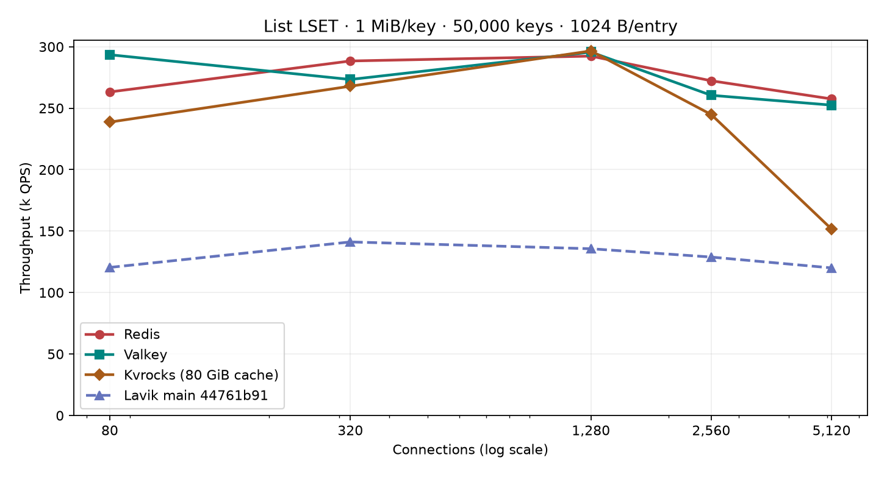
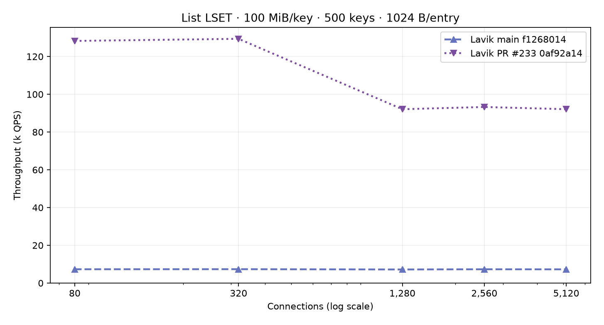
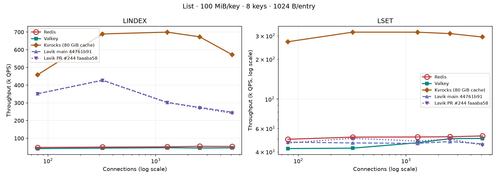
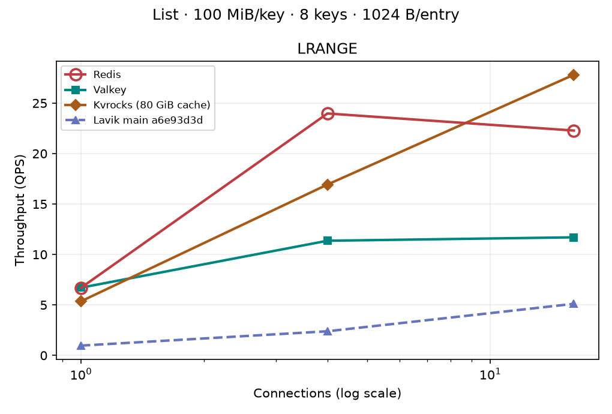
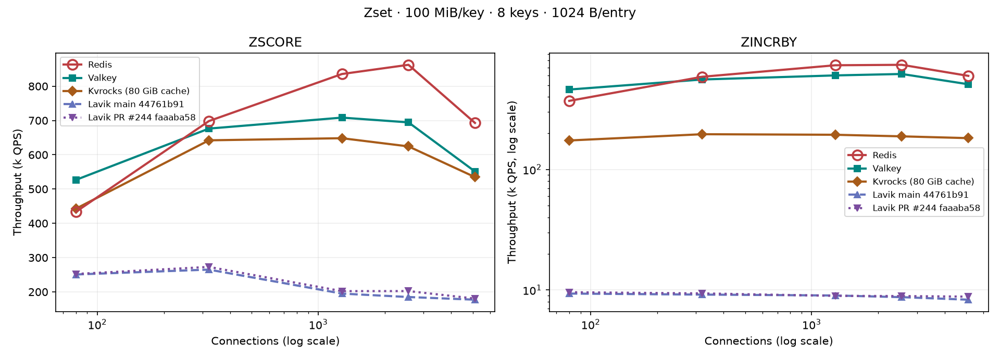
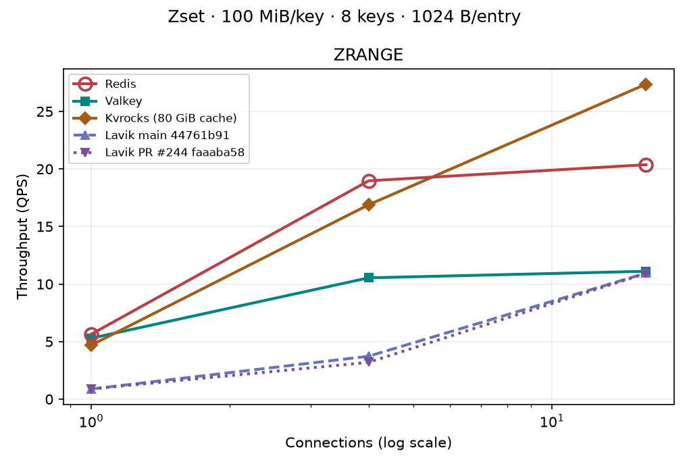

# 复杂数据结构性能：Redis、Valkey、Lavik 与 Kvrocks

[English](README.md)

本报告在同一台服务端和一台独立的 memtier 客户端上比较五类
Redis 兼容数据结构。每张图固定数据结构、每个 key 的逻辑数据量和
每个元素的字节数。横轴为连接数，纵轴为每秒完成的命令数。


**10 月 3 日 main 复测：`44761b91`（#235/#243 已合并），Hash/Set 已更新 8/8 组。每组完成后立即覆盖原图并推送；尚未完成的图标明实际旧版本。**

当前图已移除合并 PR #235 的独立曲线；待替换的 main 曲线仍为实测 `06562381`，不代表最新代码。List/Stream/ZSet 的旧版本补充负载仍保留原始版本说明。

Redis/Valkey 不持久化；Kvrocks 为无压缩 RAID0、关闭 WAL、80 GiB block/blob cache；Lavik 使用六块 NVMe SPDK 持久化。各库配置不同。版本见 [Hash/Set 清单](published-main.json)、[LSET 清单](lset-large-published.json)、[有序结构清单](ordered-published.json)。

[历史 HSET perf 诊断](diagnostics/shared-pipeline-20261001/hset-deep-diagnosis.md)：已补齐 12 个 worker 调用链，后续优化先减少重复索引查找、临时分配和页内重建。历史 PR 对比仅保存在原始测量与诊断文档中。


本轮测试盘序列号/PCI 地址与 10 月 1 日不同，已重新核对六块无挂载、无 RAID 占用的专用 NVMe；CPU 为 AMD EPYC 9V74、16 vCPU，仍使用 12 个服务 worker。其他三库保留历史同负载结果，不能把跨轮差值全部归因于代码。新 main 与后续优化会在本轮机器上直接比较。[本轮硬件与构建证明](diagnostics/main-refresh-20261003/host-and-build.json)。 [本轮 HSET 索引诊断与实测收益](diagnostics/main-refresh-20261003/index-publication-diagnosis.md)。


**后续优化：[PR #244](https://github.com/eloqdata/lavik/pull/244) 合并内联分组的物理坐标更新，减少索引路径和 64 项坐标页的重复复制；同时减少元数据分配和重复路由查找。已完成负载会直接加在四库图上，待测负载暂只显示实测 main。**

## List

本轮基线：main `06562381`，已包含合并的 #233。每档 LSET 图固定 key 数、每 key 大小、元素大小，并展示其他三库同规模结果。

### LSET：增加独立 key

1 MiB/key 使用 50,000 个 key，100 MiB/key 使用 500 个 key；本轮元素均为 1 KiB。每个版本独立灌入相同初始数据；10 月 1 日的新测量还会先清空专用测试盘。32 个导入连接、128 KiB RPUSH 批次、导入 pipeline=4；正式 memtier 为单元素 LSET、pipeline=1、每点 10 秒，覆盖 80/320/1280/2560/5120 连接。全部连接数测完后再单独运行 CPU 采样，采样测点不混入曲线。早期四库图使用不同 key 数量，保留在各自负载下。

#### 1 MiB/key × 50,000 keys



**最新 main `44761b91` 与 [PR #244](https://github.com/eloqdata/lavik/pull/244) `faaaba58` 同图，同时保留 Redis、Valkey、Kvrocks。** 50,000 keys × 1 MiB/key; 1024 B/entry. 两版本本轮同机独立清盘灌入，逐 key 前后校验通过，全部测点零错误。 [PR raw](raw/lavik-index-pr244-faaaba58-lset-list-1048576-k50000-f1024-20261003/) · [Main raw](raw/lavik-main44761-lset-list-1048576-k50000-f1024-20261003/).

#### 100 MiB/key × 500 keys



**最新 main `44761b91` 与 [PR #244](https://github.com/eloqdata/lavik/pull/244) `faaaba58` 同图，同时保留 Redis、Valkey、Kvrocks。** 500 keys × 100 MiB/key; 1024 B/entry. 两版本本轮同机独立清盘灌入，逐 key 前后校验通过，全部测点零错误。 [PR raw](raw/lavik-index-pr244-faaaba58-lset-list-104857600-k500-f1024-20261003/) · [Main raw](raw/lavik-main44761-lset-list-104857600-k500-f1024-20261003/).


<details>
<summary>LINDEX / LSET：较少 key 的补充负载（展开）</summary>

### LINDEX / LSET

#### 64 KiB


#### 1 MiB


#### 100 MiB




**待复测：图中 Lavik main 为实测 `06562381`；已移除合并 PR #235 曲线。**

</details>

### LRANGE 0 -1

#### 64 KiB


#### 1 MiB


#### 100 MiB




1 MiB/128 B 的 `LINDEX` 中，Lavik 峰值约 139k QPS；1 KiB 元素时约 677k。该差距与页内元素个数相关，但尚无足够剖析证据把它归因于单一操作。

## Hash

### HGET / HSET

#### 1 MiB


**最新 main `44761b91` 与 [PR #244](https://github.com/eloqdata/lavik/pull/244) `faaaba58` 同图，同时保留 Redis、Valkey、Kvrocks。** 50,000 keys × 1 MiB/key; 128 B/entry. 两版本本轮同机独立清盘灌入，逐 key 前后校验通过，全部测点零错误。 [PR raw](raw/lavik-index-pr244-faaaba58-hashset-hash-1048576-k50000-f128-20261003/) · [Main raw](raw/lavik-main44761-hashset-hash-1048576-k50000-f128-20261003/).


**最新 main `44761b91` 与 [PR #244](https://github.com/eloqdata/lavik/pull/244) `faaaba58` 同图，同时保留 Redis、Valkey、Kvrocks。** 50,000 keys × 1 MiB/key; 1024 B/entry. 两版本本轮同机独立清盘灌入，逐 key 前后校验通过，全部测点零错误。 [PR raw](raw/lavik-index-pr244-faaaba58-hashset-hash-1048576-k50000-f1024-20261003/) · [Main raw](raw/lavik-main44761-hashset-hash-1048576-k50000-f1024-20261003/).

#### 100 MiB


**最新 main `44761b91` 与 [PR #244](https://github.com/eloqdata/lavik/pull/244) `faaaba58` 同图，同时保留 Redis、Valkey、Kvrocks。** 500 keys × 100 MiB/key; 128 B/entry. 两版本本轮同机独立清盘灌入，逐 key 前后校验通过，全部测点零错误。 [PR raw](raw/lavik-index-pr244-faaaba58-hashset-hash-104857600-k500-f128-20261003/) · [Main raw](raw/lavik-main44761-hashset-hash-104857600-k500-f128-20261003/).


**最新 main `44761b91` 与 [PR #244](https://github.com/eloqdata/lavik/pull/244) `faaaba58` 同图，同时保留 Redis、Valkey、Kvrocks。** 500 keys × 100 MiB/key; 1024 B/entry. 两版本本轮同机独立清盘灌入，逐 key 前后校验通过，全部测点零错误。 [PR raw](raw/lavik-index-pr244-faaaba58-hashset-hash-104857600-k500-f1024-20261003/) · [Main raw](raw/lavik-main44761-hashset-hash-104857600-k500-f1024-20261003/).

### HGETALL

#### 1 MiB


#### 100 MiB


### 批量导入（HSET）

#### 1 MiB / 1024 B


历史导入测量：Lavik main `ebe28dd5`，未在本轮 main 更新中重测。

四库统一用 HSET，每条 16 个元素、8 个连接、pipeline 64；main 灌入耗时 **500.3 秒**。持久化配置仍不同。

#### 1 MiB / 128 B


历史导入测量：Lavik main `ebe28dd5`，未在本轮 main 更新中重测。

四库统一用 HSET，每条 128 个元素、8 个连接、pipeline 64；main 灌入耗时 **1306.3 秒**。持久化配置仍不同。

### RESTORE

本轮独立预置计时：1 MiB 为 50,000 个 key、32 个客户端；100 MiB 为 500 个 key、8 个客户端。只包含 RESTORE 灌入，不包含随后清理和恢复；不与三库的 HSET/SADD 导入计时混比。

此组保留实际 main `06562381` 测量，等待最新 main 复测。

此组保留实际 main `06562381` 测量，等待最新 main 复测。

此组保留实际 main `06562381` 测量，等待最新 main 复测。

此组保留实际 main `06562381` 测量，等待最新 main 复测。

## Set

### SISMEMBER / SADD + SREM

#### 1 MiB


**最新 main `44761b91` 与 [PR #244](https://github.com/eloqdata/lavik/pull/244) `faaaba58` 同图，同时保留 Redis、Valkey、Kvrocks。** 50,000 keys × 1 MiB/key; 128 B/entry. 两版本本轮同机独立清盘灌入，逐 key 前后校验通过，全部测点零错误。 [PR raw](raw/lavik-index-pr244-faaaba58-hashset-set-1048576-k50000-f128-20261003/) · [Main raw](raw/lavik-main44761-hashset-set-1048576-k50000-f128-20261003/).


**最新 main `44761b91` 与 [PR #244](https://github.com/eloqdata/lavik/pull/244) `faaaba58` 同图，同时保留 Redis、Valkey、Kvrocks。** 50,000 keys × 1 MiB/key; 1024 B/entry. 两版本本轮同机独立清盘灌入，逐 key 前后校验通过，全部测点零错误。 [PR raw](raw/lavik-index-pr244-faaaba58-hashset-set-1048576-k50000-f1024-20261003/) · [Main raw](raw/lavik-main44761-hashset-set-1048576-k50000-f1024-20261003/).

#### 100 MiB


**最新 main `44761b91` 与 [PR #244](https://github.com/eloqdata/lavik/pull/244) `faaaba58` 同图，同时保留 Redis、Valkey、Kvrocks。** 500 keys × 100 MiB/key; 128 B/entry. 两版本本轮同机独立清盘灌入，逐 key 前后校验通过，全部测点零错误。 [PR raw](raw/lavik-index-pr244-faaaba58-hashset-set-104857600-k500-f128-20261003/) · [Main raw](raw/lavik-main44761-hashset-set-104857600-k500-f128-20261003/).


**最新 main `44761b91` 与 [PR #244](https://github.com/eloqdata/lavik/pull/244) `faaaba58` 同图，同时保留 Redis、Valkey、Kvrocks。** 500 keys × 100 MiB/key; 1024 B/entry. 两版本本轮同机独立清盘灌入，逐 key 前后校验通过，全部测点零错误。 [PR raw](raw/lavik-index-pr244-faaaba58-hashset-set-104857600-k500-f1024-20261003/) · [Main raw](raw/lavik-main44761-hashset-set-104857600-k500-f1024-20261003/).

### SMEMBERS

#### 1 MiB


#### 100 MiB


历史 100 MiB / 128 B、16 连接的持续 SMEMBERS 复测出现过内存准入拒绝；八秒成功点不代表持续并发稳定。[失败原始记录](raw/lavik-fullcheck-maina6d-set-100m-k500-f128-20260930/)。

### 批量导入（SADD）

#### 1 MiB / 1024 B


历史导入测量：Lavik main `ebe28dd5`，未在本轮 main 更新中重测。

四库统一用 SADD，每条 16 个元素、8 个连接、pipeline 64；main 灌入耗时 **517.9 秒**。持久化配置仍不同。

#### 1 MiB / 128 B


历史导入测量：Lavik main `ebe28dd5`，未在本轮 main 更新中重测。

四库统一用 SADD，每条 128 个元素、8 个连接、pipeline 64；main 灌入耗时 **1724.2 秒**。持久化配置仍不同。


100 MiB 的同命令 SADD 导入尚无本轮完整结果。
此前 Lavik RESTORE 与其他数据库 SADD 混用的对比图已撤下。

### RESTORE

本轮独立预置计时：1 MiB 为 50,000 个 key、32 个客户端；100 MiB 为 500 个 key、8 个客户端。只包含 RESTORE 灌入，不包含随后清理和恢复；不与三库的 HSET/SADD 导入计时混比。

此组保留实际 main `06562381` 测量，等待最新 main 复测。

此组保留实际 main `06562381` 测量，等待最新 main 复测。

此组保留实际 main `06562381` 测量，等待最新 main 复测。

此组保留实际 main `06562381` 测量，等待最新 main 复测。

## 工作负载

按位置读取和覆盖时，memtier 轮流访问每个 key 内均匀分布的八个位置。
原先的 64 KiB、1 MiB 条件使用 64 个 key；100 MiB 条件使用八个 key。
本轮 Hash/Set 使用 1 MiB/50,000 key、100 MiB/500 key。每个命令在当前条件的 key 中均匀随机选取一个。每个 field
value、member 或元素为 128 B 或 1 KiB。Stream 的字段名和各结构元数据
不计入逻辑 payload。测量前检查元素数量和抽样内容，写入后再次检查元素
数量。Set 的增删在随机命中相同 key 时可能产生空操作，因此该项目报告
两种命令合计的 QPS，而不是实际持久化修改的 QPS。

本轮 Hash/Set 新 main 测量独立预置并重启恢复；每种条件依次执行完整读取、点查和写入。不同连接数的写入会改变被访问字段的值和物理布局。

## 测试配置

- 服务端 172.16.0.4，AMD EPYC 9V74 的 16 个 vCPU（0–15），100 Gb/s 网卡。
  Redis 8.8.0 与 Valkey 9.1.0 使用
  12 个 I/O 线程，关闭 RDB/AOF；Lavik 使用 12 个 worker、内核 TCP
  和六块专用 SPDK NVMe。三者的持久化配置不同。
- List 和 Sorted Set 的 100 MiB / 1 KiB 使用各图注明的 main 版本；其余条件仍是早期 [PR #203](https://github.com/eloqdata/lavik/pull/203) 的
  `646a7b4e` 二进制；Hash/Set 与 Stream 的当前 main 版本在各自章节注明。
  不同版本的数据不组成一条 Lavik 曲线。
- Kvrocks 使用 16 个 worker，各大小档位使用相同缓存与压缩配置。List、Sorted Set 的 64 KiB 与
  1 MiB 于 2026-09-27 后补测；Hash/Set 使用本轮 key 数重新填充。
  保存的配置启用了 80 GiB RocksDB
  block cache 和 blob cache；它的热读 QPS 因而包含大容量内存缓存的收益，
  与 Lavik 的数据页读取路径不同。
- 批量导入由服务端本机的 Python 客户端发送；点查和写命令的 QPS 使用下面独立主机上的 memtier。新的导入对比共用预编码的元素字节，仍保持相同 RESP 命令、连接数和 pipeline。
- 客户端 172.16.0.5，AMD EPYC 9V45 的 16 个 vCPU，memtier_benchmark 2.5.1，
  pipeline 1、随机选 key，每个点测八秒。点查和写入用 16 个客户端线程、
  80/320/1280/2560/5120 个连接；64 KiB 和 1 MiB 完整读取用 16/80
  个连接，100 MiB 完整读取用 1/4/16 个连接，客户端线程数不超过连接数。
- 每种条件由访问不同 key 的并发 RESP 客户端重新填充；旧运行默认八个，
  新运行的并发数、每条预填充命令的目标字节数与 pipeline 保存在 provenance JSON 中。
  先读后写，写入过程使结构长度
  基本保持在初始水平；同一条件下不同连接数访问相同的 key。100 MiB 条件
  的每个预填充连接使用有界 pipeline，准确深度见各次 provenance。
- 这里的大小只计算 payload 字节，不等于 Redis 内存占用或 Lavik 磁盘用量。
  List、Sorted Set 和 Stream 的早期 64-key 图会显露单对象竞争；Hash/Set 使用本轮标注的 key 数。
- QPS 和延迟来自 memtier JSON；脚本拒绝连接错误、中断和服务端错误。

## Sorted Set

此组保留实际 main `06562381` 测量，等待最新 main 复测。

### ZSCORE / ZINCRBY

#### 64 KiB


#### 1 MiB


#### 100 MiB




**最新 main `44761b91` 与 [PR #244](https://github.com/eloqdata/lavik/pull/244) `faaaba58` 同图，同时保留 Redis、Valkey、Kvrocks。** 8 keys × 100 MiB/key; 1024 B/entry. 两版本本轮同机独立清盘灌入，逐 key 前后校验通过，全部测点零错误。 [PR raw](raw/lavik-index-pr244-faaaba58-ordered-zset-104857600-k8-f1024-20261003/) · [Main raw](raw/lavik-main44761-ordered-zset-104857600-k8-f1024-20261003/).


### ZRANGE WITHSCORES

#### 64 KiB


#### 1 MiB


#### 100 MiB




## 测量边界

每点运行八秒、只测一次，QPS 没有重复测量置信区间。Redis/Valkey 关闭持久化，Kvrocks 关闭 WAL 并使用 80 GiB block cache，Lavik 向 SPDK 提交；写入曲线不可解释为同等持久性下的排名。100 MiB 的全量读取有些测点不足 100 次完成回复，小差异不宜过度解释。

[HGETALL 内存调查](diagnostics/hgetall-oom-20260929/README.md)和 [HSET 写入诊断](diagnostics/hset-20260929/README.md)保存了问题分析；Hash/Set 的旧版测点仍在 `raw/`，不作为当前 main 的曲线。

## Stream

此组保留实际 main `06562381` 测量，等待最新 main 复测。

点查和写入覆盖 80–5120 连接；小档完整读取覆盖 16/80 连接，100 MiB 档覆盖 1/4/16 连接。Redis 和 Valkey 关闭持久化，Kvrocks 关闭 WAL 且启用 80 GiB block cache，Lavik 提交到 SPDK；写入结果反映这些具体配置。

[小档测点及历史 100 MiB 测点](stream-latest.csv)、[当前 100 MiB 测点](stream-104857600-1024-current.csv)、[当前绘图来源](ordered-published.json)；Lavik [小档](raw/lavik-main9acd-stream-small-20260929/)与 [100 MiB 档](raw/lavik-ordered-pipeline-main-stream-100m-k8-f1024-20261001/)的原始记录可复核各点。每点八秒、只测一次；旧优化阶段的结果保留在 `raw/`，不参与当前图表。

### 指定 ID `XRANGE`

#### 64 KiB


#### 1 MiB


#### 100 MiB


### `XADD MAXLEN`

#### 64 KiB


#### 1 MiB


#### 100 MiB


**最新 main `44761b91` 与 [PR #244](https://github.com/eloqdata/lavik/pull/244) `faaaba58` 同图，同时保留 Redis、Valkey、Kvrocks。** 8 keys × 100 MiB/key; 1024 B/entry. 两版本本轮同机独立清盘灌入，逐 key 前后校验通过，全部测点零错误。 [PR raw](raw/lavik-index-pr244-faaaba58-ordered-stream-104857600-k8-f1024-20261003/) · [Main raw](raw/lavik-main44761-ordered-stream-104857600-k8-f1024-20261003/).


### 全范围 `XRANGE - +`

#### 64 KiB


#### 1 MiB


#### 100 MiB


## 复现

确保服务端和客户端没有其他压测，然后在本目录执行：

```bash
python3 run.py redis
python3 run.py valkey
python3 run.py redis --levels 16,80 --mode full
python3 run.py valkey --levels 16,80 --mode full
sudo python3 spdk_host.py prepare --discard-scratch
sudo python3 run.py lavik
sudo python3 run.py lavik --levels 16,80 --mode full
sudo python3 run.py lavik --tag backlog64 --types hash --sizes 1048576 \
  --fields 128 --levels 80,320,2560 --backlog-mb 64
sudo python3 spdk_host.py restore
sudo python3 kvrocks_host.py prepare --discard-scratch
python3 run.py kvrocks --sizes 65536,1048576 --fields 128,1024 --keys 64 \
  --mode both --levels 80,320,1280,2560,5120 --full-levels 16,80 \
  --seed-pipeline 64 --seconds 8 --continue-on-error
sudo python3 kvrocks_host.py restore
python3 -m venv .venv
.venv/bin/pip install -r requirements.txt
.venv/bin/python collect_plot.py
```

100 MiB 扩展按 Redis、Valkey、Lavik、Kvrocks 的顺序串行执行。Lavik 的 SPDK
和 Kvrocks 的 RAID0 分别丢弃六块临时盘上的旧数据；两个准备脚本都会先核对
序列号和 PCI 地址。

```bash
large=(--tag 100m --sizes 104857600 --fields 128,1024 --keys 8 \
  --mode both --levels 80,320,1280,2560,5120 --full-levels 1,4,16 \
  --seed-pipeline 64 --seconds 8)
python3 run.py redis "${large[@]}"
python3 run.py valkey "${large[@]}"
sudo python3 spdk_host.py prepare --discard-scratch
sudo python3 run.py lavik "${large[@]}" --continue-on-error
sudo python3 spdk_host.py restore
sudo python3 kvrocks_host.py prepare --discard-scratch
python3 run.py kvrocks "${large[@]}" --continue-on-error
sudo python3 kvrocks_host.py restore
.venv/bin/python collect_plot.py
```

SPDK 准备脚本在丢弃临时数据前，会核对六块专用控制器的序列号和 PCI
地址。不要对需要保留数据的设备执行准备命令。服务端命令、二进制哈希、
memtier 命令、填充耗时、校验结果与各次运行的 JSON 已提交到 `raw/`。
控制台输出留在本机，分支中的 JSON 已包含测量数据，因此没有提交重复日志。

上面的命令保留了早期 64/8-key 图的复现方式。本轮 Hash/Set 每次运行只填充
一种数据结构、大小和元素长度；`--tag` 依照原始目录命名。例如 1 MiB、
50,000 key、128 B Hash 的 Redis 运行：

```bash
python3 run_with_memory_guard.py --minimum-available-gib=20 -- \
  python3 run.py redis --tag=hash-1m-k50000-f128-20260929 \
  --types=hash --sizes=1048576 --fields=128 --keys=50000 \
  --levels=80,320,1280,2560,5120 --full-levels=16,80 \
  --seconds=8 --mode=both --seed-pipeline=64 --continue-on-error
```

100 MiB 档将 `--sizes` 改成 `104857600`、`--keys` 改成 `500`，
`--full-levels` 改成 `1,4,16`；依次运行 128 B、1 KiB 的 Hash 与 Set。
Valkey 使用同样参数。Kvrocks 在 `kvrocks_host.py prepare --discard-scratch` 后
运行，并在全部结束后调用 `restore`。Lavik 则在恢复 RAID0、调用
`spdk_host.py prepare --discard-scratch` 后，以 root 运行 `run.py lavik`，
加上 `--binary`、`--source-commit`，并在 tag 前加 `main<提交前八位>-`。
Lavik 大部分条件用 `--fill-workers=64 --seed-command-bytes=65536`
提高不同 key 的预填充并发并减少预填充命令数；第一组 Set 1 MiB/1 KiB
使用旧默认值八个，Set 1 MiB/128 B 仍使用 16 KiB 目标批次；后续每次实际值以原始
provenance 为准。
每次运行的 provenance JSON 保存了准确提交和二进制 SHA256。

2026-09-30 新增的 1 MiB main/PR 对比统一用批量 HSET/SADD 预填充：
`--fill-workers=8 --seed-pipeline=64 --seed-command-bytes=16384`，不传 `--seed-dump-path`。
128 B 元素每条命令 128 个，1 KiB 元素每条 16 个，与三库已有导入测点一致。
main 从空的基准盘灌入；PR 使用 `--reuse-seeded-data --seed-source-tag=<main-tag>`
恢复同一批 key，前后都逐 key 校验数量。批量导入图只比较同命令、同批大小的结果。
下面的 RDB 步骤仅用于独立的 RESTORE 测量和先前的 100 MiB 压测预填充。

100 MiB/128 B 的 Lavik 预填充使用 [RDB 种子生成器](make_rdb_seed_dump.py)
创建单个 819,200 元素的 Hash 或 Set，再用 `RESTORE` 写入 500 个不同 key。
生成器核对 Redis 原始校验和，并为 Lavik 的 RDB v11 读取器重新计算校验和；
运行记录保存种子 SHA256。生成 Set 种子的命令为：

```bash
python3 make_rdb_seed_dump.py set 104857600 128 /tmp/lavik-set-100m-f128-generated.dump \
  --redis-binary=/mnt/dev/peer-bench/redis/v8.8.0/src/src/redis-server
```

相应的 Lavik 运行在上述公共参数之外使用
`--fill-workers=8 --seed-dump-path=/tmp/lavik-set-100m-f128-generated.dump`；
Hash 将 `set` 改成 `hash` 并使用单独生成的文件。正式测点在全部 key 的数量和样本内容校验、
以及 TxCleaner 积压稳定后才开始。

重绘单一条件图：

```bash
.venv/bin/python plot_set_hash_high_keys.py set 1048576 128 \
  --main-tag pr222faef28d9-set-1m-k50000-f128-leaf-c64-20260930 \
  --main-commit faef28d9411fa32ae5f3a39915a6ca2c2b01f191 \
  --main-sha256 b0c664967357b9c648f066b11ff33febb10540bf941c36b6ac0973690d212b8c
```
