# 复杂数据结构性能：Redis、Valkey、Kvrocks 与 Lavik

[English](README.md)

**2026-10-04：main `a565d603` 已完成 7/28 组复测，包含已合并的 #244, #246, #247, #249, #258, #259, #260, #262。**

批量 HSET/SADD 导入另计：0/4 组已更新。未完成的图注明实际历史版本。

吞吐图固定命令、每 key 的 payload 大小、元素大小和 key 数；横轴为连接数，纵轴为 QPS。批量导入图显示完成固定数据量所需的秒数。只保留当前 main 和后续未合并 PR，其他三库保留同负载的历史实测。

未完成复测的图暂时保留带实际版本号的历史 Lavik 测量，图注明确标记待更新。旧结果没有改名为新 main。

Redis/Valkey 关闭持久化；Kvrocks 使用无压缩 RAID0、关闭 WAL、80 GiB block/blob cache；Lavik 使用六块 NVMe SPDK 持久化，不缓存字段或页内容。配置不同，写入 QPS 不代表同等持久性下的排名。

本轮不重跑其他三库。Lavik 使用 AMD EPYC 9V74、16 vCPU、12 个服务 worker。每点 8 秒，较多 key 的 LSET 为 10 秒；pipeline=1。每组独立预置并逐 key 校验，perf 采样在完整连接扫描后单独进行，不混入 QPS 图。单次扫描没有统计置信区间。

本轮固定使用上述 main 提交，已合并优化不再作为独立 PR 曲线显示。历史观察仍保留原始提交号；每完成一组独立复测才替换对应图。

[绘图数据清单](current-main.json) · [复现脚本](run.py) · [上一轮构建与硬件证明](diagnostics/main-refresh-20261004/host-and-build.json)

[本轮构建与硬件证明](diagnostics/main-a565d603-20261004/host-and-build.json)

[本轮 perf 分析](diagnostics/main-a565d603-20261004/README.md)

[本轮绘图数据核验](diagnostics/main-a565d603-20261004/report-audit.json)

[上一轮绘图数据核验](diagnostics/main-refresh-20261004/report-audit.json) · [上一轮核验脚本](diagnostics/main-refresh-20261004/audit-report.py)

[Hash/Set 写入 perf 分析](diagnostics/hashset-write-20261004/README.md) · [有序目录优化与测试](diagnostics/ordered-metadata-20261004/README.md)

未合并优化：[PR #265](https://github.com/eloqdata/lavik/pull/265)

[Stream 尾部目录复用：吞吐、交替复测、perf 与测试](diagnostics/stream-suffix-20261004/README.md)

## List

### LINDEX

#### 64 KiB/key

128 B/entry · 64 keys · 本轮 main 基线 `a565d603`

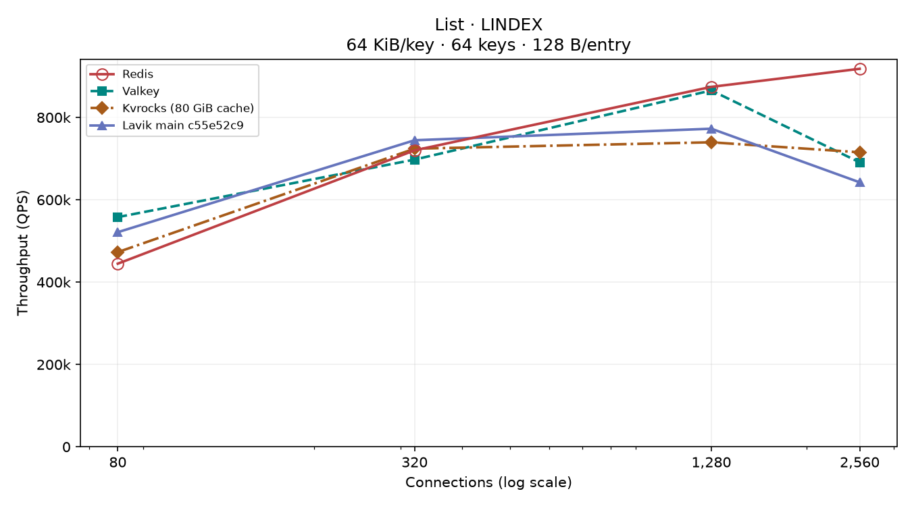

[Redis](raw/redis/) · [Valkey](raw/valkey/) · [Kvrocks (80 GiB cache)](raw/kvrocks/) · [Lavik main a565d603](raw/lavik-maina565d603-ordered-list-65536-k64-f128-20261004/)

1024 B/entry · 64 keys · 本轮 main 基线 `a565d603`

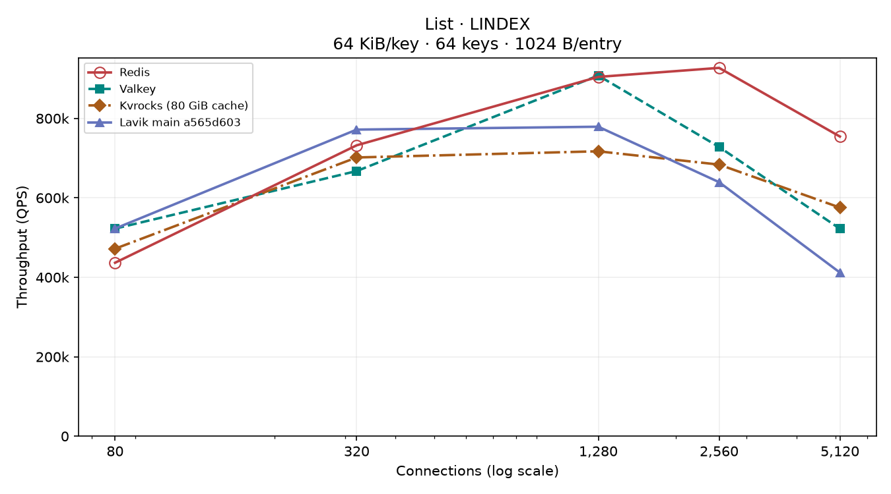

[Redis](raw/redis/) · [Valkey](raw/valkey/) · [Kvrocks (80 GiB cache)](raw/kvrocks/) · [Lavik main a565d603](raw/lavik-maina565d603-ordered-list-65536-k64-f1024-20261004/)

#### 1 MiB/key

128 B/entry · 64 keys · 历史测量，待复测 `5d7d12ec`

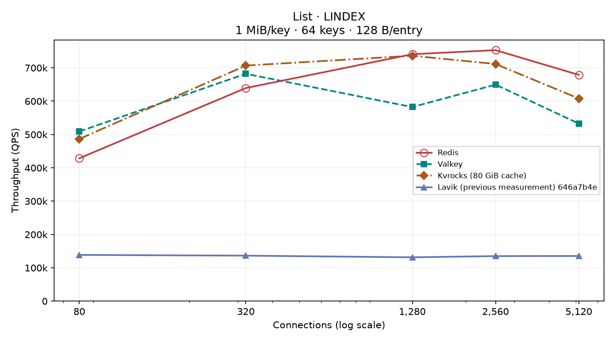

[Redis](raw/redis/) · [Valkey](raw/valkey/) · [Kvrocks (80 GiB cache)](raw/kvrocks/) · [Lavik (previous measurement) 5d7d12ec](raw/lavik-main5d7d12ec-ordered-list-1048576-k64-f128-20261004/)

1024 B/entry · 64 keys · 历史测量，待复测 `5d7d12ec`

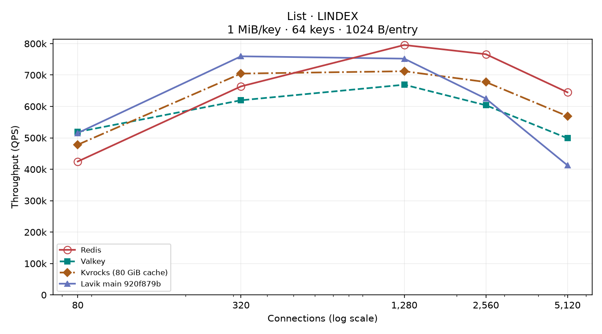

[Redis](raw/redis/) · [Valkey](raw/valkey/) · [Kvrocks (80 GiB cache)](raw/kvrocks/) · [Lavik (previous measurement) 5d7d12ec](raw/lavik-main5d7d12ec-ordered-list-1048576-k64-f1024-20261004/)

#### 100 MiB/key

128 B/entry · 8 keys · 历史测量，待复测 `5d7d12ec`

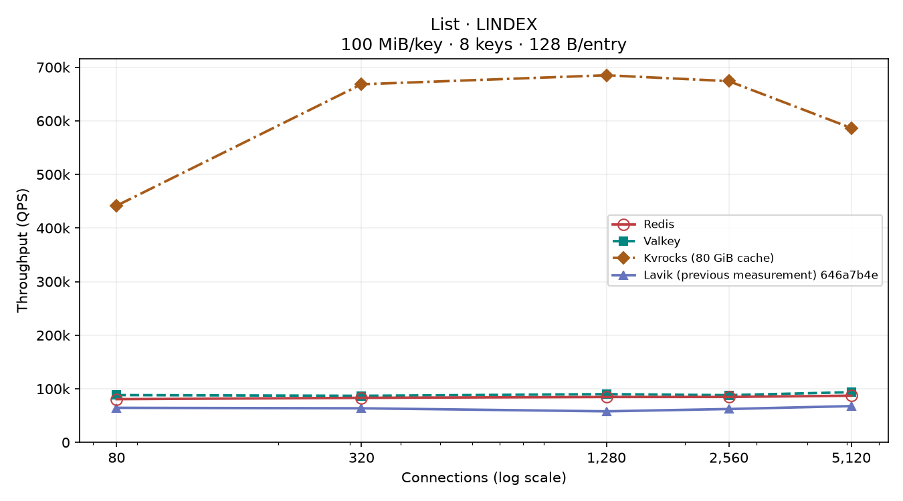

[Redis](raw/redis-100m/) · [Valkey](raw/valkey-100m/) · [Kvrocks (80 GiB cache)](raw/kvrocks-100m/) · [Lavik (previous measurement) 5d7d12ec](raw/lavik-main5d7d12ec-ordered-list-104857600-k8-f128-20261004/)

1024 B/entry · 8 keys · 历史测量，待复测 `5d7d12ec`

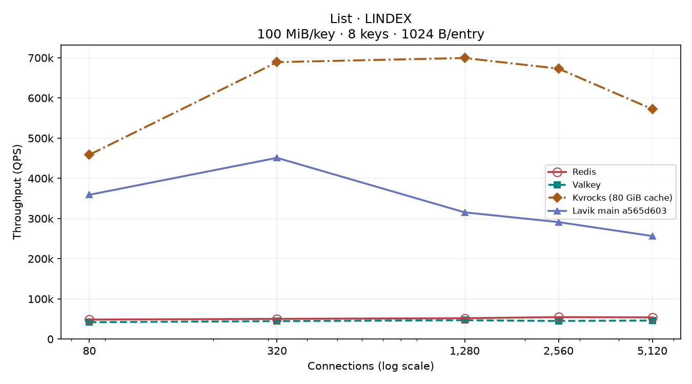

[Redis](raw/redis-100m/) · [Valkey](raw/valkey-100m/) · [Kvrocks (80 GiB cache)](raw/kvrocks-100m/) · [Lavik (previous measurement) 5d7d12ec](raw/lavik-main5d7d12ec-ordered-list-104857600-k8-f1024-20261004/)

### LSET

#### 64 KiB/key

128 B/entry · 64 keys · 本轮 main 基线 `a565d603`

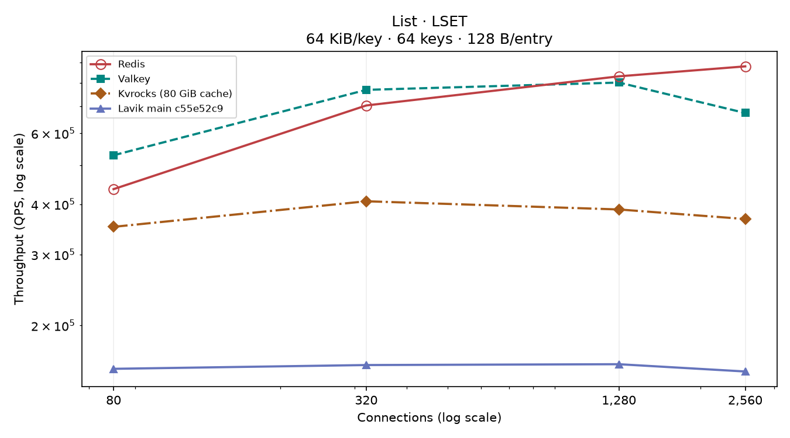

[Redis](raw/redis/) · [Valkey](raw/valkey/) · [Kvrocks (80 GiB cache)](raw/kvrocks/) · [Lavik main a565d603](raw/lavik-maina565d603-ordered-list-65536-k64-f128-20261004/)

1024 B/entry · 64 keys · 本轮 main 基线 `a565d603`

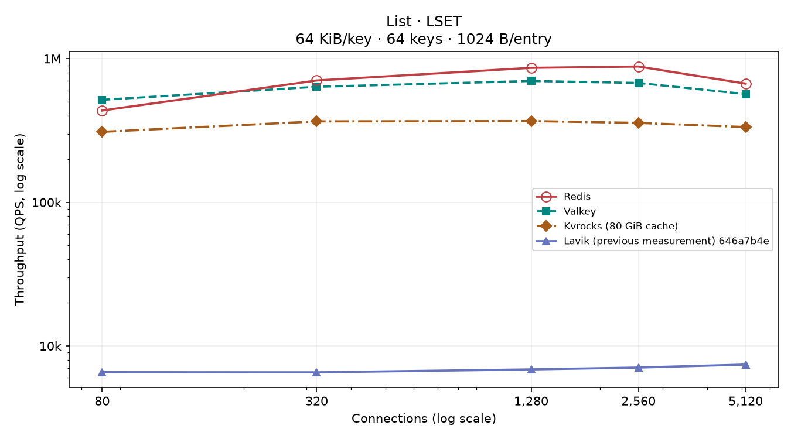

[Redis](raw/redis/) · [Valkey](raw/valkey/) · [Kvrocks (80 GiB cache)](raw/kvrocks/) · [Lavik main a565d603](raw/lavik-maina565d603-ordered-list-65536-k64-f1024-20261004/)

#### 1 MiB/key

128 B/entry · 64 keys · 历史测量，待复测 `5d7d12ec`

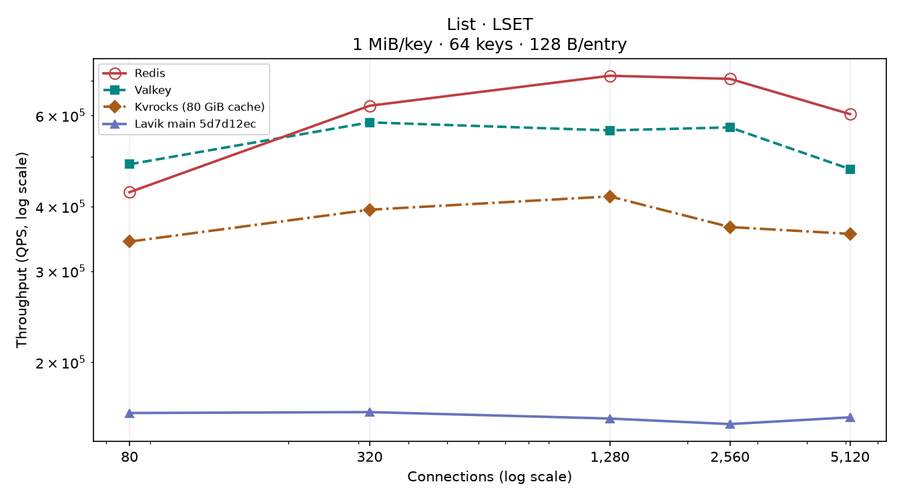

[Redis](raw/redis/) · [Valkey](raw/valkey/) · [Kvrocks (80 GiB cache)](raw/kvrocks/) · [Lavik (previous measurement) 5d7d12ec](raw/lavik-main5d7d12ec-ordered-list-1048576-k64-f128-20261004/)

1024 B/entry · 50,000 keys · 历史测量，待复测 `5d7d12ec`

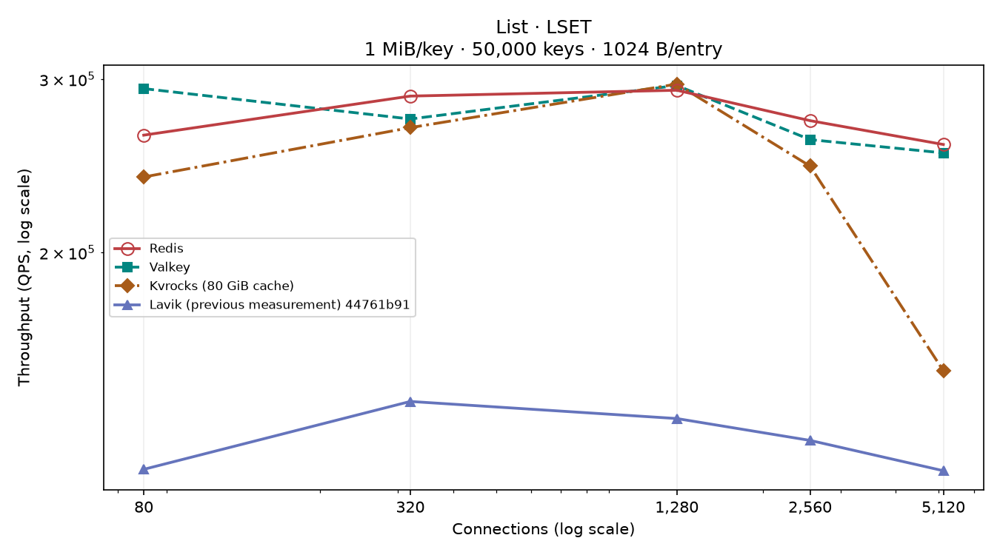

[Redis](raw/redis-lset-matched-1048576-k50000-f1024-20261001/) · [Valkey](raw/valkey-lset-matched-1048576-k50000-f1024-20261001/) · [Kvrocks (80 GiB cache)](raw/kvrocks-lset-matched-1048576-k50000-f1024-20261001/) · [Lavik (previous measurement) 5d7d12ec](raw/lavik-main5d7d12ec-lset-list-1048576-k50000-f1024-20261004/)

#### 100 MiB/key

128 B/entry · 8 keys · 历史测量，待复测 `5d7d12ec`

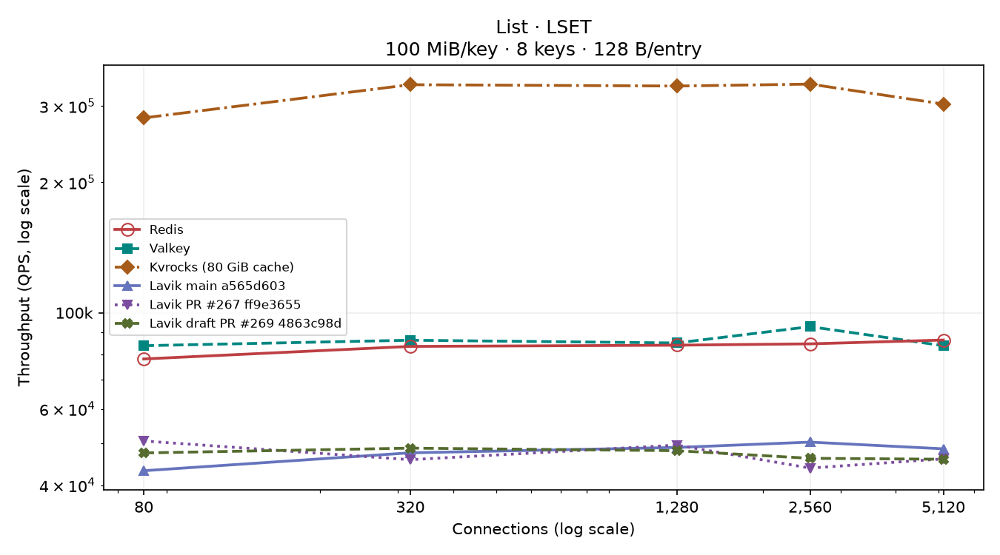

[Redis](raw/redis-100m/) · [Valkey](raw/valkey-100m/) · [Kvrocks (80 GiB cache)](raw/kvrocks-100m/) · [Lavik (previous measurement) 5d7d12ec](raw/lavik-main5d7d12ec-ordered-list-104857600-k8-f128-20261004/)

1024 B/entry · 500 keys · 历史测量，待复测 `5d7d12ec`

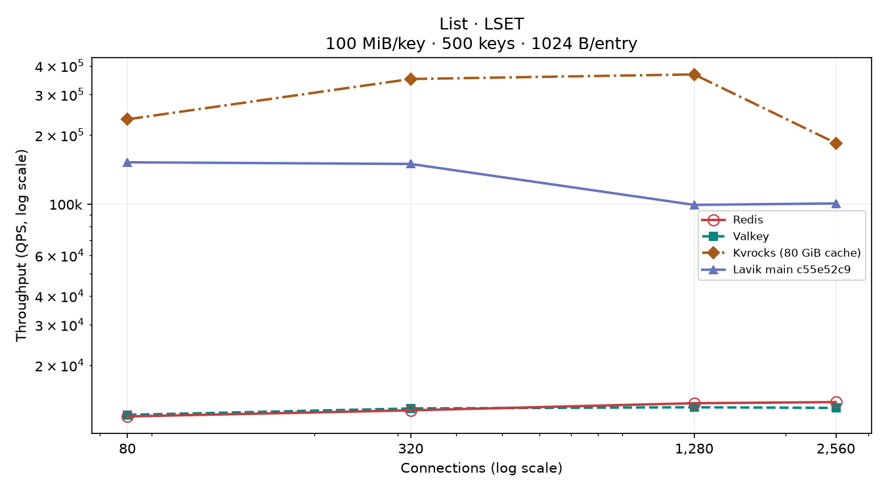

[Redis](raw/redis-lset-matched-104857600-k500-f1024-20261001/) · [Valkey](raw/valkey-lset-matched-104857600-k500-f1024-20261001/) · [Kvrocks (80 GiB cache)](raw/kvrocks-lset-matched-104857600-k500-f1024-20261001/) · [Lavik (previous measurement) 5d7d12ec](raw/lavik-main5d7d12ec-lset-list-104857600-k500-f1024-20261004/)

### LRANGE 0 -1

#### 64 KiB/key

128 B/entry · 64 keys · 本轮 main 基线 `a565d603`

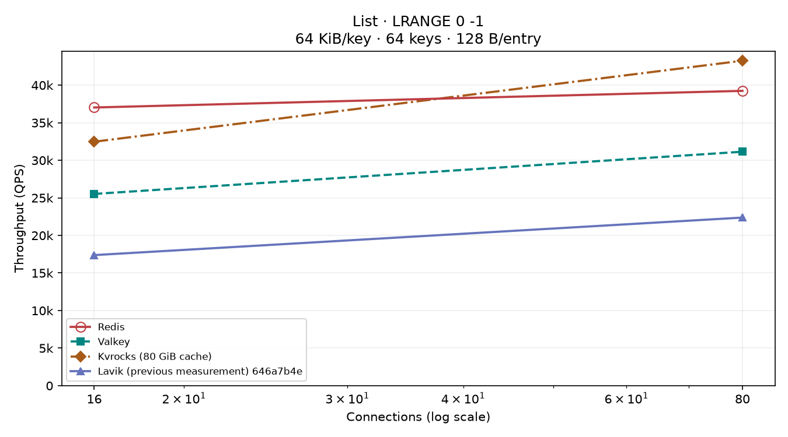

[Redis](raw/redis/) · [Valkey](raw/valkey/) · [Kvrocks (80 GiB cache)](raw/kvrocks/) · [Lavik main a565d603](raw/lavik-maina565d603-ordered-list-65536-k64-f128-20261004/)

1024 B/entry · 64 keys · 本轮 main 基线 `a565d603`

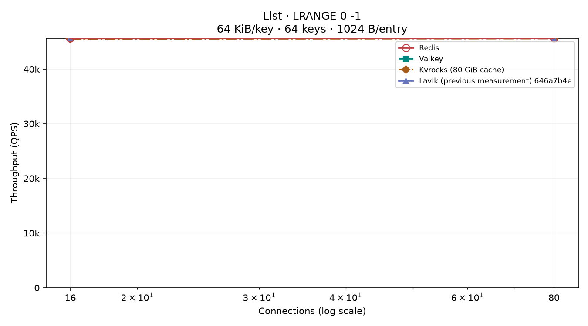

[Redis](raw/redis/) · [Valkey](raw/valkey/) · [Kvrocks (80 GiB cache)](raw/kvrocks/) · [Lavik main a565d603](raw/lavik-maina565d603-ordered-list-65536-k64-f1024-20261004/)

#### 1 MiB/key

128 B/entry · 64 keys · 历史测量，待复测 `5d7d12ec`

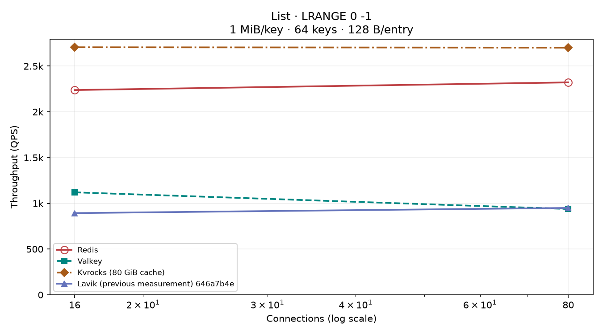

[Redis](raw/redis/) · [Valkey](raw/valkey/) · [Kvrocks (80 GiB cache)](raw/kvrocks/) · [Lavik (previous measurement) 5d7d12ec](raw/lavik-main5d7d12ec-ordered-list-1048576-k64-f128-20261004/)

1024 B/entry · 64 keys · 历史测量，待复测 `5d7d12ec`

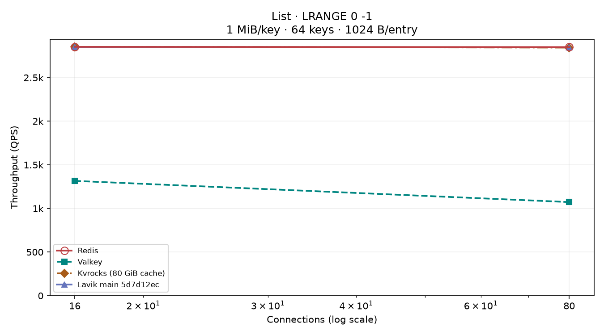

[Redis](raw/redis/) · [Valkey](raw/valkey/) · [Kvrocks (80 GiB cache)](raw/kvrocks/) · [Lavik (previous measurement) 5d7d12ec](raw/lavik-main5d7d12ec-ordered-list-1048576-k64-f1024-20261004/)

#### 100 MiB/key

128 B/entry · 8 keys · 历史测量，待复测 `5d7d12ec`

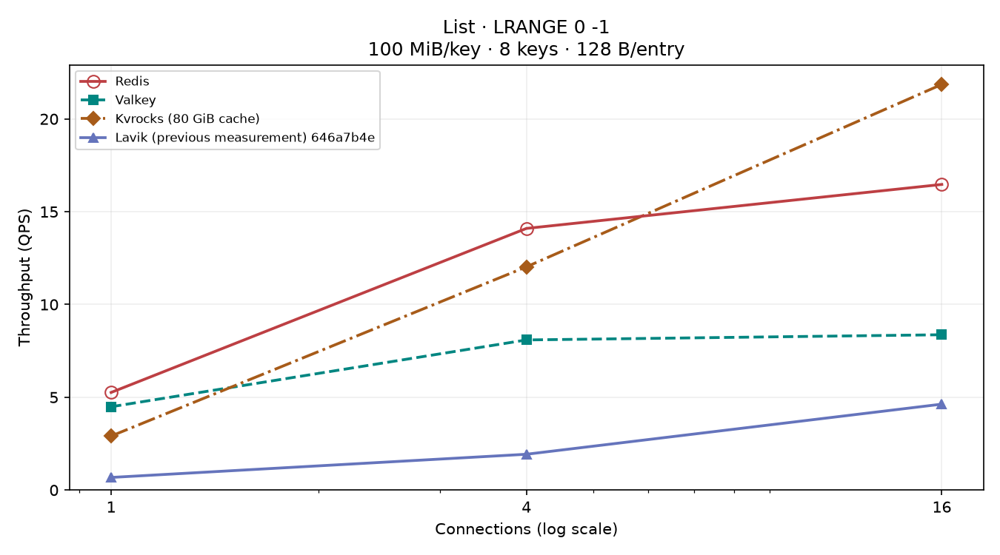

[Redis](raw/redis-100m/) · [Valkey](raw/valkey-100m/) · [Kvrocks (80 GiB cache)](raw/kvrocks-100m/) · [Lavik (previous measurement) 5d7d12ec](raw/lavik-main5d7d12ec-ordered-list-104857600-k8-f128-20261004/)

1024 B/entry · 8 keys · 历史测量，待复测 `5d7d12ec`

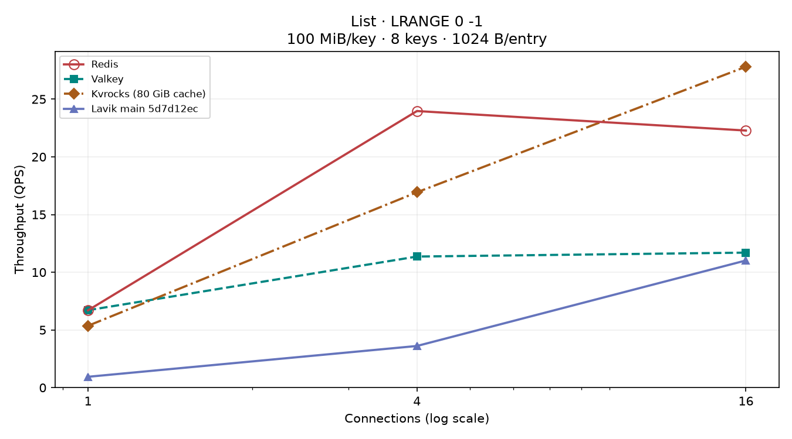

[Redis](raw/redis-100m/) · [Valkey](raw/valkey-100m/) · [Kvrocks (80 GiB cache)](raw/kvrocks-100m/) · [Lavik (previous measurement) 5d7d12ec](raw/lavik-main5d7d12ec-ordered-list-104857600-k8-f1024-20261004/)

### RPUSH 批量预置

与 LSET 使用同一组独立预置计时：32 客户端、pipeline=4、每命令 128 个 1 KiB 元素，四库使用相同的客户端编码。

#### 1 MiB/key

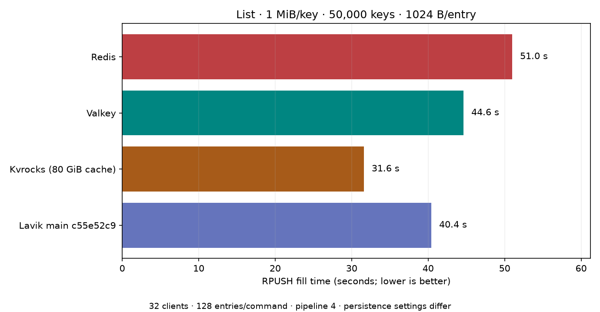

#### 100 MiB/key

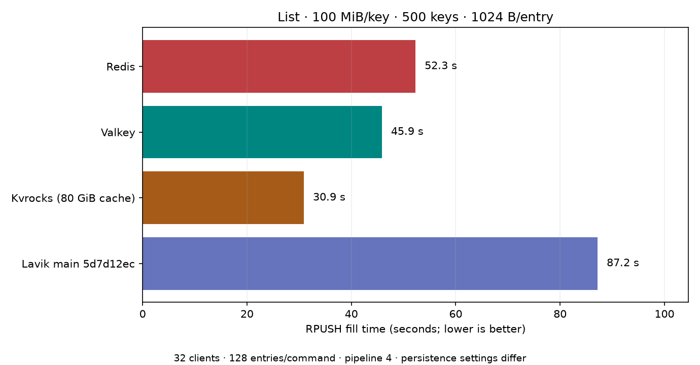

## Hash

### HGET

#### 1 MiB/key

128 B/entry · 50,000 keys · 历史测量，待复测 `5d7d12ec`

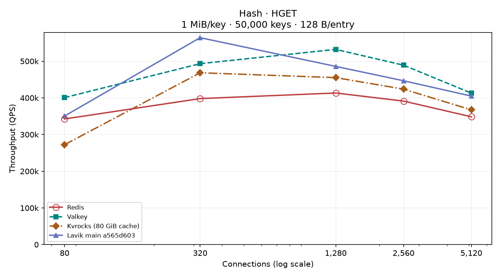

[Redis](raw/redis-hash-1m-k50000-f128-20260929/) · [Valkey](raw/valkey-hash-1m-k50000-f128-20260929/) · [Kvrocks (80 GiB cache)](raw/kvrocks-hash-1m-k50000-f128-20260929/) · [Lavik (previous measurement) 5d7d12ec](raw/lavik-main5d7d12ec-hashset-hash-1048576-k50000-f128-20261004/)

1024 B/entry · 50,000 keys · 历史测量，待复测 `5d7d12ec`

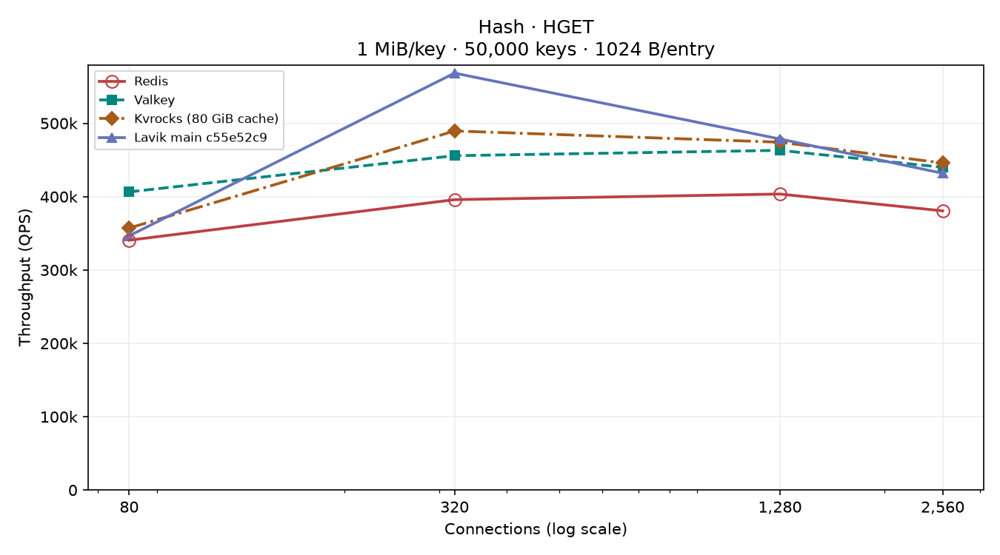

[Redis](raw/redis-hash-1m-k50000-f1024-20260929/) · [Valkey](raw/valkey-hash-1m-k50000-f1024-20260929/) · [Kvrocks (80 GiB cache)](raw/kvrocks-hash-1m-k50000-f1024-20260929/) · [Lavik (previous measurement) 5d7d12ec](raw/lavik-main5d7d12ec-hashset-hash-1048576-k50000-f1024-20261004/)

#### 100 MiB/key

128 B/entry · 500 keys · 历史测量，待复测 `5d7d12ec`

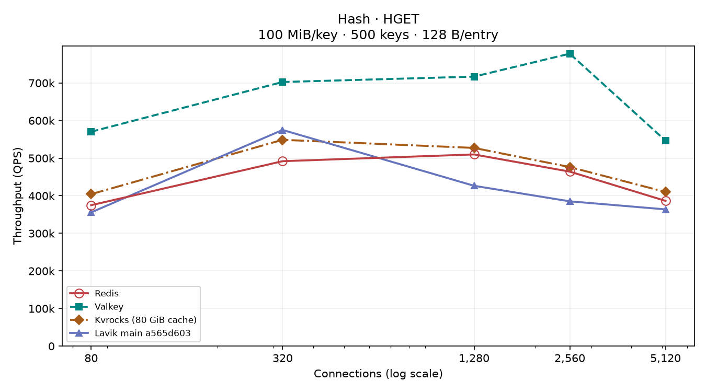

[Redis](raw/redis-hash-100m-k500-f128-20260929/) · [Valkey](raw/valkey-hash-100m-k500-f128-20260929/) · [Kvrocks (80 GiB cache)](raw/kvrocks-hash-100m-k500-f128-20260929/) · [Lavik (previous measurement) 5d7d12ec](raw/lavik-main5d7d12ec-hashset-hash-104857600-k500-f128-20261004/)

1024 B/entry · 500 keys · 历史测量，待复测 `5d7d12ec`

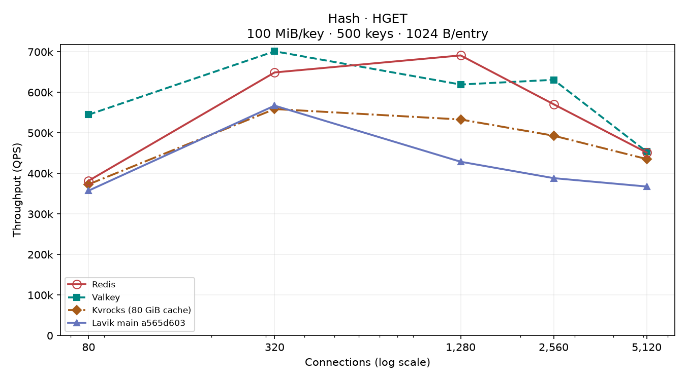

[Redis](raw/redis-hash-100m-k500-f1024-20260929/) · [Valkey](raw/valkey-hash-100m-k500-f1024-20260929/) · [Kvrocks (80 GiB cache)](raw/kvrocks-hash-100m-k500-f1024-20260929/) · [Lavik (previous measurement) 5d7d12ec](raw/lavik-main5d7d12ec-hashset-hash-104857600-k500-f1024-20261004/)

### HSET

#### 1 MiB/key

128 B/entry · 50,000 keys · 历史测量，待复测 `5d7d12ec`

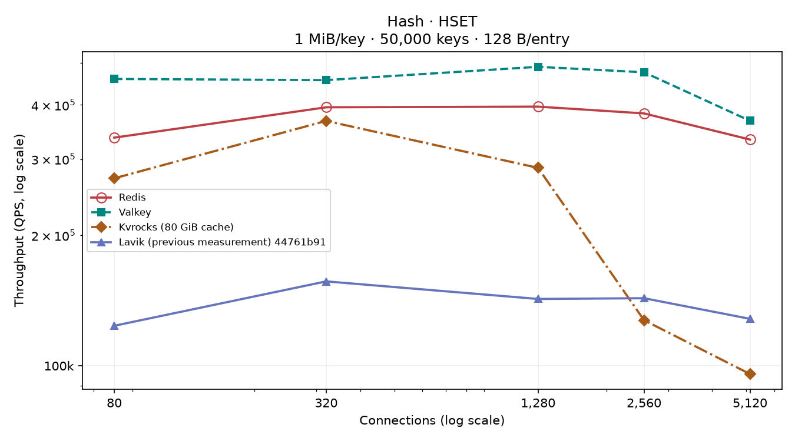

[Redis](raw/redis-hash-1m-k50000-f128-20260929/) · [Valkey](raw/valkey-hash-1m-k50000-f128-20260929/) · [Kvrocks (80 GiB cache)](raw/kvrocks-hash-1m-k50000-f128-20260929/) · [Lavik (previous measurement) 5d7d12ec](raw/lavik-main5d7d12ec-hashset-hash-1048576-k50000-f128-20261004/)

1024 B/entry · 50,000 keys · 历史测量，待复测 `5d7d12ec`

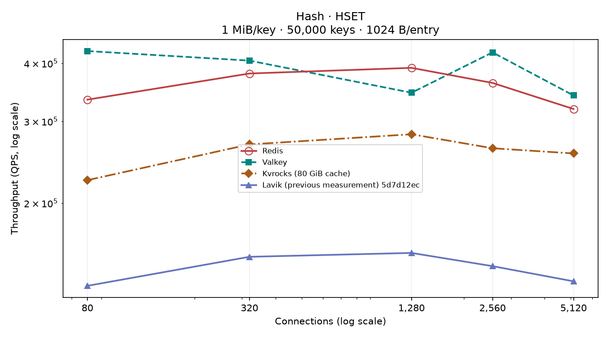

[Redis](raw/redis-hash-1m-k50000-f1024-20260929/) · [Valkey](raw/valkey-hash-1m-k50000-f1024-20260929/) · [Kvrocks (80 GiB cache)](raw/kvrocks-hash-1m-k50000-f1024-20260929/) · [Lavik (previous measurement) 5d7d12ec](raw/lavik-main5d7d12ec-hashset-hash-1048576-k50000-f1024-20261004/)

#### 100 MiB/key

128 B/entry · 500 keys · 历史测量，待复测 `5d7d12ec`

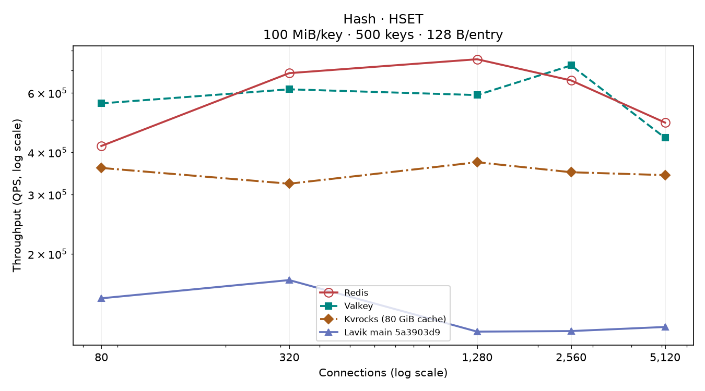

[Redis](raw/redis-hash-100m-k500-f128-20260929/) · [Valkey](raw/valkey-hash-100m-k500-f128-20260929/) · [Kvrocks (80 GiB cache)](raw/kvrocks-hash-100m-k500-f128-20260929/) · [Lavik (previous measurement) 5d7d12ec](raw/lavik-main5d7d12ec-hashset-hash-104857600-k500-f128-20261004/)

1024 B/entry · 500 keys · 历史测量，待复测 `5d7d12ec`

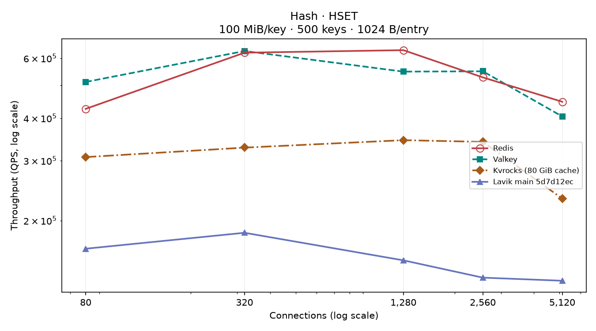

[Redis](raw/redis-hash-100m-k500-f1024-20260929/) · [Valkey](raw/valkey-hash-100m-k500-f1024-20260929/) · [Kvrocks (80 GiB cache)](raw/kvrocks-hash-100m-k500-f1024-20260929/) · [Lavik (previous measurement) 5d7d12ec](raw/lavik-main5d7d12ec-hashset-hash-104857600-k500-f1024-20261004/)

### HGETALL

#### 1 MiB/key

128 B/entry · 50,000 keys · 历史测量，待复测 `5d7d12ec`

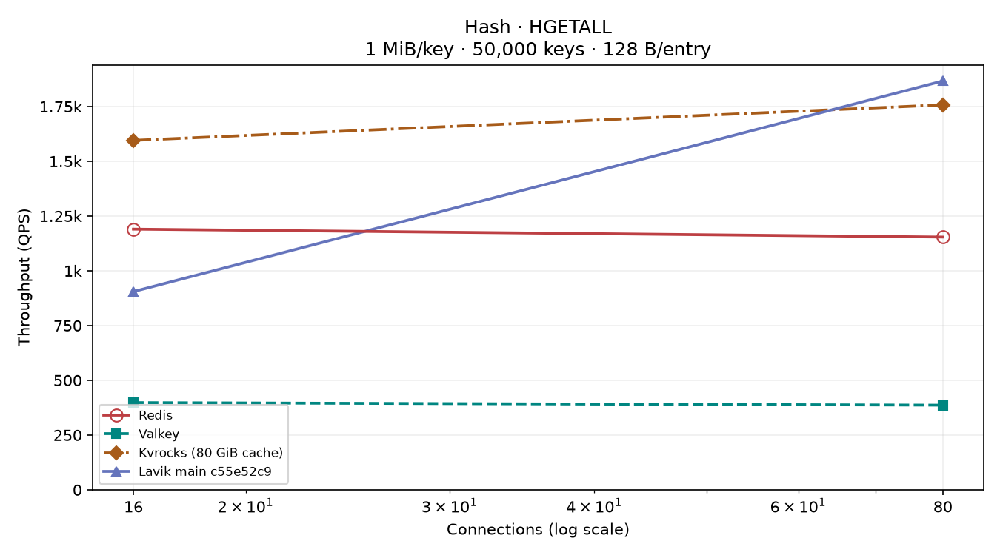

[Redis](raw/redis-hash-1m-k50000-f128-20260929/) · [Valkey](raw/valkey-hash-1m-k50000-f128-20260929/) · [Kvrocks (80 GiB cache)](raw/kvrocks-hash-1m-k50000-f128-20260929/) · [Lavik (previous measurement) 5d7d12ec](raw/lavik-main5d7d12ec-hashset-hash-1048576-k50000-f128-20261004/)

1024 B/entry · 50,000 keys · 历史测量，待复测 `5d7d12ec`

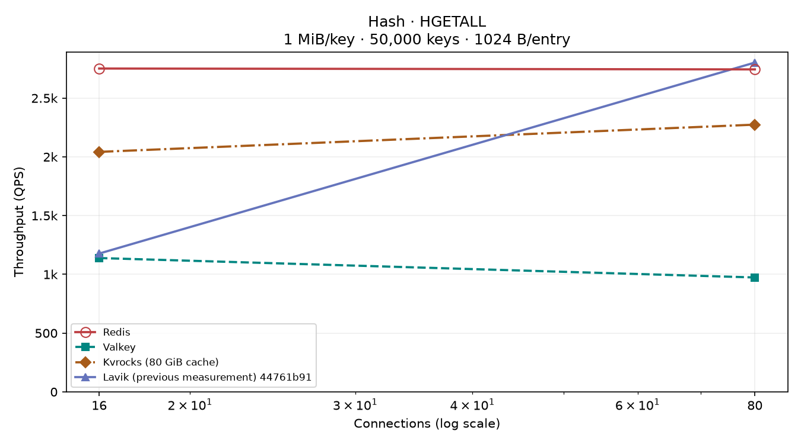

[Redis](raw/redis-hash-1m-k50000-f1024-20260929/) · [Valkey](raw/valkey-hash-1m-k50000-f1024-20260929/) · [Kvrocks (80 GiB cache)](raw/kvrocks-hash-1m-k50000-f1024-20260929/) · [Lavik (previous measurement) 5d7d12ec](raw/lavik-main5d7d12ec-hashset-hash-1048576-k50000-f1024-20261004/)

#### 100 MiB/key

128 B/entry · 500 keys · 历史测量，待复测 `5d7d12ec`

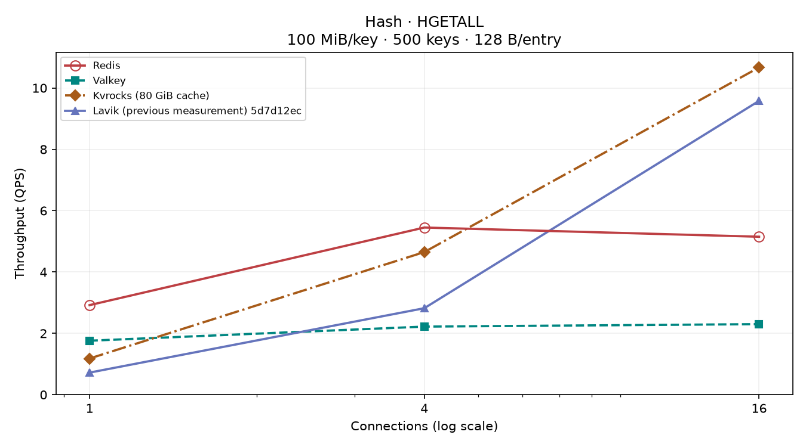

[Redis](raw/redis-hash-100m-k500-f128-20260929/) · [Valkey](raw/valkey-hash-100m-k500-f128-20260929/) · [Kvrocks (80 GiB cache)](raw/kvrocks-hash-100m-k500-f128-20260929/) · [Lavik (previous measurement) 5d7d12ec](raw/lavik-main5d7d12ec-hashset-hash-104857600-k500-f128-20261004/)

1024 B/entry · 500 keys · 历史测量，待复测 `5d7d12ec`

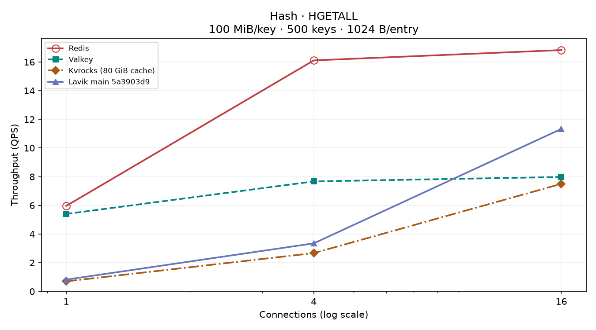

[Redis](raw/redis-hash-100m-k500-f1024-20260929/) · [Valkey](raw/valkey-hash-100m-k500-f1024-20260929/) · [Kvrocks (80 GiB cache)](raw/kvrocks-hash-100m-k500-f1024-20260929/) · [Lavik (previous measurement) 5d7d12ec](raw/lavik-main5d7d12ec-hashset-hash-104857600-k500-f1024-20261004/)

### HSET 批量导入

#### 1 MiB/key

50,000 keys；8 个客户端、pipeline=64、每命令约 16 KiB 元素。使用与历史三库相同的逐命令 RESP 编码方式，耗时包含 Python 客户端编码；不是 RESTORE，也不代表数据库单独的吞吐上限。

1024 B/entry · 历史测量，导入复测待完成 `5d7d12ec`

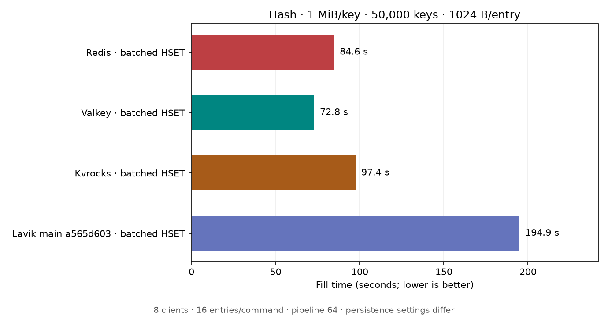

[Lavik raw](raw/lavik-main5d7d12ec-import-hash-1048576-k50000-f1024-20261004/)

128 B/entry · 历史测量，导入复测待完成 `5d7d12ec`

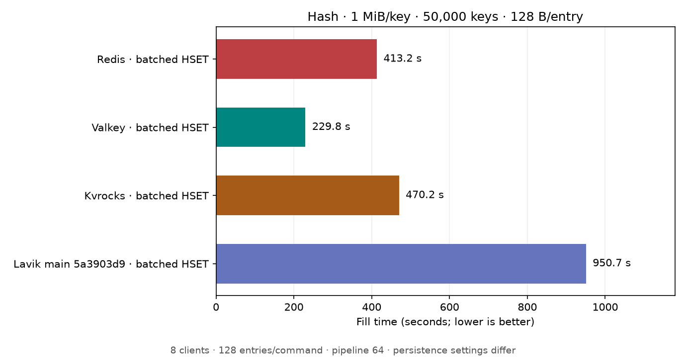

[Lavik raw](raw/lavik-main5d7d12ec-import-hash-1048576-k50000-f128-20261004/)

## Set

SADD + SREM 为两个命令等比例混合，QPS 计算完成的命令数，不是命令对数。随机命中相同 key 时可能产生空操作，因此不代表实际持久化修改次数。

### SISMEMBER

#### 1 MiB/key

128 B/entry · 50,000 keys · 历史测量，待复测 `5d7d12ec`

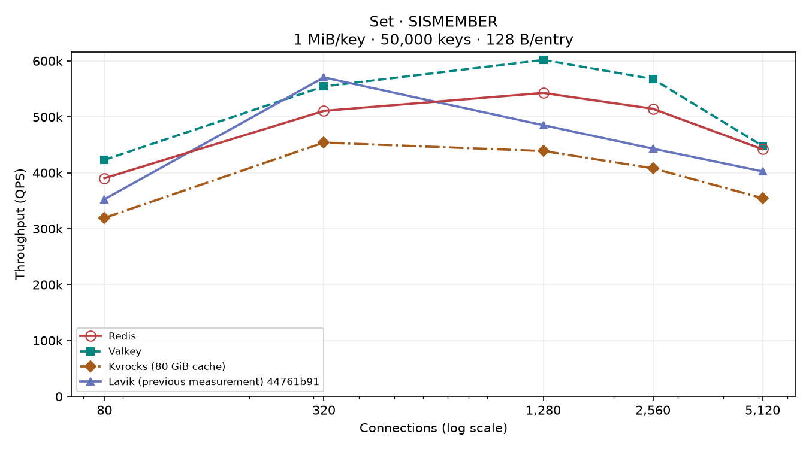

[Redis](raw/redis-set-1m-k50000-f128-20260929/) · [Valkey](raw/valkey-set-1m-k50000-f128-20260929/) · [Kvrocks (80 GiB cache)](raw/kvrocks-set-1m-k50000-f128-20260929/) · [Lavik (previous measurement) 5d7d12ec](raw/lavik-main5d7d12ec-hashset-set-1048576-k50000-f128-20261004/)

1024 B/entry · 50,000 keys · 历史测量，待复测 `5d7d12ec`

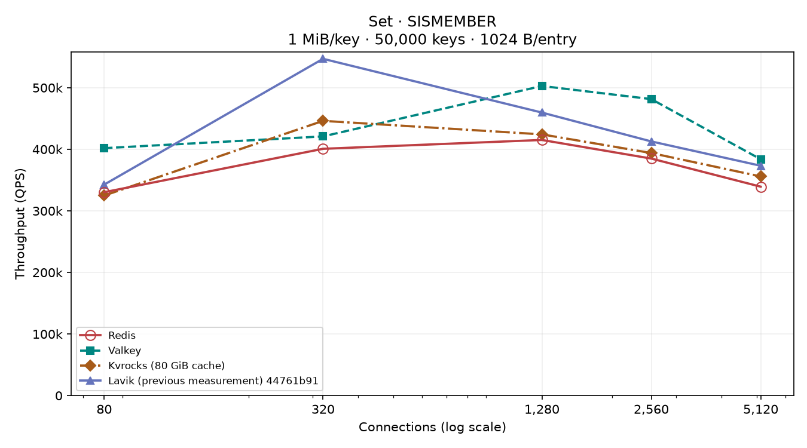

[Redis](raw/redis-set-1m-k50000-f1024-20260929/) · [Valkey](raw/valkey-set-1m-k50000-f1024-20260929/) · [Kvrocks (80 GiB cache)](raw/kvrocks-set-1m-k50000-f1024-20260929/) · [Lavik (previous measurement) 5d7d12ec](raw/lavik-main5d7d12ec-hashset-set-1048576-k50000-f1024-20261004/)

#### 100 MiB/key

128 B/entry · 500 keys · 历史测量，待复测 `5d7d12ec`

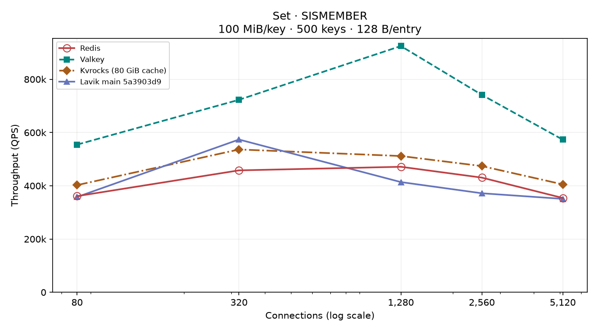

[Redis](raw/redis-set-100m-k500-f128-20260929/) · [Valkey](raw/valkey-set-100m-k500-f128-20260929/) · [Kvrocks (80 GiB cache)](raw/kvrocks-set-100m-k500-f128-20260929/) · [Lavik (previous measurement) 5d7d12ec](raw/lavik-main5d7d12ec-hashset-set-104857600-k500-f128-20261004/)

1024 B/entry · 500 keys · 历史测量，待复测 `5d7d12ec`

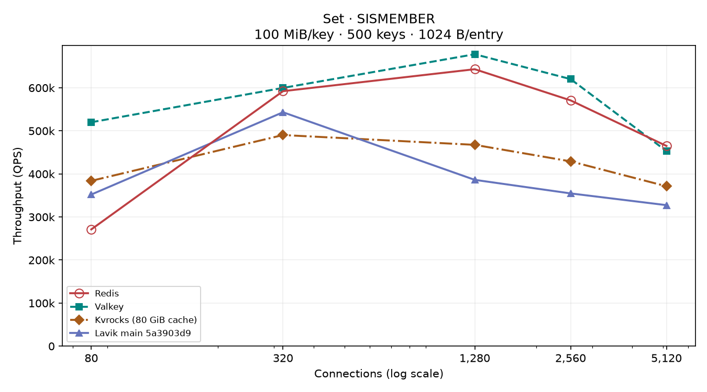

[Redis](raw/redis-set-100m-k500-f1024-20260929/) · [Valkey](raw/valkey-set-100m-k500-f1024-20260929/) · [Kvrocks (80 GiB cache)](raw/kvrocks-set-100m-k500-f1024-20260929/) · [Lavik (previous measurement) 5d7d12ec](raw/lavik-main5d7d12ec-hashset-set-104857600-k500-f1024-20261004/)

### SADD + SREM

#### 1 MiB/key

128 B/entry · 50,000 keys · 历史测量，待复测 `5d7d12ec`

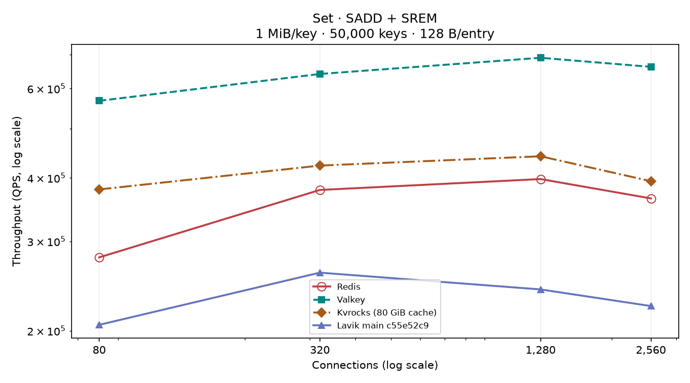

[Redis](raw/redis-set-1m-k50000-f128-20260929/) · [Valkey](raw/valkey-set-1m-k50000-f128-20260929/) · [Kvrocks (80 GiB cache)](raw/kvrocks-set-1m-k50000-f128-20260929/) · [Lavik (previous measurement) 5d7d12ec](raw/lavik-main5d7d12ec-hashset-set-1048576-k50000-f128-20261004/)

1024 B/entry · 50,000 keys · 历史测量，待复测 `5d7d12ec`

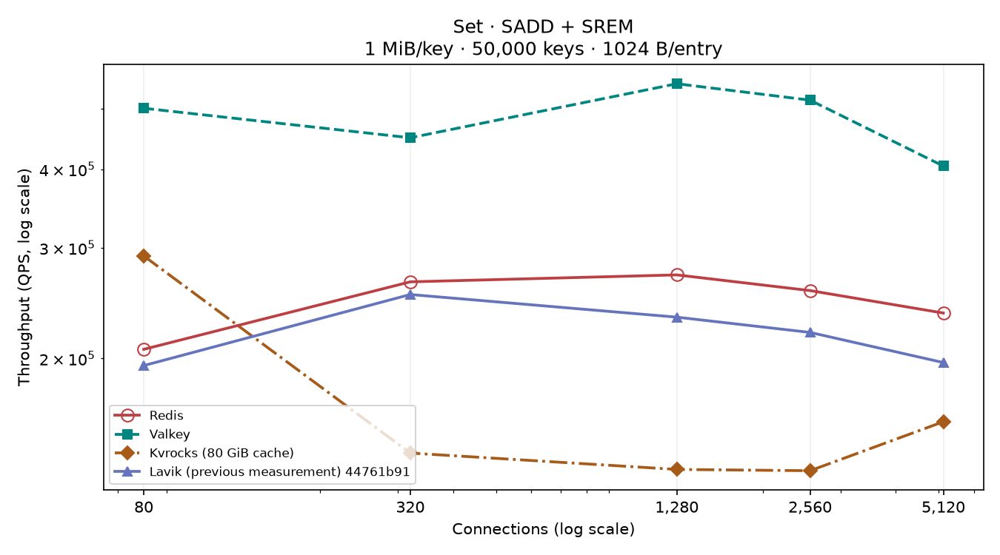

[Redis](raw/redis-set-1m-k50000-f1024-20260929/) · [Valkey](raw/valkey-set-1m-k50000-f1024-20260929/) · [Kvrocks (80 GiB cache)](raw/kvrocks-set-1m-k50000-f1024-20260929/) · [Lavik (previous measurement) 5d7d12ec](raw/lavik-main5d7d12ec-hashset-set-1048576-k50000-f1024-20261004/)

#### 100 MiB/key

128 B/entry · 500 keys · 历史测量，待复测 `5d7d12ec`

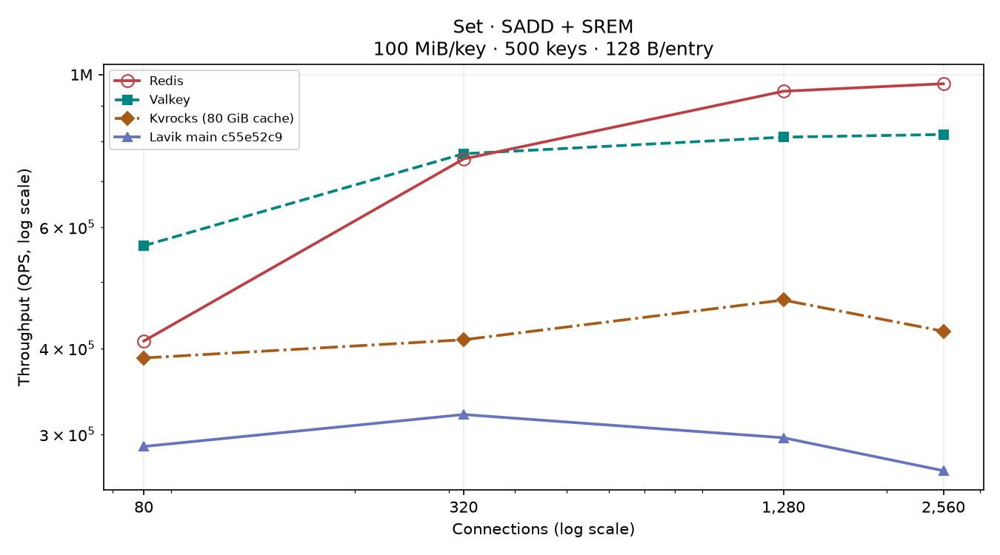

[Redis](raw/redis-set-100m-k500-f128-20260929/) · [Valkey](raw/valkey-set-100m-k500-f128-20260929/) · [Kvrocks (80 GiB cache)](raw/kvrocks-set-100m-k500-f128-20260929/) · [Lavik (previous measurement) 5d7d12ec](raw/lavik-main5d7d12ec-hashset-set-104857600-k500-f128-20261004/)

1024 B/entry · 500 keys · 历史测量，待复测 `5d7d12ec`

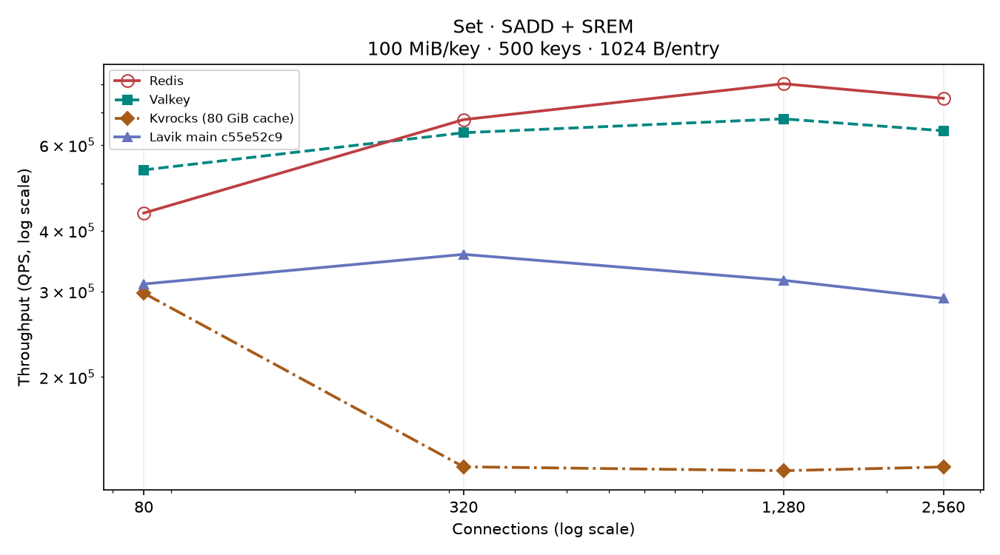

[Redis](raw/redis-set-100m-k500-f1024-20260929/) · [Valkey](raw/valkey-set-100m-k500-f1024-20260929/) · [Kvrocks (80 GiB cache)](raw/kvrocks-set-100m-k500-f1024-20260929/) · [Lavik (previous measurement) 5d7d12ec](raw/lavik-main5d7d12ec-hashset-set-104857600-k500-f1024-20261004/)

### SMEMBERS

#### 1 MiB/key

128 B/entry · 50,000 keys · 历史测量，待复测 `5d7d12ec`

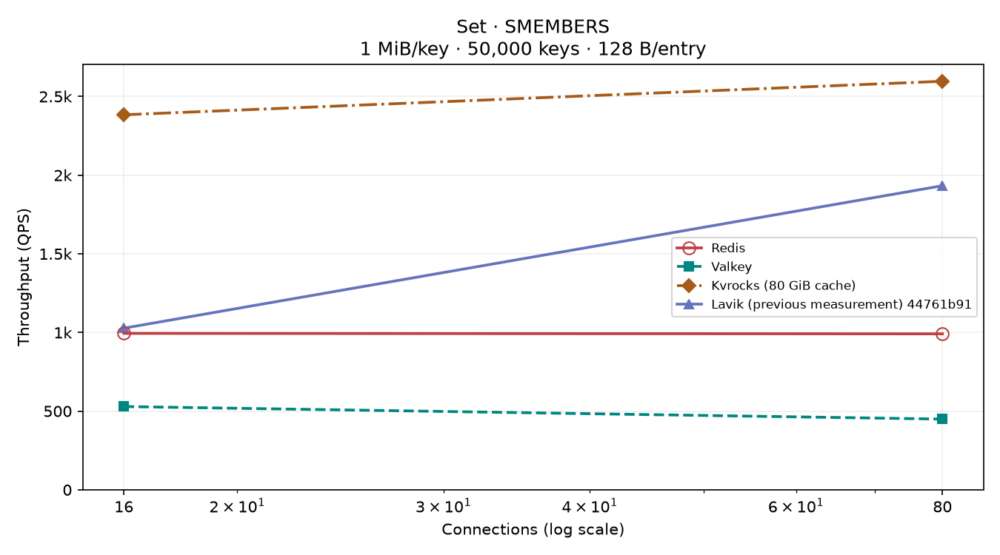

[Redis](raw/redis-set-1m-k50000-f128-20260929/) · [Valkey](raw/valkey-set-1m-k50000-f128-20260929/) · [Kvrocks (80 GiB cache)](raw/kvrocks-set-1m-k50000-f128-20260929/) · [Lavik (previous measurement) 5d7d12ec](raw/lavik-main5d7d12ec-hashset-set-1048576-k50000-f128-20261004/)

1024 B/entry · 50,000 keys · 历史测量，待复测 `5d7d12ec`

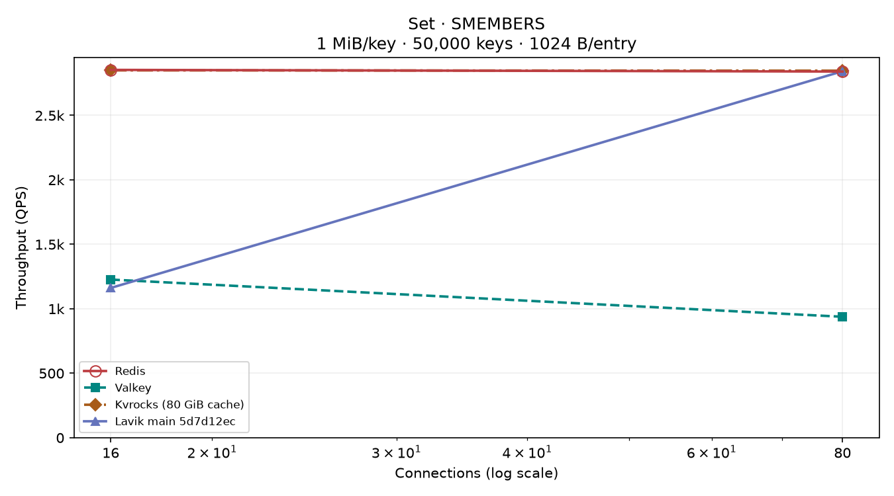

[Redis](raw/redis-set-1m-k50000-f1024-20260929/) · [Valkey](raw/valkey-set-1m-k50000-f1024-20260929/) · [Kvrocks (80 GiB cache)](raw/kvrocks-set-1m-k50000-f1024-20260929/) · [Lavik (previous measurement) 5d7d12ec](raw/lavik-main5d7d12ec-hashset-set-1048576-k50000-f1024-20261004/)

#### 100 MiB/key

128 B/entry · 500 keys · 历史测量，待复测 `5d7d12ec`

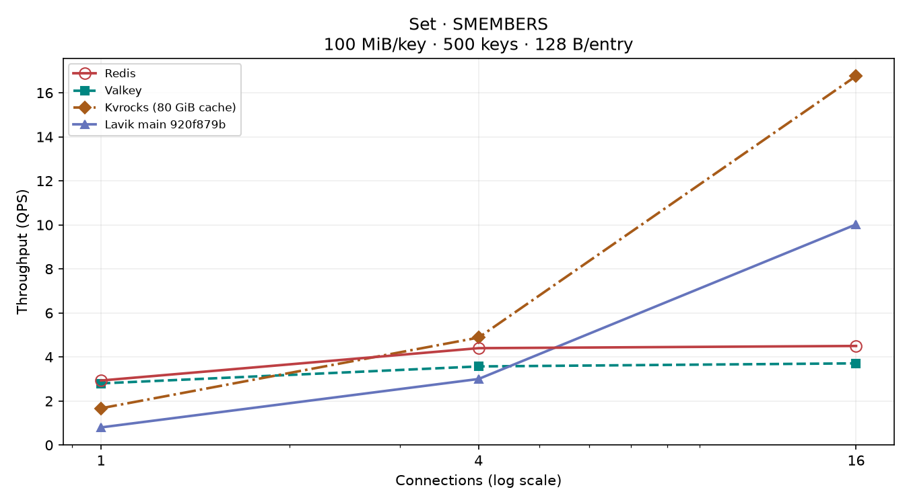

[Redis](raw/redis-set-100m-k500-f128-20260929/) · [Valkey](raw/valkey-set-100m-k500-f128-20260929/) · [Kvrocks (80 GiB cache)](raw/kvrocks-set-100m-k500-f128-20260929/) · [Lavik (previous measurement) 5d7d12ec](raw/lavik-main5d7d12ec-hashset-set-104857600-k500-f128-20261004/)

1024 B/entry · 500 keys · 历史测量，待复测 `5d7d12ec`

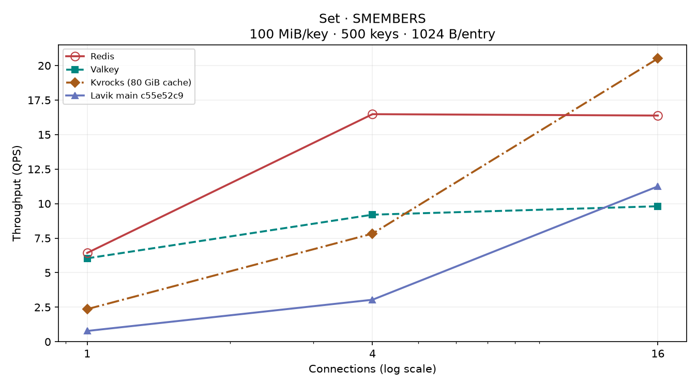

[Redis](raw/redis-set-100m-k500-f1024-20260929/) · [Valkey](raw/valkey-set-100m-k500-f1024-20260929/) · [Kvrocks (80 GiB cache)](raw/kvrocks-set-100m-k500-f1024-20260929/) · [Lavik (previous measurement) 5d7d12ec](raw/lavik-main5d7d12ec-hashset-set-104857600-k500-f1024-20261004/)

### SADD 批量导入

#### 1 MiB/key

50,000 keys；8 个客户端、pipeline=64、每命令约 16 KiB 元素。使用与历史三库相同的逐命令 RESP 编码方式，耗时包含 Python 客户端编码；不是 RESTORE，也不代表数据库单独的吞吐上限。

1024 B/entry · 历史测量，导入复测待完成 `5d7d12ec`

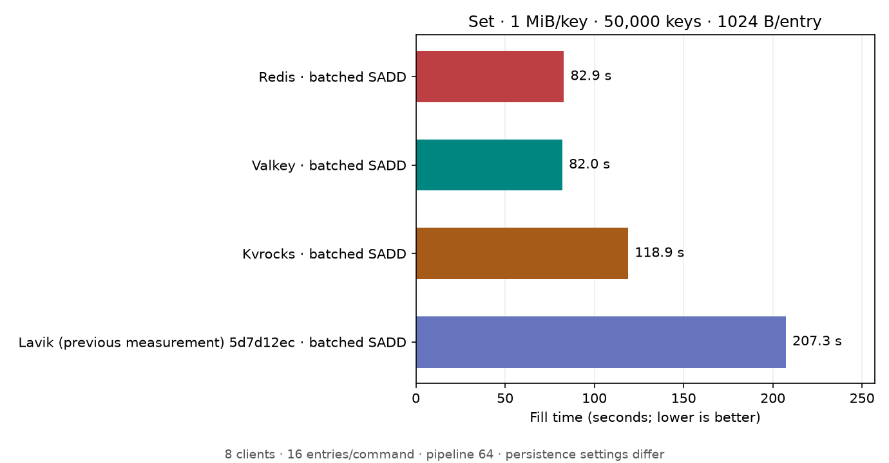

[Lavik raw](raw/lavik-main5d7d12ec-import-set-1048576-k50000-f1024-20261004/)

128 B/entry · 历史测量，导入复测待完成 `5d7d12ec`

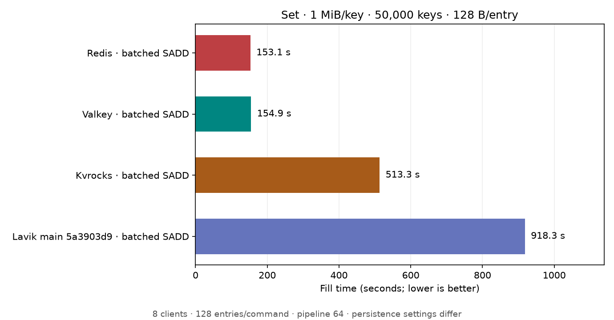

[Lavik raw](raw/lavik-main5d7d12ec-import-set-1048576-k50000-f128-20261004/)

## Sorted Set

### ZSCORE

#### 64 KiB/key

128 B/entry · 64 keys · 本轮 main 基线 `a565d603`

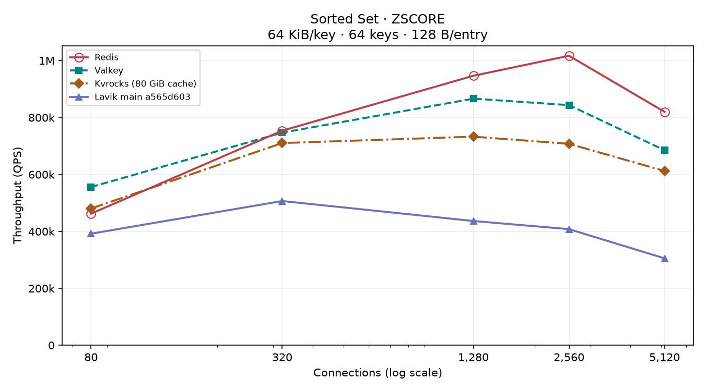

[Redis](raw/redis/) · [Valkey](raw/valkey/) · [Kvrocks (80 GiB cache)](raw/kvrocks/) · [Lavik main a565d603](raw/lavik-maina565d603-ordered-zset-65536-k64-f128-20261004/)

1024 B/entry · 64 keys · 历史测量，待复测 `5d7d12ec`

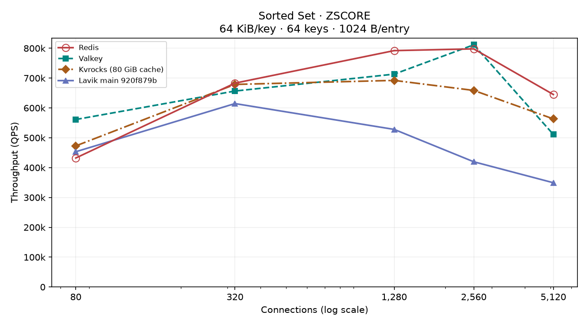

[Redis](raw/redis/) · [Valkey](raw/valkey/) · [Kvrocks (80 GiB cache)](raw/kvrocks/) · [Lavik (previous measurement) 5d7d12ec](raw/lavik-main5d7d12ec-ordered-zset-65536-k64-f1024-20261004/)

#### 1 MiB/key

128 B/entry · 64 keys · 历史测量，待复测 `5d7d12ec`

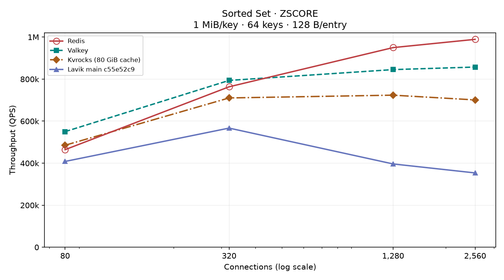

[Redis](raw/redis/) · [Valkey](raw/valkey/) · [Kvrocks (80 GiB cache)](raw/kvrocks/) · [Lavik (previous measurement) 5d7d12ec](raw/lavik-main5d7d12ec-ordered-zset-1048576-k64-f128-20261004/)

1024 B/entry · 64 keys · 历史测量，待复测 `5d7d12ec`

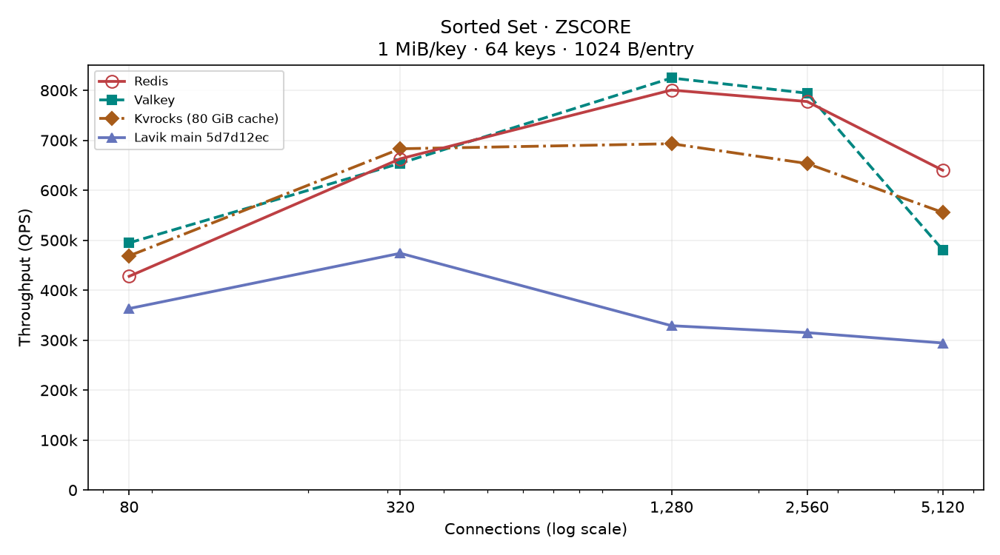

[Redis](raw/redis/) · [Valkey](raw/valkey/) · [Kvrocks (80 GiB cache)](raw/kvrocks/) · [Lavik (previous measurement) 5d7d12ec](raw/lavik-main5d7d12ec-ordered-zset-1048576-k64-f1024-20261004/)

#### 100 MiB/key

128 B/entry · 8 keys · 本轮 main 基线 `a565d603`

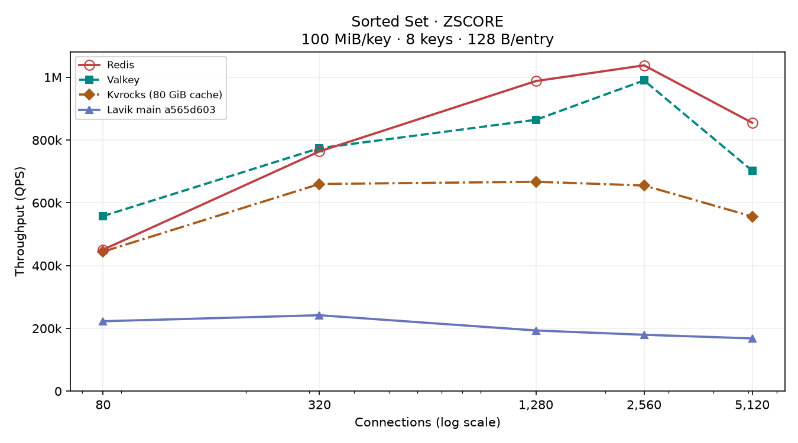

[Redis](raw/redis-100m/) · [Valkey](raw/valkey-100m/) · [Kvrocks (80 GiB cache)](raw/kvrocks-100m/) · [Lavik main a565d603](raw/lavik-maina565d603-ordered-zset-104857600-k8-f128-20261004/)

1024 B/entry · 8 keys · 本轮 main 基线 `a565d603`

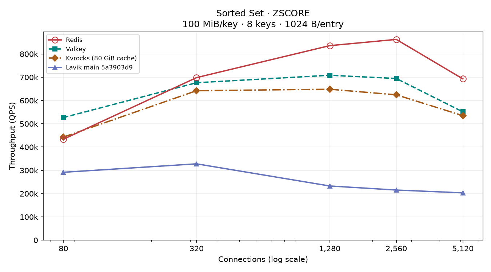

[Redis](raw/redis-100m/) · [Valkey](raw/valkey-100m/) · [Kvrocks (80 GiB cache)](raw/kvrocks-100m/) · [Lavik main a565d603](raw/lavik-maina565d603-ordered-zset-104857600-k8-f1024-20261004/)

### ZINCRBY

#### 64 KiB/key

128 B/entry · 64 keys · 本轮 main 基线 `a565d603`

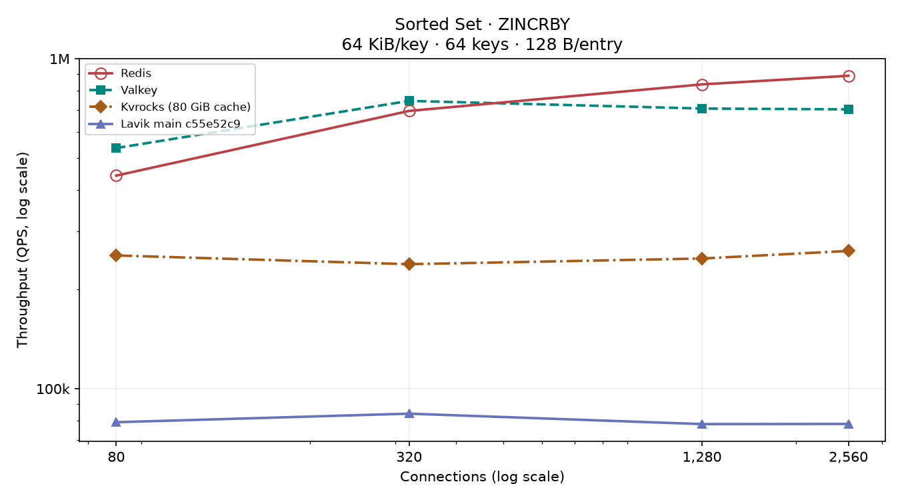

[Redis](raw/redis/) · [Valkey](raw/valkey/) · [Kvrocks (80 GiB cache)](raw/kvrocks/) · [Lavik main a565d603](raw/lavik-maina565d603-ordered-zset-65536-k64-f128-20261004/)

1024 B/entry · 64 keys · 历史测量，待复测 `5d7d12ec`

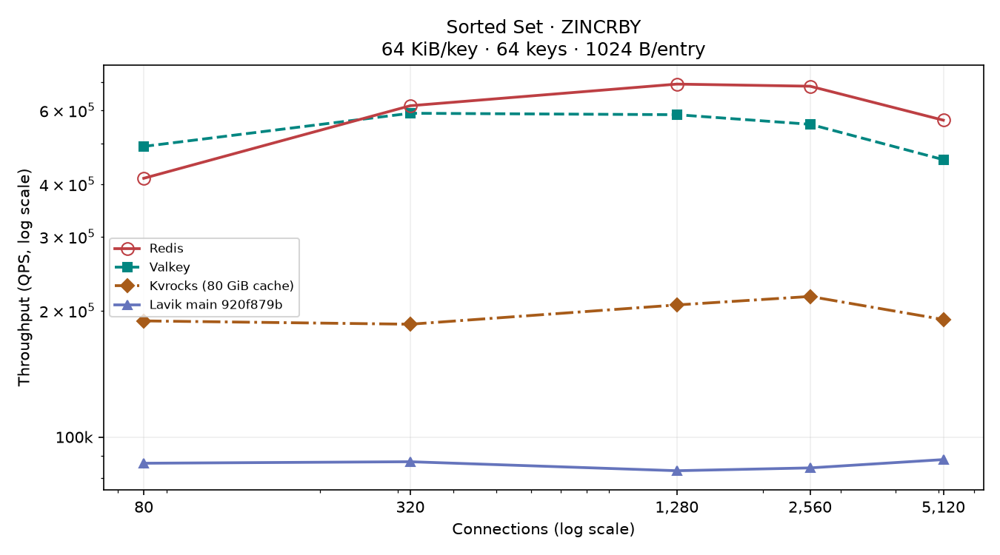

[Redis](raw/redis/) · [Valkey](raw/valkey/) · [Kvrocks (80 GiB cache)](raw/kvrocks/) · [Lavik (previous measurement) 5d7d12ec](raw/lavik-main5d7d12ec-ordered-zset-65536-k64-f1024-20261004/)

#### 1 MiB/key

128 B/entry · 64 keys · 历史测量，待复测 `5d7d12ec`

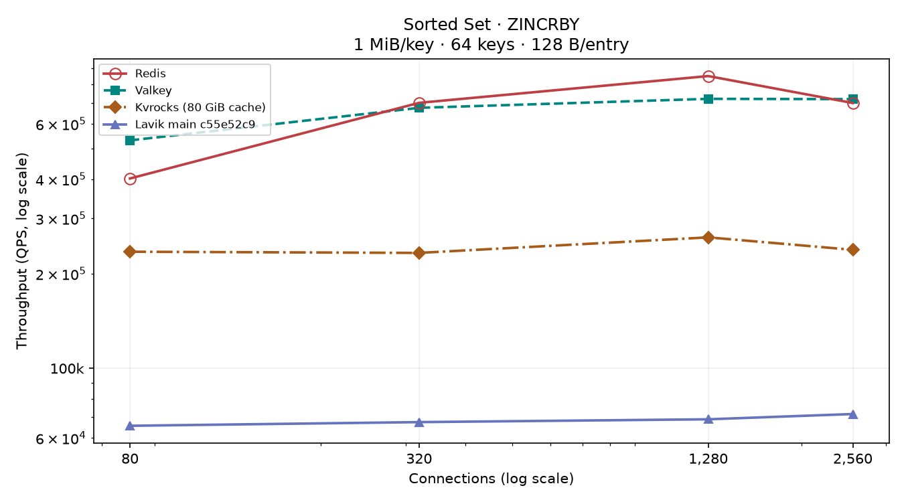

[Redis](raw/redis/) · [Valkey](raw/valkey/) · [Kvrocks (80 GiB cache)](raw/kvrocks/) · [Lavik (previous measurement) 5d7d12ec](raw/lavik-main5d7d12ec-ordered-zset-1048576-k64-f128-20261004/)

1024 B/entry · 64 keys · 历史测量，待复测 `5d7d12ec`

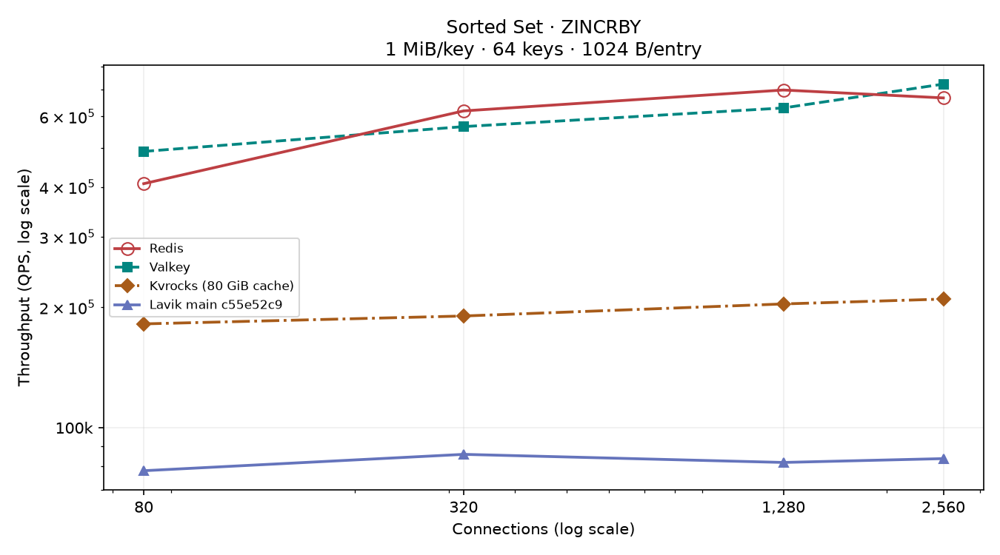

[Redis](raw/redis/) · [Valkey](raw/valkey/) · [Kvrocks (80 GiB cache)](raw/kvrocks/) · [Lavik (previous measurement) 5d7d12ec](raw/lavik-main5d7d12ec-ordered-zset-1048576-k64-f1024-20261004/)

#### 100 MiB/key

128 B/entry · 8 keys · 本轮 main 基线 `a565d603`

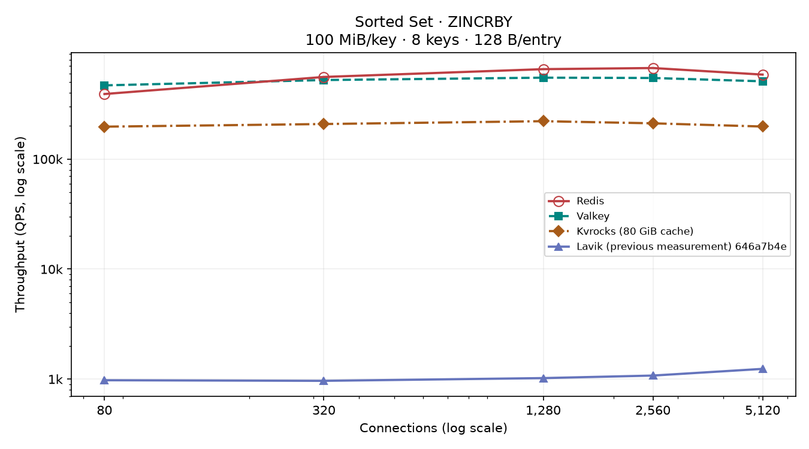

[Redis](raw/redis-100m/) · [Valkey](raw/valkey-100m/) · [Kvrocks (80 GiB cache)](raw/kvrocks-100m/) · [Lavik main a565d603](raw/lavik-maina565d603-ordered-zset-104857600-k8-f128-20261004/)

1024 B/entry · 8 keys · 本轮 main 基线 `a565d603`

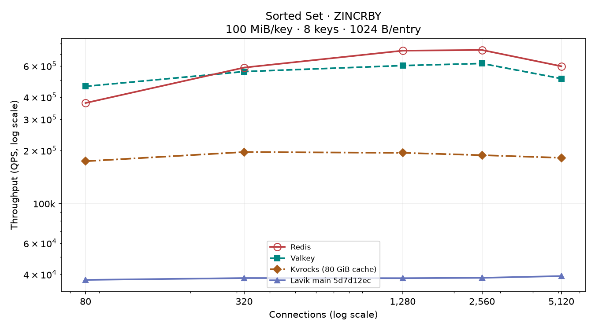

[Redis](raw/redis-100m/) · [Valkey](raw/valkey-100m/) · [Kvrocks (80 GiB cache)](raw/kvrocks-100m/) · [Lavik main a565d603](raw/lavik-maina565d603-ordered-zset-104857600-k8-f1024-20261004/)

### ZRANGE 0 -1 WITHSCORES

#### 64 KiB/key

128 B/entry · 64 keys · 本轮 main 基线 `a565d603`

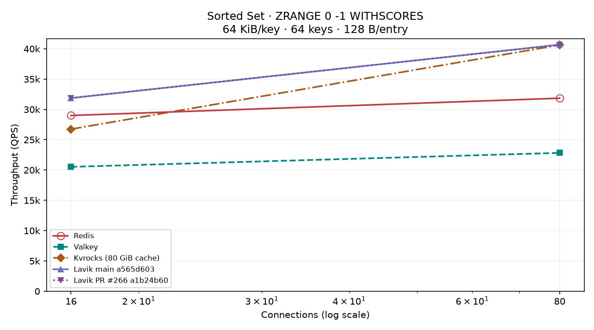

[Redis](raw/redis/) · [Valkey](raw/valkey/) · [Kvrocks (80 GiB cache)](raw/kvrocks/) · [Lavik main a565d603](raw/lavik-maina565d603-ordered-zset-65536-k64-f128-20261004/)

1024 B/entry · 64 keys · 历史测量，待复测 `5d7d12ec`

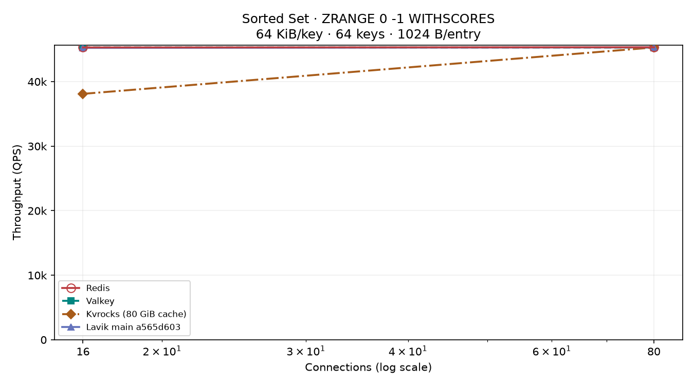

[Redis](raw/redis/) · [Valkey](raw/valkey/) · [Kvrocks (80 GiB cache)](raw/kvrocks/) · [Lavik (previous measurement) 5d7d12ec](raw/lavik-main5d7d12ec-ordered-zset-65536-k64-f1024-20261004/)

#### 1 MiB/key

128 B/entry · 64 keys · 历史测量，待复测 `5d7d12ec`

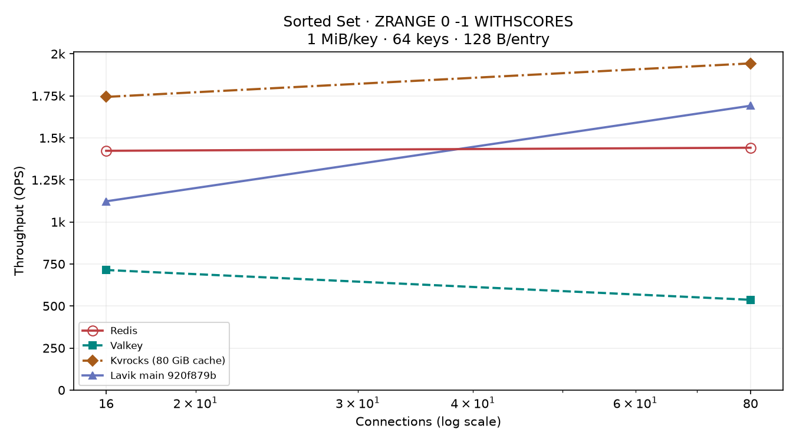

[Redis](raw/redis/) · [Valkey](raw/valkey/) · [Kvrocks (80 GiB cache)](raw/kvrocks/) · [Lavik (previous measurement) 5d7d12ec](raw/lavik-main5d7d12ec-ordered-zset-1048576-k64-f128-20261004/)

1024 B/entry · 64 keys · 历史测量，待复测 `5d7d12ec`

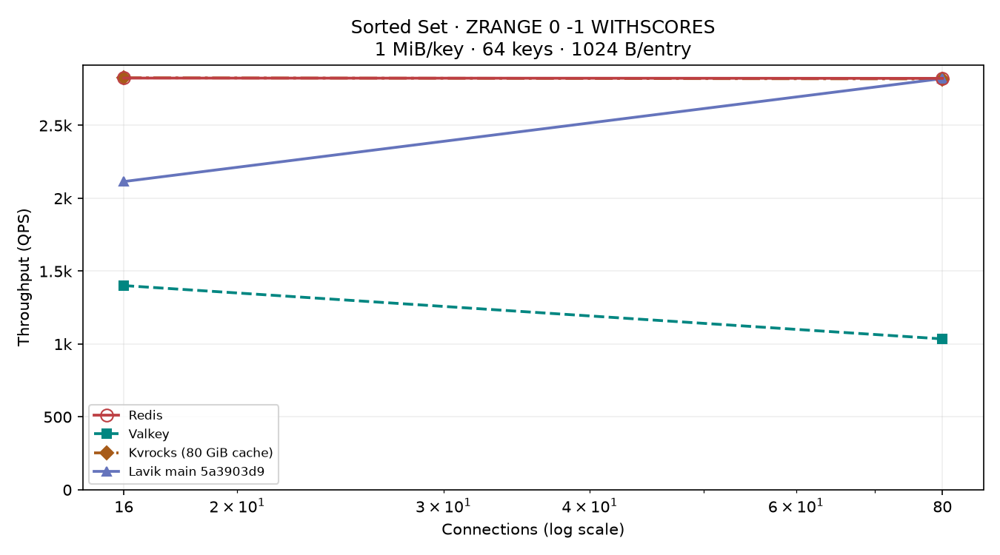

[Redis](raw/redis/) · [Valkey](raw/valkey/) · [Kvrocks (80 GiB cache)](raw/kvrocks/) · [Lavik (previous measurement) 5d7d12ec](raw/lavik-main5d7d12ec-ordered-zset-1048576-k64-f1024-20261004/)

#### 100 MiB/key

128 B/entry · 8 keys · 本轮 main 基线 `a565d603`

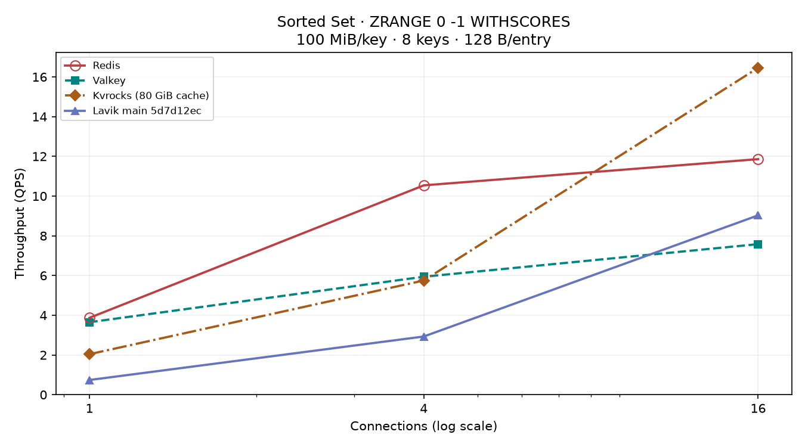

[Redis](raw/redis-100m/) · [Valkey](raw/valkey-100m/) · [Kvrocks (80 GiB cache)](raw/kvrocks-100m/) · [Lavik main a565d603](raw/lavik-maina565d603-ordered-zset-104857600-k8-f128-20261004/)

1024 B/entry · 8 keys · 本轮 main 基线 `a565d603`

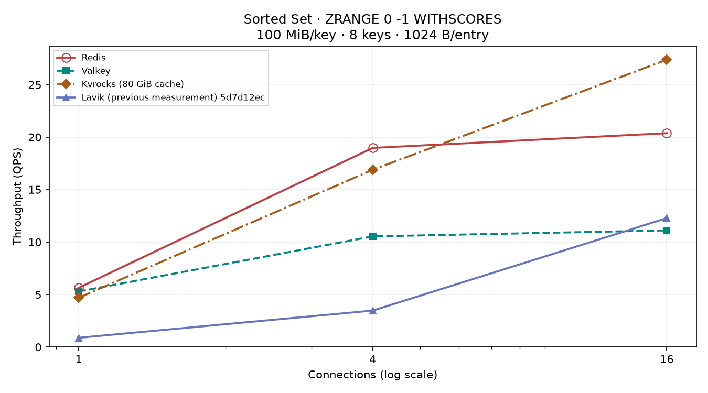

[Redis](raw/redis-100m/) · [Valkey](raw/valkey-100m/) · [Kvrocks (80 GiB cache)](raw/kvrocks-100m/) · [Lavik main a565d603](raw/lavik-maina565d603-ordered-zset-104857600-k8-f1024-20261004/)

## Stream

### XRANGE (one ID)

#### 64 KiB/key

128 B/entry · 64 keys · 历史测量，待复测 `5d7d12ec`

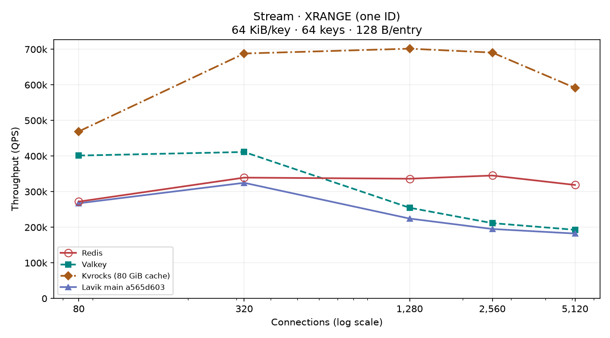

[Redis](raw/redis/) · [Valkey](raw/valkey/) · [Kvrocks (80 GiB cache)](raw/kvrocks/) · [Lavik (previous measurement) 5d7d12ec](raw/lavik-main5d7d12ec-ordered-stream-65536-k64-f128-20261004/)

1024 B/entry · 64 keys · 历史测量，待复测 `5d7d12ec`

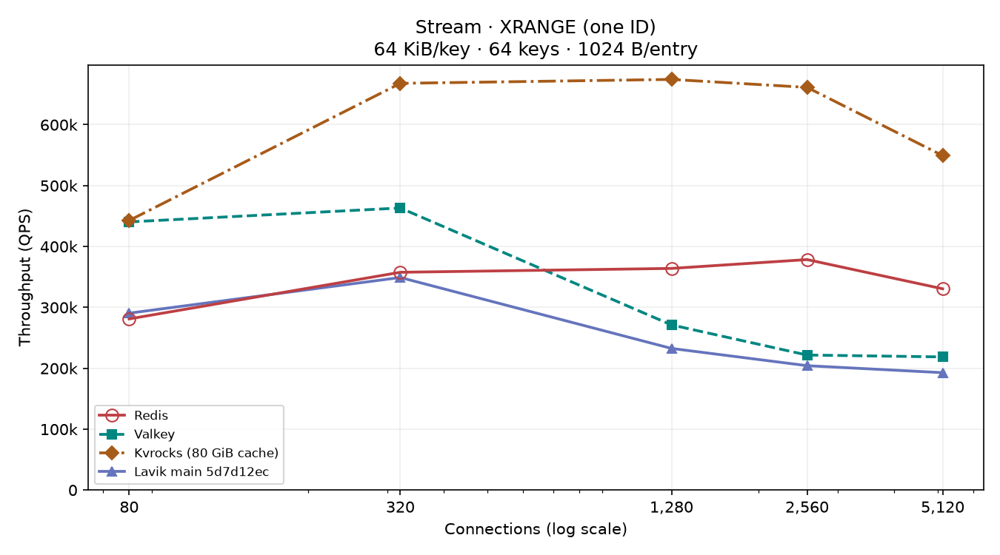

[Redis](raw/redis/) · [Valkey](raw/valkey/) · [Kvrocks (80 GiB cache)](raw/kvrocks/) · [Lavik (previous measurement) 5d7d12ec](raw/lavik-main5d7d12ec-ordered-stream-65536-k64-f1024-20261004/)

#### 1 MiB/key

128 B/entry · 64 keys · 历史测量，待复测 `5d7d12ec`

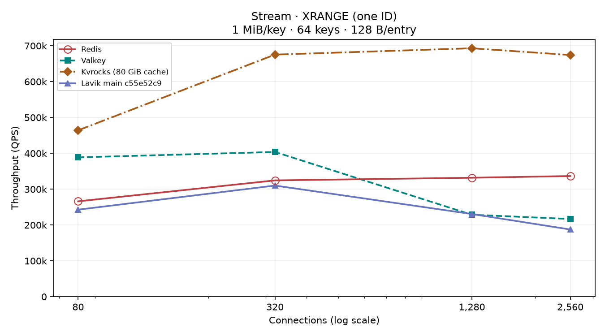

[Redis](raw/redis/) · [Valkey](raw/valkey/) · [Kvrocks (80 GiB cache)](raw/kvrocks/) · [Lavik (previous measurement) 5d7d12ec](raw/lavik-main5d7d12ec-ordered-stream-1048576-k64-f128-20261004/)

1024 B/entry · 64 keys · 本轮 main 基线 `a565d603`

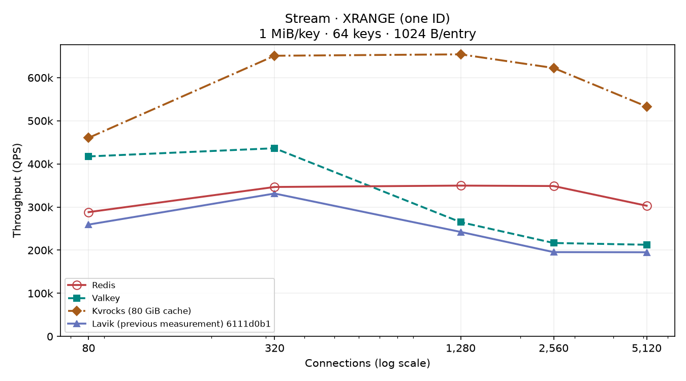

[Redis](raw/redis/) · [Valkey](raw/valkey/) · [Kvrocks (80 GiB cache)](raw/kvrocks/) · [Lavik main a565d603](raw/lavik-maina565d603-ordered-stream-1048576-k64-f1024-20261004/) · [Lavik PR #265 7586dc6f](raw/lavik-candidate7586dc6f-ordered-stream-1048576-k64-f1024-20261004/)

#### 100 MiB/key

128 B/entry · 8 keys · 历史测量，待复测 `5d7d12ec`

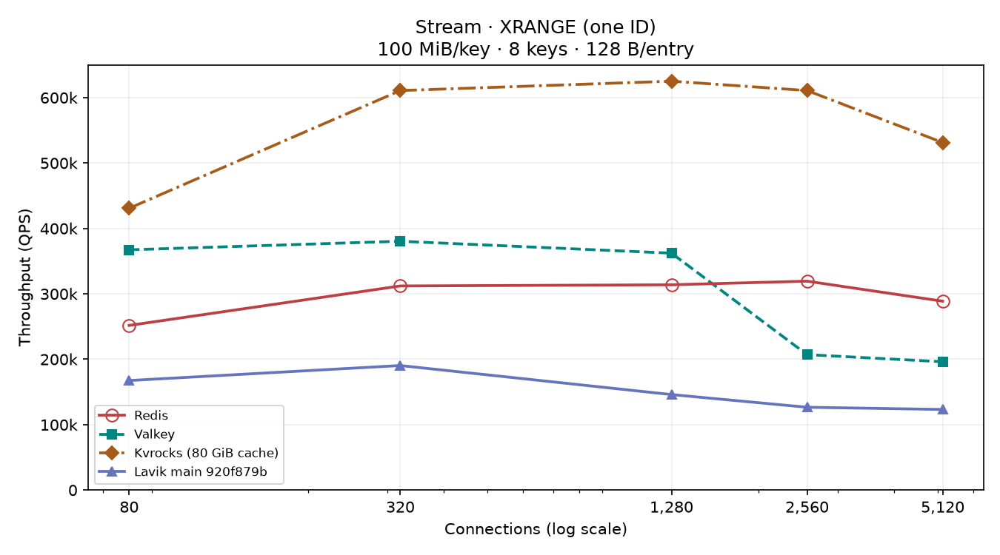

[Redis](raw/redis-100m/) · [Valkey](raw/valkey-100m/) · [Kvrocks (80 GiB cache)](raw/kvrocks-100m/) · [Lavik (previous measurement) 5d7d12ec](raw/lavik-main5d7d12ec-ordered-stream-104857600-k8-f128-20261004/)

1024 B/entry · 8 keys · 本轮 main 基线 `a565d603`

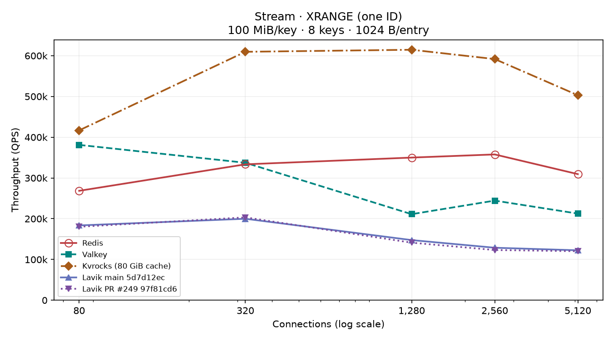

[Redis](raw/redis-100m/) · [Valkey](raw/valkey-100m/) · [Kvrocks (80 GiB cache)](raw/kvrocks-100m/) · [Lavik main a565d603](raw/lavik-maina565d603-ordered-stream-104857600-k8-f1024-20261004/) · [Lavik PR #265 7586dc6f](raw/lavik-candidate7586dc6f-ordered-stream-104857600-k8-f1024-20261004/)

### XADD MAXLEN ~

#### 64 KiB/key

128 B/entry · 64 keys · 历史测量，待复测 `5d7d12ec`

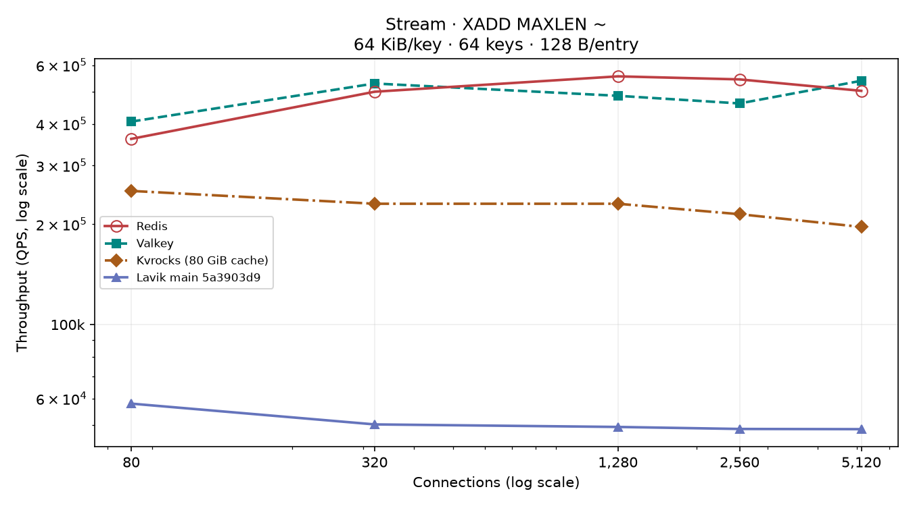

[Redis](raw/redis/) · [Valkey](raw/valkey/) · [Kvrocks (80 GiB cache)](raw/kvrocks/) · [Lavik (previous measurement) 5d7d12ec](raw/lavik-main5d7d12ec-ordered-stream-65536-k64-f128-20261004/)

1024 B/entry · 64 keys · 历史测量，待复测 `5d7d12ec`

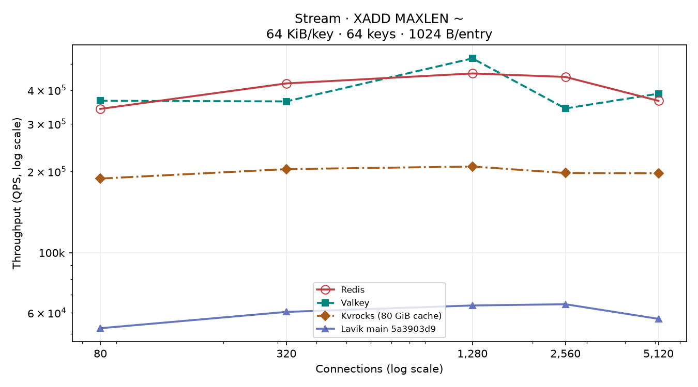

[Redis](raw/redis/) · [Valkey](raw/valkey/) · [Kvrocks (80 GiB cache)](raw/kvrocks/) · [Lavik (previous measurement) 5d7d12ec](raw/lavik-main5d7d12ec-ordered-stream-65536-k64-f1024-20261004/)

#### 1 MiB/key

128 B/entry · 64 keys · 历史测量，待复测 `5d7d12ec`

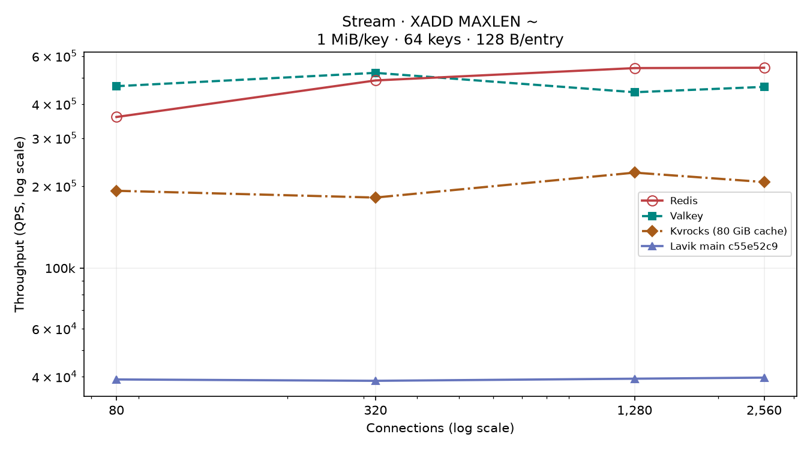

[Redis](raw/redis/) · [Valkey](raw/valkey/) · [Kvrocks (80 GiB cache)](raw/kvrocks/) · [Lavik (previous measurement) 5d7d12ec](raw/lavik-main5d7d12ec-ordered-stream-1048576-k64-f128-20261004/)

1024 B/entry · 64 keys · 本轮 main 基线 `a565d603`

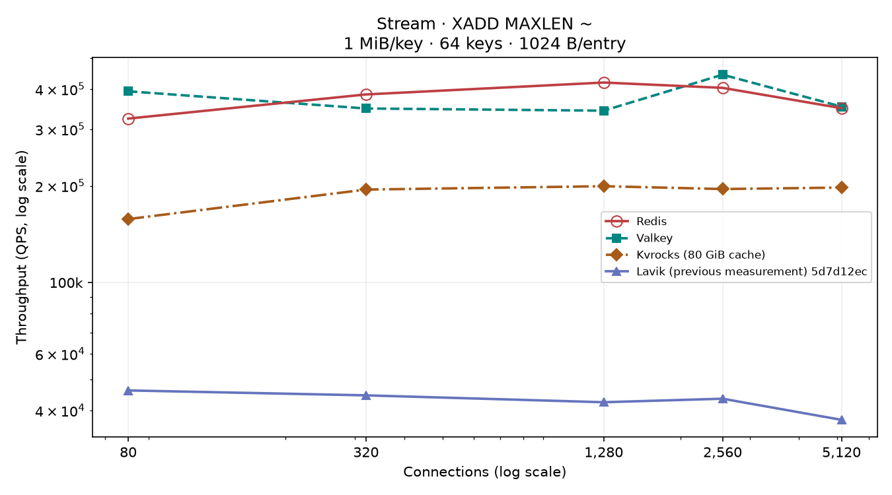

[Redis](raw/redis/) · [Valkey](raw/valkey/) · [Kvrocks (80 GiB cache)](raw/kvrocks/) · [Lavik main a565d603](raw/lavik-maina565d603-ordered-stream-1048576-k64-f1024-20261004/) · [Lavik PR #265 7586dc6f](raw/lavik-candidate7586dc6f-ordered-stream-1048576-k64-f1024-20261004/)

#### 100 MiB/key

128 B/entry · 8 keys · 历史测量，待复测 `5d7d12ec`

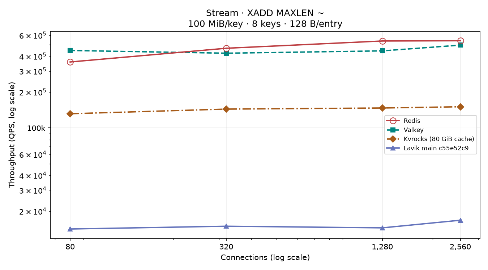

[Redis](raw/redis-100m/) · [Valkey](raw/valkey-100m/) · [Kvrocks (80 GiB cache)](raw/kvrocks-100m/) · [Lavik (previous measurement) 5d7d12ec](raw/lavik-main5d7d12ec-ordered-stream-104857600-k8-f128-20261004/)

1024 B/entry · 8 keys · 本轮 main 基线 `a565d603`

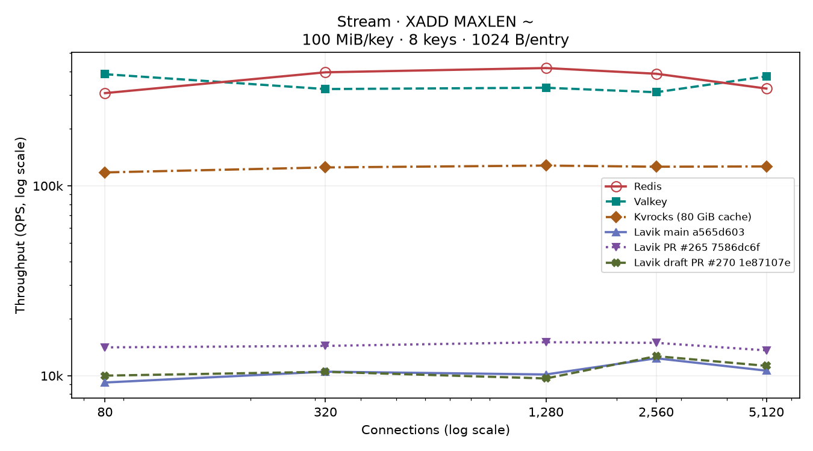

[Redis](raw/redis-100m/) · [Valkey](raw/valkey-100m/) · [Kvrocks (80 GiB cache)](raw/kvrocks-100m/) · [Lavik main a565d603](raw/lavik-maina565d603-ordered-stream-104857600-k8-f1024-20261004/) · [Lavik PR #265 7586dc6f](raw/lavik-candidate7586dc6f-ordered-stream-104857600-k8-f1024-20261004/)

### XRANGE - +

#### 64 KiB/key

128 B/entry · 64 keys · 历史测量，待复测 `5d7d12ec`

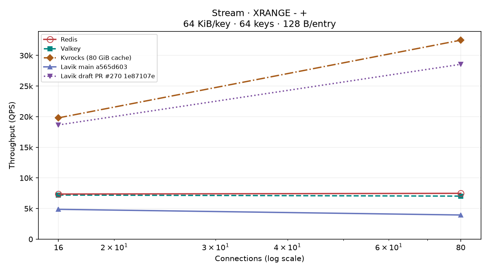

[Redis](raw/redis/) · [Valkey](raw/valkey/) · [Kvrocks (80 GiB cache)](raw/kvrocks/) · [Lavik (previous measurement) 5d7d12ec](raw/lavik-main5d7d12ec-ordered-stream-65536-k64-f128-20261004/)

1024 B/entry · 64 keys · 历史测量，待复测 `5d7d12ec`

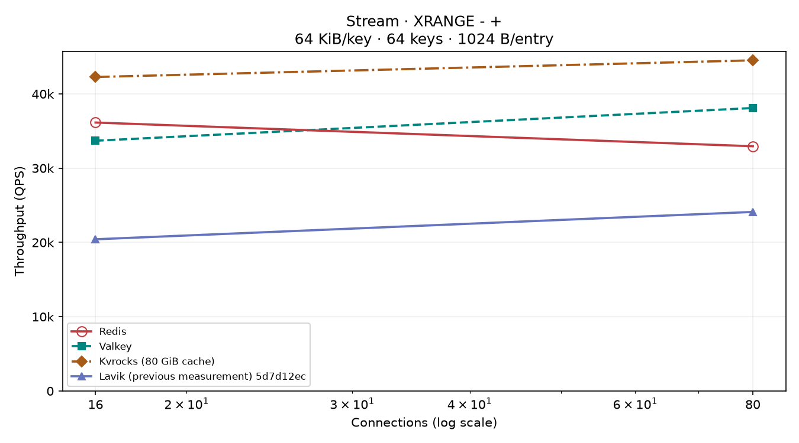

[Redis](raw/redis/) · [Valkey](raw/valkey/) · [Kvrocks (80 GiB cache)](raw/kvrocks/) · [Lavik (previous measurement) 5d7d12ec](raw/lavik-main5d7d12ec-ordered-stream-65536-k64-f1024-20261004/)

#### 1 MiB/key

128 B/entry · 64 keys · 历史测量，待复测 `5d7d12ec`

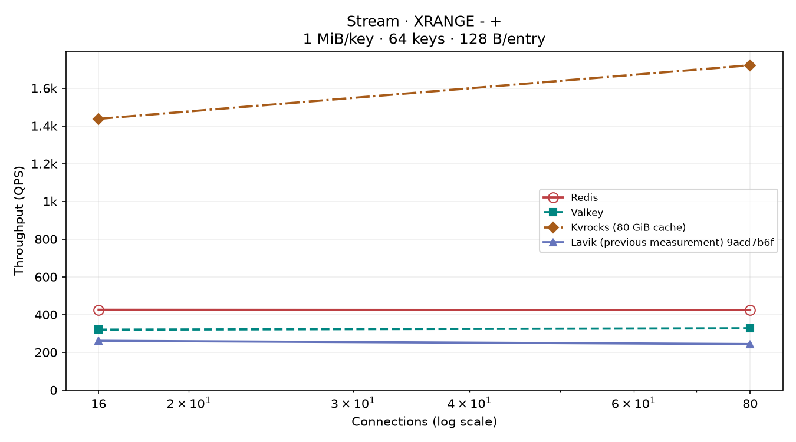

[Redis](raw/redis/) · [Valkey](raw/valkey/) · [Kvrocks (80 GiB cache)](raw/kvrocks/) · [Lavik (previous measurement) 5d7d12ec](raw/lavik-main5d7d12ec-ordered-stream-1048576-k64-f128-20261004/)

1024 B/entry · 64 keys · 本轮 main 基线 `a565d603`

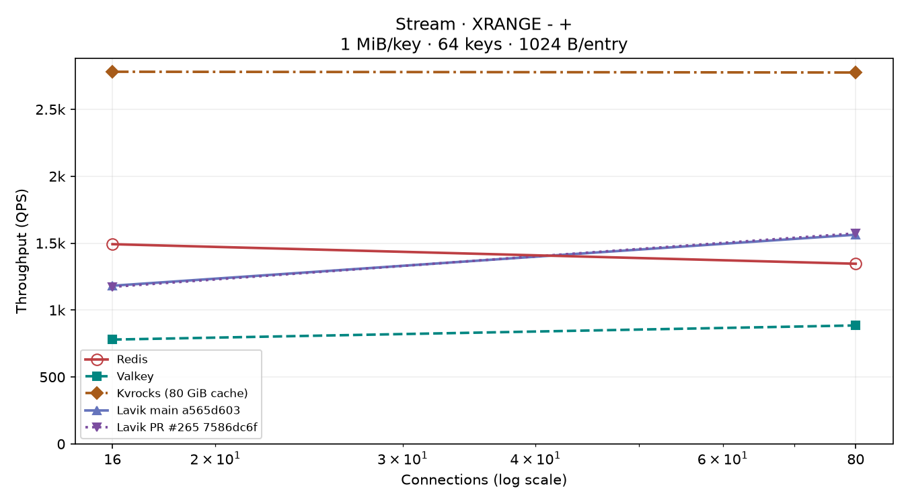

[Redis](raw/redis/) · [Valkey](raw/valkey/) · [Kvrocks (80 GiB cache)](raw/kvrocks/) · [Lavik main a565d603](raw/lavik-maina565d603-ordered-stream-1048576-k64-f1024-20261004/) · [Lavik PR #265 7586dc6f](raw/lavik-candidate7586dc6f-ordered-stream-1048576-k64-f1024-20261004/)

#### 100 MiB/key

128 B/entry · 8 keys · 历史测量，待复测 `5d7d12ec`

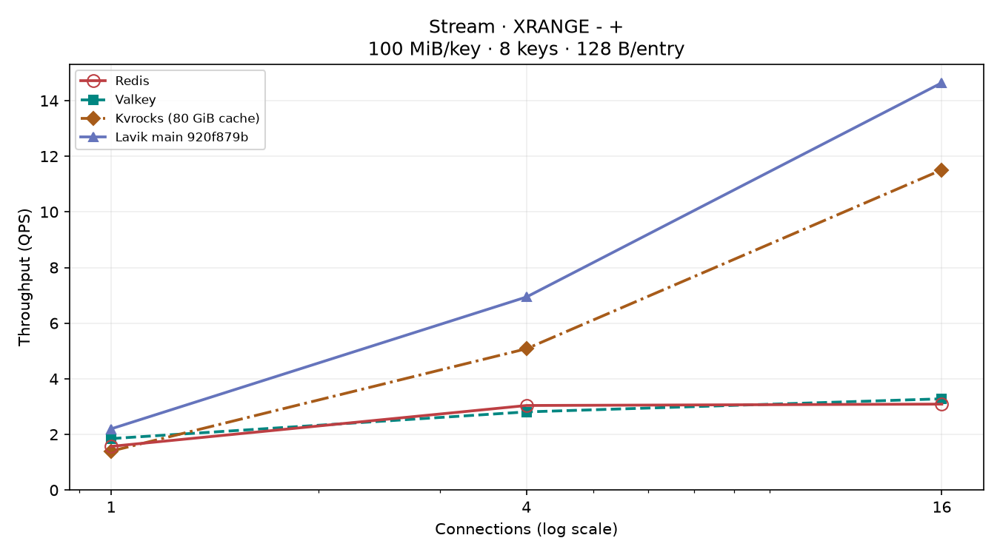

[Redis](raw/redis-100m/) · [Valkey](raw/valkey-100m/) · [Kvrocks (80 GiB cache)](raw/kvrocks-100m/) · [Lavik (previous measurement) 5d7d12ec](raw/lavik-main5d7d12ec-ordered-stream-104857600-k8-f128-20261004/)

1024 B/entry · 8 keys · 本轮 main 基线 `a565d603`

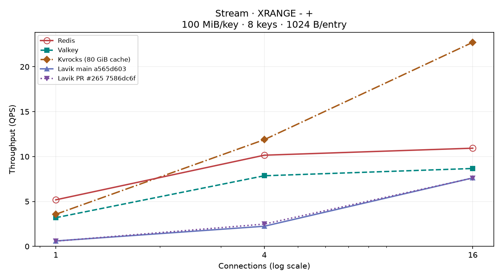

[Redis](raw/redis-100m/) · [Valkey](raw/valkey-100m/) · [Kvrocks (80 GiB cache)](raw/kvrocks-100m/) · [Lavik main a565d603](raw/lavik-maina565d603-ordered-stream-104857600-k8-f1024-20261004/) · [Lavik PR #265 7586dc6f](raw/lavik-candidate7586dc6f-ordered-stream-104857600-k8-f1024-20261004/)

## 测量与复现

memtier 在独立客户端主机 172.16.0.5 上运行，绑定 CPU 0–15；key 均匀随机。HGET/HSET、SISMEMBER、LINDEX/LSET、ZSCORE/ZINCRBY 和指定 ID 的 XRANGE 在每 key 的八个等距位置间轮换，并非对所有字段均匀采样。SADD/SREM 使用固定测试 member；XADD MAXLEN 追加新 ID。每组按连接数顺序测试，后续写入点继承前面测点改变的值和布局。

Hash/Set：1 MiB/key 使用 50,000 keys，100 MiB/key 使用 500 keys。LSET 的大 key 数负载同样使用 50,000/500 keys。其他有序结构保留既有四库一致的 64/8-key 负载，标题明确区分；不同 key 数的曲线不能直接比较。

Hash/Set 以 RESTORE 独立预置后清理、重启恢复再测；LSET 大 key 数预置使用 32 个连接、128 KiB RPUSH 批次、pipeline=4。预置耗时保存在每组 raw 目录中，不将 RESTORE 与其他系统的 HSET/SADD 导入耗时混比。

读取整个 100 MiB key 的低吞吐测点可能只有少量完成回复，小差异不作性能结论。八秒成功不代表长时间高并发下内存稳定；历史 SMEMBERS 持续负载曾触发内存准入拒绝。失败测点保留断线与说明，不填零、不插值。

历史优化数据保存在 `raw/` 和 `diagnostics/`，不再显示为已合并 PR 的独立曲线。
