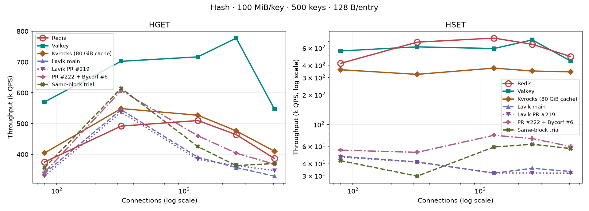
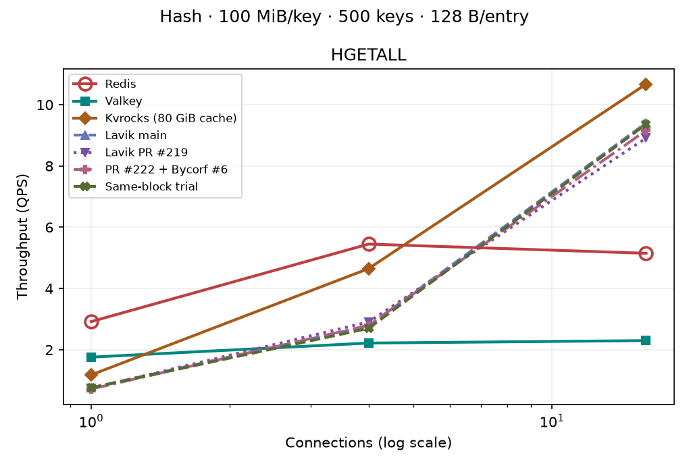

# 同块数据与 Commit 合并刷盘试验

500 个 100 MiB Hash，128 B field，12 workers，SPDK；与主图相同数据集、连接数和八秒测点。

`Same-block trial` 为 PR #222 的 `8a41c578da15381cfdbab412fa2ec11a89f0eab6`，
二进制 SHA256 `2211a8ce9854c55a53a682c4ebd11f75b594893d7dfdd250ab6ebbea3a9a46f5`。
在上一版 `d8405fad` 的 NVMe 优化上，尝试让同一块中的事务数据和 Commit 由一个持久化块前缀覆盖。
跨块或跨 worker 仍等待原来的数据 fence。Commit 前后崩溃恢复、并发 Hash/Set、共享结构和跨 key 事务回归均通过。

本轮 13 个测点零错误，但 HSET 为 2.97–6.28 万 QPS，低于上一版的 5.20–7.75 万。
320 连接、每点 20 秒复测也确认下降：上一版 45,603 QPS，合并版 37,704 QPS（低 17.3%）。
该改动已从 PR #222 撤回；正确性测试通过并不能证明吞吐会提高。此图记录该试验，不把减少 I/O 次数直接当作已证实的吞吐优化。
主报告保留当前表现更好的 NVMe 优化曲线；原始数据在 `raw/lavik-coalesce8a41c578-hash-100m-k500-f128-20260929`。

