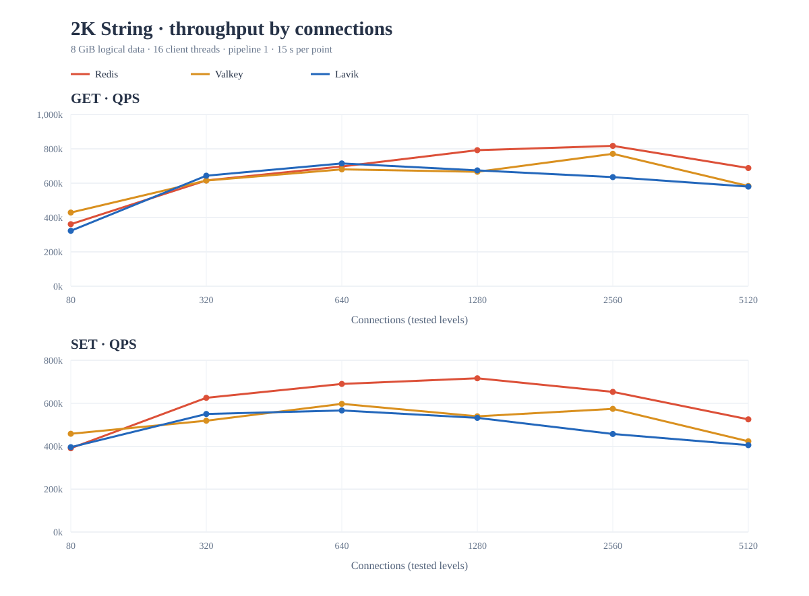
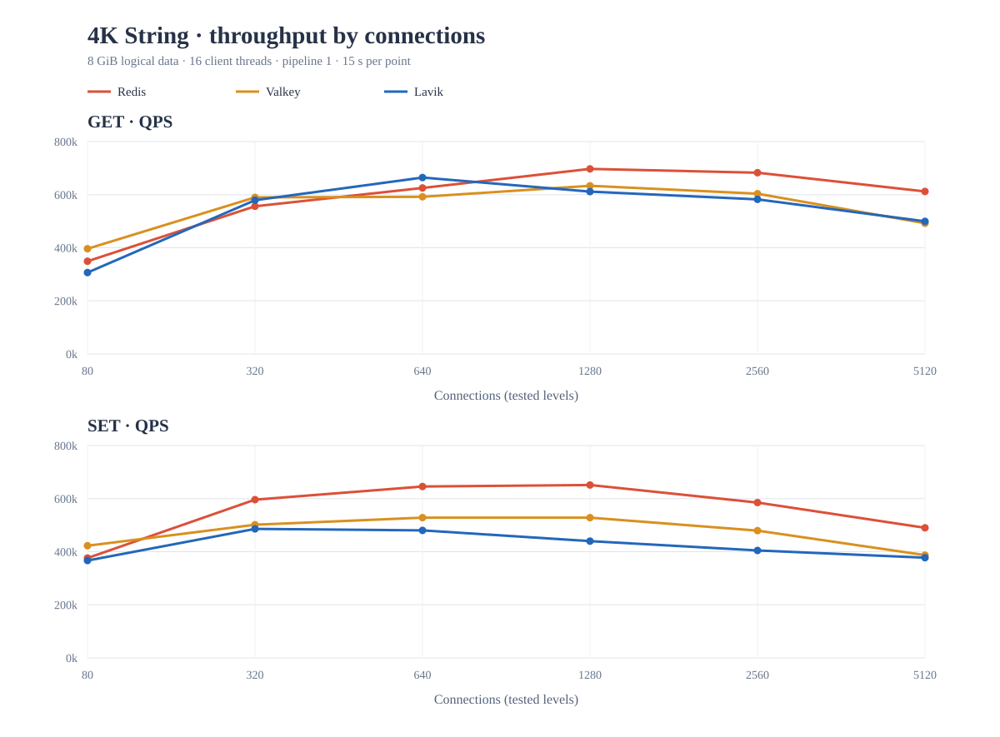
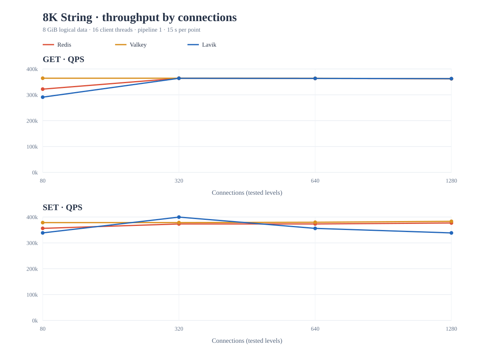
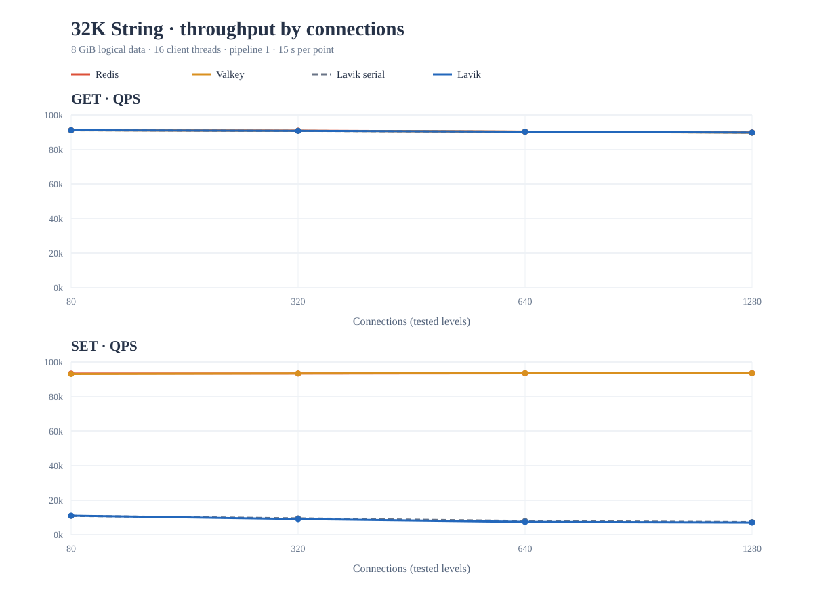
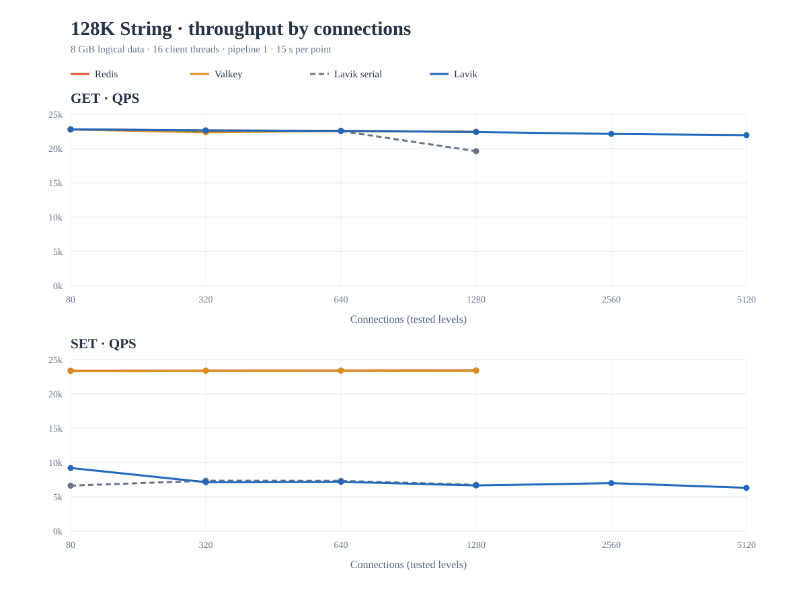
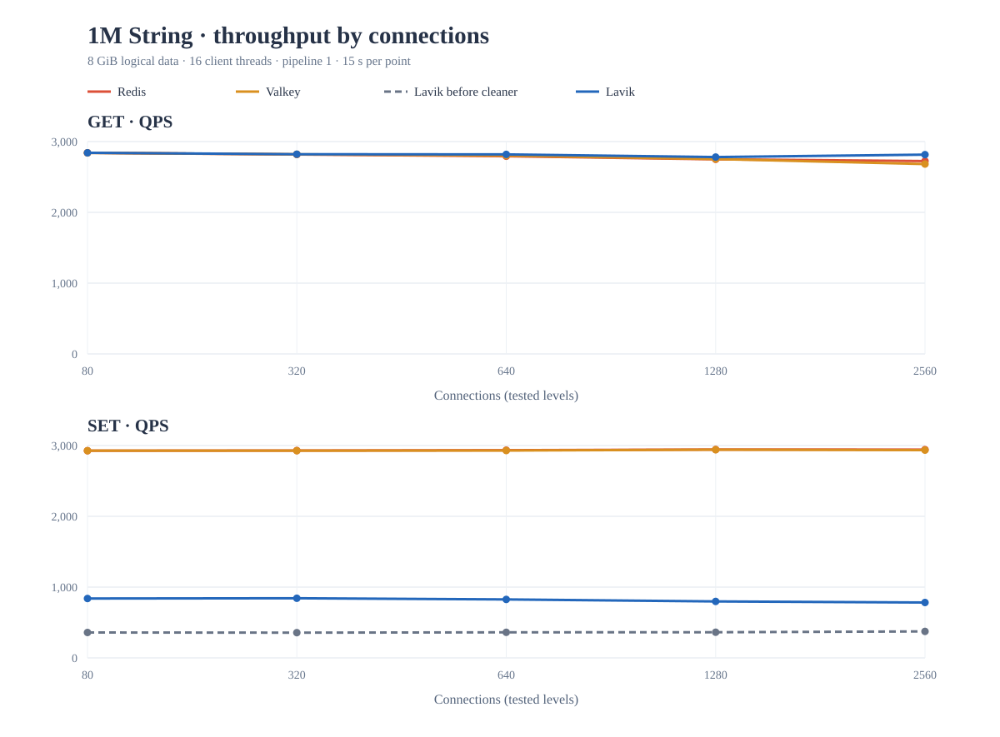

# Large String connection scaling, 2026-09-26

The six charts show memtier QPS against **connection count**. Each chart has a
GET panel and a SET panel. Points at 2560 and 5120 connections were added where
the earlier sweep left open a possible scaling gain; blank series segments mean
that product was not measured at that level. [Exact QPS, p99 and run source are
in the CSV](results.csv).

| Value | Chart | Peak GET QPS (Redis / Valkey / Lavik) | Peak SET QPS (Redis / Valkey / Lavik) |
| --- | --- | ---: | ---: |
| 2 KiB | [2K](charts/2K.svg) | 817k / 771k / 715k | 716k / 597k / 566k |
| 4 KiB | [4K](charts/4K.svg) | 697k / 633k / 665k | 651k / 528k / 486k |
| 8 KiB | [8K](charts/8K.svg) | 364k / 364k / 364k | 377k / 383k / 400k |
| 32 KiB | [32K](charts/32K.svg) | 91.2k / 91.2k / 91.2k | 93.7k / 93.6k / 11.0k |
| 128 KiB | [128K](charts/128K.svg) | 22.8k / 22.8k / 22.8k | 23.4k / 23.4k / 9.2k |
| 1 MiB | [1M](charts/1M.svg) | 2.84k / 2.84k / 2.84k | 2.94k / 2.94k / 0.84k |

These are **independent peaks** across the connections tested for each product,
not QPS at a common connection level. The charts and CSV retain each actual
point. Read throughput at 32 and 128 KiB clustered around 2.7 GB/s of observed
server NIC transmit traffic. Raising connections beyond 1280 did not raise
128 KiB Lavik GET throughput; 2 and 4 KiB Lavik throughput declined at 2560
and 5120. The extra connections established that those curves had passed their
peak rather than being client concurrency limited.

At 128 KiB and 1280 connections, the bounded parallel String read experiment
measured 22.4k GET QPS and 243 ms p99, versus 19.6k and 725 ms for the serial
read. At 80–640 connections both versions were about 22.6–22.8k QPS. At 32 KiB
the parallel version did not materially change GET QPS. The serial and parallel
curves are both shown in those two charts. Each point is one 15-second run, so
the high-connection tail-latency difference needs replication before treating
it as a stable gain.

The 32 and 128 KiB SET results expose a separate gap. Redis and Valkey were run
without persistence, while Lavik committed to six SPDK NVMe drives, so the SET
numbers include different durability work. The first unmodified Lavik run could
not finish the 32 KiB fill: outstanding transaction decisions consumed all
segmented-String append capacity. The attached code bounds those decision
leases before starting another standalone String transaction, and the subsequent
large-value fills and sweeps completed without response errors.

The lease cap in this branch is an **experimental String-path mitigation**, not
a general bound on transaction-log blocks. A follow-up run replaced the cap
with the maximum permitted by the record-fit calculation. That version fell
from 7.0k to 4.6k SET QPS at 32 KiB/1280 connections and from 6.7k to 2.1k
at 128 KiB/1280 connections, alongside a high transaction-block retirement
count. Those follow-up points are excluded from the charts, and that change
was not kept. A general solution needs a bounded window of transaction blocks,
with backpressure plus reserved progress for commit decisions and relocation.

## 1 MiB follow-up

The 1 MiB run used the same two hosts, an 8 GiB logical dataset (8,160 keys),
16 memtier threads, pipeline depth one, 15-second points, and 80, 320, 640,
1,280 and 2,560 connections. Redis and Valkey used the same no-persistence
settings as the smaller-size runs. The Lavik baseline was the current
transaction-backlog and parallel-read branch at `6f59fd4a`, with the default
8 MiB per-worker Tx backlog limit and six SPDK devices. Its binary SHA-256
begins `cd5144c7b1546a83`; the Bycorf revision was `4c11a9125ab3`.

The retained Lavik GET reached 2,841 QPS at 80 connections, matching Redis and Valkey at
about 2,840 QPS. Observed server transmit traffic was 2.77 GB/s for all
three. The read curve did not need more connections to saturate this network
path. Redis and Valkey SET reached about 2,940 QPS, with 2.84 GB/s of server
receive traffic at 80 connections. Their writes were memory-only; Lavik's
writes included durable transaction records, commit decisions and relocation
to ordinary blocks.

Lavik's original 1 MiB fill ran at 364 QPS and accumulated 7,534 Tx backlog
admission waits across 8,160 SETs. At 80 connections, its measured SET rate
was 359 QPS with 606 ms p99. Raising the runtime backlog limit to 64 MiB
in an otherwise identical run produced 382 QPS at 80 connections and
402 QPS at its best level, so the limit alone did not explain the gap.

The follow-up change at `646a7b4e` lets the transaction cleaner promote independent workers'
sealed blocks concurrently. It waits for every promotion before retiring any
source or decision block. With the default 8 MiB limit, the final 1 MiB fill
ran at 845 QPS. At 80 connections, SET rose to 839 QPS and p99 fell to 268 ms;
the maximum measured SET rate was 842 QPS at 320 connections. The final binary
SHA-256 begins `d98624e48eeac1aa`. A separate experiment that reduced cleaner yield
frequency varied between 735 and 849 QPS across the connection levels,
without consistent benefit; that change was discarded. The chart includes
the original and final cleaner SET curves and the final GET curve.

Each point is one run. At 1 MiB, high connection counts mainly increased
queueing latency: the original and final cleaner versions had 22.0 and 15.9 second
p99 respectively at 2,560 connections. Compare the 80-connection points for
the clearer latency result. The committed [CSV](results.csv) keeps every
plotted point and its source directory; the raw memtier and `INFO STATS` logs
remain on the benchmark hosts.

## Method

- Server: `172.16.0.4`, pinned to CPUs 0–15. Redis 8.8.0 and Valkey 9.1.0
  used 12 IO threads, no snapshots or AOF. Lavik used 12 pinned workers, SPDK
  on six dedicated NVMe devices, 20 µs busy polling and paused defragmentation.
  Lavik source began at upstream `a23043be`; the report branch contains its
  admission and parallel-read changes. The memtier client ran separately on
  `172.16.0.5`, pinned to CPUs 0–15.
- Each size rebuilt about 8 GiB of logical String values, rounded to a multiple
  of 80 keys: 4,194,240 / 2,097,120 / 1,048,560 / 262,080 / 65,520 keys
  respectively. The harness checked `DBSIZE` and three `STRLEN` samples after
  each fill, and rejected GET misses, server responses with errors and client
  connection errors.
- Each measured point used 16 memtier threads, pipeline depth 1, random keys,
  15 seconds, and either GET-only or SET-only traffic. Standard levels were
  80, 320, 640 and 1280 connections. The extra 2560/5120 levels were measured
  for the small sizes and for Lavik 128 KiB as recorded in the CSV.
- The first Valkey 128 KiB 15-second sweep reported an unrepeatable 74k GET
  QPS point at 640 connections despite no reported misses/errors. Both a
  30-second repeat and a second 15-second sweep measured about 22k; server NIC
  transmit counters corroborated the latter. The charts use the second
  15-second sweep (`valkey-verified128`) for all 128 KiB Valkey points and omit
  the anomalous first sweep.
- The `Lavik` series combines `lavik-baseline` for 2/4/8 KiB standard levels,
  `lavik-parallel` for 32/128 KiB standard levels, and `lavik-high` for extra
  levels. The small-value read path was unchanged by the String parallel-read
  patch. `Lavik serial` is the 32/128 KiB run with the admission fix but before
  parallel reads. The final extra-connection run also included the admission
  recheck under the store lock.

The [harness](run.py), [Lavik runner](run_lavik.py) and [SPDK host setup](spdk_host.py)
are specific to this two-host lab. The host setup checks an exact six-controller
serial/BDF allowlist before wiping or binding any scratch device. Raw logs stay
local; the committed [CSV](results.csv) has every plotted value and source tag.
Regenerate the charts from the CSV with `python3 plot.py`.

## Charts

### 2 KiB

### 4 KiB

### 8 KiB

### 32 KiB

### 128 KiB

### 1 MiB

